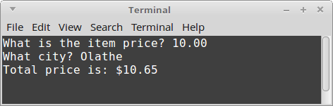
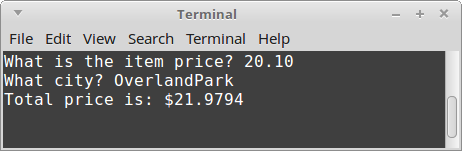
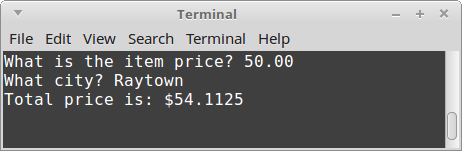
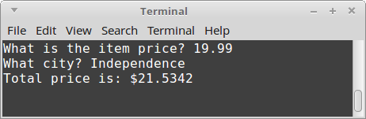
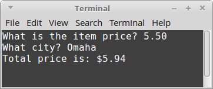
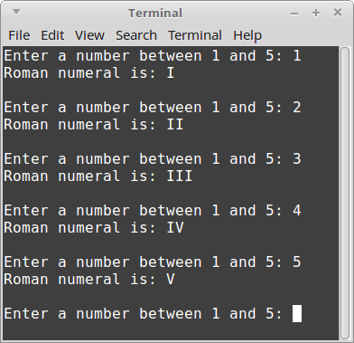
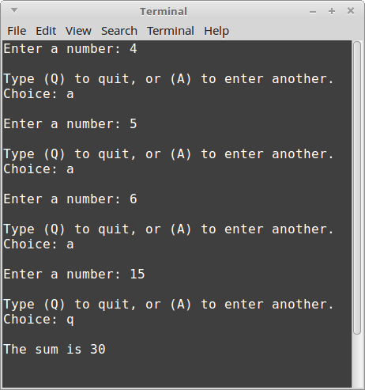
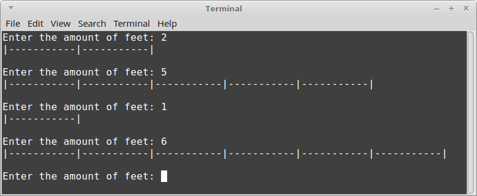

# Homework Exercise 3: Control Flow

## Topics

* If statements
* Switch statements
* While loops
* For loops

## Chapters

* Chapter 2
* Chapter 3

## Rules

* Team size: **1 person**
    * You can brainstorm with others - that is, you can verbally discuss the problem.
    * You cannot copy another person's work. 
    Code will be checked against other submissions with a diff tool.
    If a copy is found, both people will receive a 0 on the assignment.
* Open book / open note - do research as-needed.

## Template program

You can use this code as your starting point:

    #include <iostream>
    using namespace std;

    int main()
    {
        
        
        return 0;
    }

**Each of these projects should have their own source file.**

---

## Project 1: If Statements - Tax Rate

Create a program that will calculate the total price for an item
based on what city the user is in.

* Ask the user for the price of their item. Store this in a float.
* Ask the user what city they're in. Store this in a string.
* Create a new variable to store price plus tax. 
    * The calculation for this is total = price + ( price * tax ).
    * Tax is based on the city. See the following table.
    * If they are in none of the cities listed in the table, default the tax to %8.00.
* After the calculation is done, display the final price to the user.

<table>
    <tr>
        <th>Olathe</th><th>OverlandPark</th><th>Raytown</th><th>Independence</th>
    </tr>
    <tr>
        <td>6.5%</td><td>9.35%</td><td>8.225%</td><td>7.725%</td>
    </tr>
</table>

### Example output

**Olathe:**

**OverlandPark:**

**Raytown:**

**Independence:**

**Omaha:**

---

## Project 2: Switch and While Loop -  Roman Numerals

Write a program that will ask the user to enter a number (an integer)
between 1 and 5. Then, using a switch statement, convert that number
into a roman numeral. 

Store the roman numeral value in a string and display it once the
switch statement is done.

Make sure to declare your roman numeral *before* the switch statement,
so that you can assign a value to it within the switch.

Your **cout** that displays the value of the roman numeral should be
*after* the switch statement is done.

Also have your program run forever - contain the above functionality
within a **while** loop, like:

    while ( true )
    {
        // program functionality
    }
    
that way, it will keep asking the user to enter a new value.

### Example output

---

## Project 3: While Loop - Sum!

Sum together numbers that the user inputs until they decide to quit.

First, create an integer variable called **sum**, and initialize it to 0.

Create a boolean variable called **isDone** and initialize it to false.

Then, create a while loop. Keep looping while **isDone** is false.

Within the while loop:

* Ask the user to enter a number. Store this in a new integer variable.
* Add the inputted value to the sum.
* Ask the user if they want to enter another value by typing "A", or to quit by typing "Q".
* Get the user's input and store it in a char variable.
* If the user enters 'Q' or 'q', set the **isDone** variable to true.
* No need for an else statement; if they don't enter q, the loop will continue looping.

Outside of the while loop, display the value of the sum.

### Example output

---

## Project 4: For Loop - Draw a ruler

For this program, you will ask the user how many feet they want on their
virtual computer ruler.

Then, you will draw a ruler that contains tick marks - for each inch,
with lines | at every 12th inch.

First, create an integer variable called **feet**. Ask the user to enter the 
amount of feet they want, and store it in this variable.

Second, create a for loop. It should go from 0 to ( feet x 12 ), so that it
draws the appropriate amount of inches. Increment your counter variable by 1 each time.

Within the for loop:

* If the counter variable is divisible by 12, draw a vertical line |
* Otherwise, draw a tick mark -

Note: You can use the **modulus operator** to check whether something is divisible by something else!

For example:

    isEven = ( x % 2 == 0 );         // If x is divisible by 2, then x mod 2 will be 0.
    
    isDivisibleByThree = ( x % 3 == 0 );

### Example output

