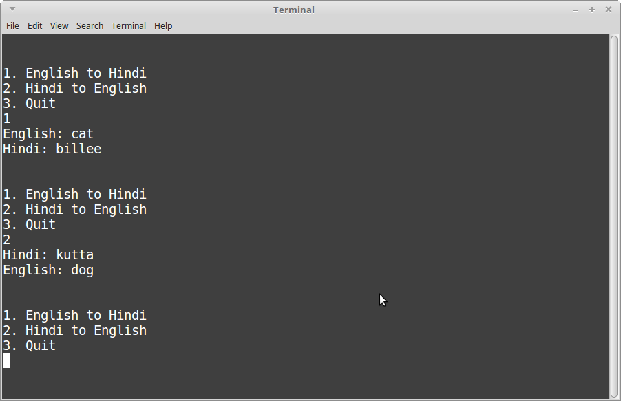

# Homework Exercise 4: Functions

## Topics

* If statements
* While loops
* Functions

## Rules

* Team size: **1 person**
    * You can brainstorm with others - that is, you can verbally discuss the problem.
    * You cannot copy another person's work. 
    Code will be checked against other submissions with a diff tool.
    If a copy is found, both people will receive a 0 on the assignment.
* Open book / open note - do research as-needed.

## Template program

You can use this code as your starting point:

	#include <iostream>
	#include <string>
	using namespace std;

	// Input/Output functions

	string GetHindi( string english )
	{
	}

	string GetEnglish( string hindi )
	{
	}

	// Menu functions

	void DisplayMenu()
	{
	}

	void EnglishToHindi()
	{
	}

	void HindiToEnglish()
	{
	}

	int main()
	{		
		return 0;
	}

---

## Introduction

For this program, **main()** will contain the program loop.

A **program loop** is how we get a program to keep running,
only ending once the user decides to quit - and therefore, breaks the loop.

The program loop will begin by showing the user a menu and having them
choose an option: Translate from English to Hindi, Hindi to English, or to exit the program.

Based on the user's choice, we will delegate the task to *another function*, so that
we don't over-crowd main().

**EnglishToHind()** and **HindiToEnglish()** both are void functions, with no parameters.
They are essentially like mini-programs on their own; they only handle one feature
of the program.

With **GetEnglish** and **GetHindi**, these functions both take input and give output.
These actually have logic to decide what to do with the input,
and give back the appropriate output.

## main()

In the main() function, you will need to create a program loop.
Generally you can handle this with a *while loop*.

First, create a **boolean variable** named something like "exit" or "isDone"
and initialize it to *false*.

Then, your while loop will loop "while exit is false".

Within the program loop, call the **DisplayMenu()** function, then
get the user's choice.

The user will enter 1 for English to Hindi, 2 for Hindi to English,
and 3 to quit.

Using an if statement or switch statement, look at what the user's choice
was. If it was 3 (exit), set your boolean *exit* variable to true.

If the user's choice was 1, call **EnglishToHindi()**. Otherwise,
if the user's choice was 2, call **HindiToEnglish()**.

## DisplayMenu()

This is the basic main menu - this function is only responsible for displaying
the number menu. It should look something like this:

	1. English to Hindi
	2. Hindi to English
	3. Quit

## EnglishToHindi()

This function is responsible for finding out the English word the user wants 
to translate into Hindi.

Display a prompt to let the user know what information the program wants...

	English:

... Then get the user's input via *cin*, and store it in a local variable,
which is the English word to be translated. It should be a string.

After getting ther user's input, this function will call the **GetHindi** function,
passing in your English term as the function argument.

Finally, display the result of your GetHindi function call. For example:

	English: cat
	Hindi translation: billee
	
### Tips...

* When you're prompting the user for some information, this is just a simple cout statement.
* You'll need a place to store the English term, so create a new string variable within the function,
then use cin to get its value from the user.
* Create another string for the Hindi term. Assign it the value of the GetHindi function's return value.

## HindiToEnglish()

This function is basically the same as EnglishToHindi, but vice-versa.

Get the Hindi word that the user wants to translate, get the English translation,
and display it.

## GetHindi()

* INPUT: english, a string
* OUTPUT: a string; the hindi translation.

Using an *if-else if-else* statement, check to see if the user entered
any of the following English terms, and **return** the corresponding Hindi text.

<table>
	<tr>
		<th>cat</th>
		<th>dog</th>
		<th>frog</th>
		<th>rabbit</th>
	</tr>
	<tr>
		<td>billee</td>
		<td>kutta</td>
		<td>medhak</td>
		<td>khargosh</td>
	</tr>
</table>

If the user enters a word that is not in our dictionary, simply return "word not found."

## GetEnglish()

Again, this is like GetHindi() but vice versa. The input is a Hindi word, and you will
return the English translation.

---

# Grading rubric

<table border="0" cellspacing="0" cellpadding="0" class="ta1"><colgroup><col width="12"/><col width="175"/><col width="256"/><col width="163"/><col width="162"/></colgroup><tr class="ro1"><td style="text-align:left;width:7.71pt; " class="Default"> </td><td colspan="4" style="text-align:left;width:113.44pt; " class="ce1">
Grading Rubric
</td></tr><tr class="ro1"><td style="text-align:left;width:7.71pt; " class="Default"> </td><td style="text-align:left;width:113.44pt; " class="ce2">
Name:
</td><td colspan="3" style="text-align:left;width:165.94pt; " class="ce7"> </td></tr><tr class="ro1"><td style="text-align:left;width:7.71pt; " class="Default"> </td><td style="text-align:left;width:113.44pt; " class="ce2">
Assignment:
</td><td colspan="3" style="text-align:left;width:165.94pt; " class="ce8">
CS 200, HWEX 4, Functions
</td></tr><tr class="ro2"><td style="text-align:left;width:7.71pt; " class="Default"> </td><td style="text-align:left;width:113.44pt; " class="Default"> </td><td style="text-align:left;width:165.94pt; " class="Default"> </td><td style="text-align:left;width:105.76pt; " class="Default"> </td><td style="text-align:left;width:104.94pt; " class="Default"> </td></tr><tr class="ro1"><td style="text-align:left;width:7.71pt; " class="Default"> </td><td colspan="4" style="text-align:left;width:113.44pt; " class="ce1">
Breakdown
</td></tr><tr class="ro1"><td style="text-align:left;width:7.71pt; " class="Default"> </td><td style="text-align:left;width:113.44pt; " class="ce3">
Item
</td><td style="text-align:left;width:165.94pt; " class="ce3">
Description
</td><td style="text-align:left;width:105.76pt; " class="ce3">
Total %
</td><td style="text-align:left;width:104.94pt; " class="ce3">
Your Score
</td></tr><tr class="ro1"><td style="text-align:left;width:7.71pt; " class="Default"> </td><td style="text-align:left;width:113.44pt; " class="ce4">
Builds &amp; Runs
</td><td style="text-align:left;width:165.94pt; " class="ce9"> </td><td style="text-align:right; width:105.76pt; " class="ce12">
5.00%
</td><td style="text-align:left;width:104.94pt; " class="ce12"> </td></tr><tr class="ro1"><td style="text-align:left;width:7.71pt; " class="Default"> </td><td style="text-align:left;width:113.44pt; " class="ce5">
Clean Code
</td><td style="text-align:left;width:165.94pt; " class="ce10"> </td><td style="text-align:right; width:105.76pt; " class="ce13">
5.00%
</td><td style="text-align:left;width:104.94pt; " class="ce13"> </td></tr><tr class="ro1"><td style="text-align:left;width:7.71pt; " class="Default"> </td><td style="text-align:left;width:113.44pt; " class="ce4">
No logic errors
</td><td style="text-align:left;width:165.94pt; " class="ce9"> </td><td style="text-align:right; width:105.76pt; " class="ce12">
10.00%
</td><td style="text-align:left;width:104.94pt; " class="ce12"> </td></tr><tr class="ro1"><td style="text-align:left;width:7.71pt; " class="Default"> </td><td style="text-align:left;width:113.44pt; " class="ce5">
main()
</td><td style="text-align:left;width:165.94pt; " class="ce10"> </td><td style="text-align:right; width:105.76pt; " class="ce13">
10.00%
</td><td style="text-align:left;width:104.94pt; " class="ce13"> </td></tr><tr class="ro1"><td style="text-align:left;width:7.71pt; " class="Default"> </td><td style="text-align:left;width:113.44pt; " class="ce4">
GetHindi()
</td><td style="text-align:left;width:165.94pt; " class="ce9"> </td><td style="text-align:right; width:105.76pt; " class="ce12">
15.00%
</td><td style="text-align:left;width:104.94pt; " class="ce12"> </td></tr><tr class="ro1"><td style="text-align:left;width:7.71pt; " class="Default"> </td><td style="text-align:left;width:113.44pt; " class="ce5">
GetEnglish()
</td><td style="text-align:left;width:165.94pt; " class="ce10"> </td><td style="text-align:right; width:105.76pt; " class="ce13">
15.00%
</td><td style="text-align:left;width:104.94pt; " class="ce13"> </td></tr><tr class="ro1"><td style="text-align:left;width:7.71pt; " class="Default"> </td><td style="text-align:left;width:113.44pt; " class="ce4">
DisplayMenu()
</td><td style="text-align:left;width:165.94pt; " class="ce9"> </td><td style="text-align:right; width:105.76pt; " class="ce12">
10.00%
</td><td style="text-align:left;width:104.94pt; " class="ce12"> </td></tr><tr class="ro1"><td style="text-align:left;width:7.71pt; " class="Default"> </td><td style="text-align:left;width:113.44pt; " class="ce5">
EnglishToHindi()
</td><td style="text-align:left;width:165.94pt; " class="ce10"> </td><td style="text-align:right; width:105.76pt; " class="ce13">
15.00%
</td><td style="text-align:left;width:104.94pt; " class="ce13"> </td></tr><tr class="ro1"><td style="text-align:left;width:7.71pt; " class="Default"> </td><td style="text-align:left;width:113.44pt; " class="ce4">
HindiToEnglish()
</td><td style="text-align:left;width:165.94pt; " class="ce9"> </td><td style="text-align:right; width:105.76pt; " class="ce12">
15.00%
</td><td style="text-align:left;width:104.94pt; " class="ce12"> </td></tr><tr class="ro1"><td style="text-align:left;width:7.71pt; " class="Default"> </td><td style="text-align:left;width:113.44pt; " class="ce5"> </td><td style="text-align:left;width:165.94pt; " class="ce10"> </td><td style="text-align:left;width:105.76pt; " class="ce13"> </td><td style="text-align:left;width:104.94pt; " class="ce13"> </td></tr><tr class="ro1"><td style="text-align:left;width:7.71pt; " class="Default"> </td><td style="text-align:left;width:113.44pt; " class="ce6"> </td><td style="text-align:left;width:165.94pt; " class="ce6"> </td><td style="text-align:left;width:105.76pt; " class="ce14"> </td><td style="text-align:left;width:104.94pt; " class="ce14"> </td></tr><tr class="ro1"><td style="text-align:left;width:7.71pt; " class="Default"> </td><td style="text-align:left;width:113.44pt; " class="ce2">
Totals
</td><td style="text-align:left;width:165.94pt; " class="ce2"> </td><td style="text-align:left;width:105.76pt; " class="ce14"> </td><td style="text-align:left;width:104.94pt; " class="ce14"> </td></tr><tr class="ro1"><td style="text-align:left;width:7.71pt; " class="Default"> </td><td style="text-align:left;width:113.44pt; " class="ce6"> </td><td style="text-align:left;width:165.94pt; " class="ce6"> </td><td style="text-align:right; width:105.76pt; " class="ce14">
100.00%
</td><td style="text-align:right; width:104.94pt; " class="ce15">
0.00%
</td></tr><tr class="ro1"><td style="text-align:left;width:7.71pt; " class="Default"> </td><td style="text-align:left;width:113.44pt; " class="ce6"> </td><td style="text-align:left;width:165.94pt; " class="ce6"> </td><td style="text-align:left;width:105.76pt; " class="ce6"> </td><td style="text-align:left;width:104.94pt; " class="ce6"> </td></tr><tr class="ro2"><td style="text-align:left;width:7.71pt; " class="Default"> </td><td style="text-align:left;width:113.44pt; " class="Default"> </td><td style="text-align:left;width:165.94pt; " class="Default"> </td><td style="text-align:left;width:105.76pt; " class="Default"> </td><td style="text-align:left;width:104.94pt; " class="Default"> </td></tr><tr class="ro2"><td style="text-align:left;width:7.71pt; " class="Default"> </td><td style="text-align:left;width:113.44pt; " class="Default"> </td><td style="text-align:left;width:165.94pt; " class="Default"> </td><td style="text-align:left;width:105.76pt; " class="Default"> </td><td style="text-align:left;width:104.94pt; " class="Default"> </td></tr><tr class="ro2"><td style="text-align:left;width:7.71pt; " class="Default"> </td><td style="text-align:left;width:113.44pt; " class="Default"> </td><td style="text-align:left;width:165.94pt; " class="Default"> </td><td style="text-align:left;width:105.76pt; " class="Default"> </td><td style="text-align:left;width:104.94pt; " class="Default"> </td></tr><tr class="ro2"><td style="text-align:left;width:7.71pt; " class="Default"> </td><td style="text-align:left;width:113.44pt; " class="Default"> </td><td style="text-align:left;width:165.94pt; " class="Default"> </td><td style="text-align:left;width:105.76pt; " class="Default"> </td><td style="text-align:left;width:104.94pt; " class="Default"> </td></tr><tr class="ro2"><td style="text-align:left;width:7.71pt; " class="Default"> </td><td style="text-align:left;width:113.44pt; " class="Default"> </td><td style="text-align:left;width:165.94pt; " class="Default"> </td><td style="text-align:left;width:105.76pt; " class="Default"> </td><td style="text-align:left;width:104.94pt; " class="Default"> </td></tr><tr class="ro2"><td style="text-align:left;width:7.71pt; " class="Default"> </td><td style="text-align:left;width:113.44pt; " class="Default"> </td><td style="text-align:left;width:165.94pt; " class="Default"> </td><td style="text-align:left;width:105.76pt; " class="Default"> </td><td style="text-align:left;width:104.94pt; " class="Default"> </td></tr><tr class="ro1"><td style="text-align:left;width:7.71pt; " class="Default"> </td><td colspan="4" style="text-align:left;width:113.44pt; " class="ce1">
Notes
</td></tr></table>

