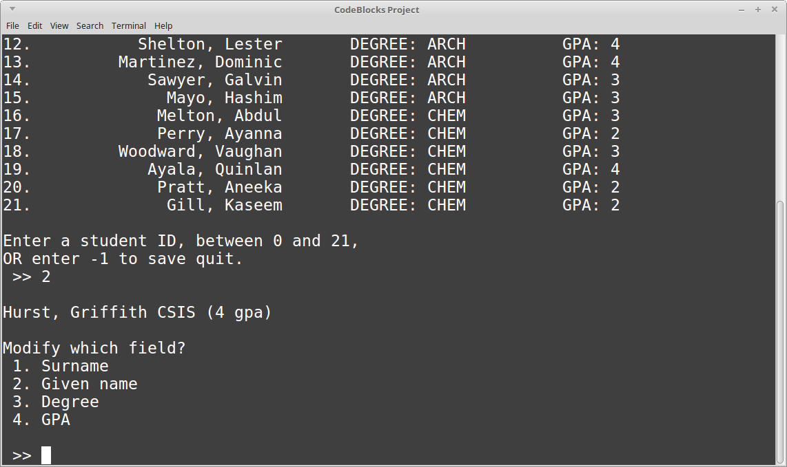
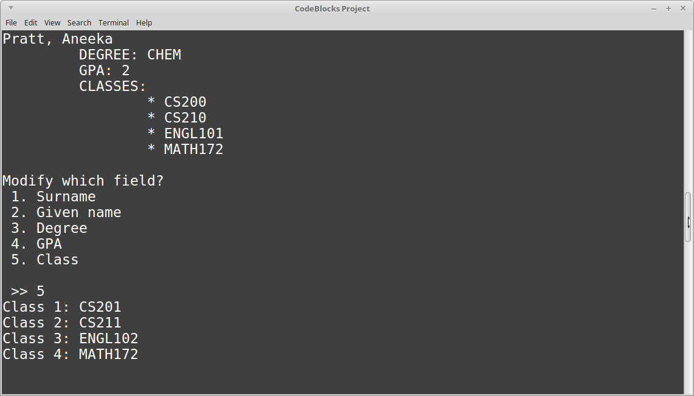
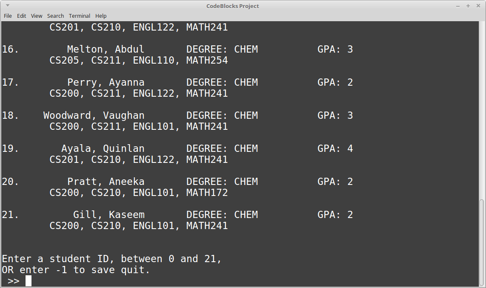

# Homework Exercise 6: File I/O and Structs

## Topics

* ifstream, ofstream
* structs

## Rules

* Team size: **1 person**
    * You can brainstorm with others - that is, you can verbally discuss the problem.
    * You cannot copy another person's work. 
    Code will be checked against other submissions with a diff tool.
    If a copy is found, both people will receive a 0 on the assignment.
* Open book / open note - do research as-needed.

## Turn in

**You will need to upload your code both to the class D2L Dropbox, and to your CS 200 GitHub repository!**

Locate your source files for this project. They should have the extentions .cpp, .hpp, and/or .h. In Windows, they are labelled as "C++ source file" and/or "Header file". 


**These are the only files you need** - You do not need to upload any Visual Studio files.

Upload these source files to your GitHub repository and to the Dropbox.

## Reference Information

* [How to turn in your source code](https://github.com/Rachels-Courses/Course-Common-Files/blob/master/How-to/Turning%20in%20source%20code.md)
* [Visual Studio - How to create a new project](https://github.com/Rachels-Courses/Course-Common-Files/blob/master/How-to/New%20project%20-%20Visual%20Studio.md)
* [Common programming errors](https://github.com/Rachels-Courses/Course-Common-Files/blob/master/Review/Common-errors.md)


---

# Review

## Structs

Structs (and later on, Classes) are a way for the programmer to create their own
*data types*. We can put together multiple variables in one container, and give
that container a name to describe the object.

For example, if you're trying to store a list of students, it would be annoying to
work with several arrays for each field:

```c++
string studentNames[100];
float studentGpas[100];
string studentDegree[100];
```

Rather than making several arrays of each field, why not group each field
together under a "Student" object, and make an array of students?

```c++
// OUTSIDE OF ALL FUNCTIONS:
struct Student
{
	string name;
	float gpa;
	string degree;
};

// In main or another function:
Student studentList[100];
```

Using the **Student** object above, let's just work with a single Student
variable for now, and step through how we use it.

```c++
int main()
{
	Student me;
	
	return 0;
}
```

To set those fields, *name*, *gpa*, and *degree*, which are *contained within Student*,
we use the dot operator . with the variable:

```c++
me.name = "Rach";
me.gpa = 3.2;
me.degree = "Computer Science";
```

So now all this information is stored within three variables (strings and a float), but these three
variables also *belong* to a single Student variable.

We can also have our array of students:

```c++
Student studentList[100];
```

and we can set each student's internal variables as well:

```c++
studentList[0].name = "Takahiro";
studentList[0].degree = "Mathematics";

studentList[1].name = "Carla";
studentList[1].degree = "Civil Engineering";
```

We can also store **functions** within our struct object.

```c++
struct Student
{
	string name;
	float allGrades[100];
	int classesTaken;
	string degree;
	
	float GetGPA()
	{
		float sum = 0;
		for ( int i = 0; i < classesTaken; i++ )
		{
			sum += allGrades[i];
		}
		return sum / classesTaken;
	}
};
```

Then, our function can be called from the object itself:

```c++
cout << "NAME: " << studentList[0] << ", GPA: " << studentList[0].GetGPA() << endl;
```

The **variables** and **functions** within a struct are known as **members**.
They belong to the struct, and when you declare a variable of that struct type,
that variable will contain those variables and functions.


## File I/O

We can write text to a file, or read text from a file, in a similar manner
to how we write to the screen and read from the keyboard.
We will continue using stream operators, but instead of **cout** and **cin**,
we need **ofstream** (output-file-stream) and **ifstream** (input-file-stream) objects
to work with.

### Output to text file

Let's say we are going to take this code:

```c++
Student studentList[100];

// [...]

cout << "STUDENT LIST" << endl;

// Display all students to screen
for ( int i = 0; i < 100; i++ )
{
	cout << studentList[i].name 
		<< "\t"
		<< studentList[i].degree
		<< endl;
}
```
and change it so that we are writing to a text file (.txt) instead
of the screen.

First, we need to make sure to include the file stream library **fstream**:

```c++
#include <fstream>
```

Then, somewhere in our program, we are going to declare a variable
whose data-type is **ofstream** (output-file-stream):

```c++
ofstream output;
```

We will first need to open some text file to write to:

```c++
output.open( "StudentList.txt" );
```

And we can output information similar to as we do with cout, but instead
with our *output* variable:

```c++
output << "STUDENT LIST" << endl;
```

Note that we can still use **endl**, **\n**, and **\t** in our file output,
just like with cout.

And when we're done writing to the text file, we need to make sure to **close it**:

```c++
output.close();
```

So when we're done updating the original code, it will look like this:

```c++
Student studentList[100];

// [...]

ofstream output;
output.open( "StudentList.txt" );

output << "STUDENT LIST" << endl;

// Display all students to screen
for ( int i = 0; i < 100; i++ )
{
	output << studentList[i].name 
		<< "\t"
		<< studentList[i].degree
		<< endl;
}

output.close();
```

When we run the program, the *output* items won't be displayed to
the screen, but when you open up the program directory, there will
be the *StudentList.txt* file written there, which you can open
with notepad.

### Input from text file

Opening and closing an input file is similar to with the output file,
except we use the **ifstream** (input-file-stream) object instead of
ofstream:

```c++
ifstream input;
input.open( "StudentGrades.txt" );

// Do stuff

input.close();
```

And, like with **cin**, we can either get one word at a time from the text file.
This way you can load any basic data-type (int, float, string, char, etc.):

```c++
input >> grades[0];
```

Or one line at a time from the text file with **getline**, but you will
have to store it in a string:

```c++
string lineOfText;
getline( input, lineOfText );
```

So, let's assume we have a text file with student info, which looks like:

		Ku Hye-sun
		3.5
		CS

And all student files will be the same format...

		LASTNAME FIRSTNAME
		GPA
		DEGREE

and we can use this standardized format to help us read in the student information
in our program...

```c++
Student topStudent;

ifstream studentFile( "Ku.txt" ); // Named the input file studentFile this time

studentFile >> topStudent.surname;		// changed Student struct to have surname
studentFile >> topStudent.givenName;	// and givenName as separate fields
studentFile >> topStudent.gpa
studentFile >> topStudent.degree

studentFile.close();
```

Once this student is loaded in from the text file, we can work with this
data in our program. Display the information, have the user update the information,
etc.

If we wanted to save the updated text file, it would look like:

```c++
ofstream output( "Ku.txt" ); // Update this record

output << topStudent.surname << " "; // put a space between surname and given name
output << topStudent.givenName << endl;
output << topStudent.gpa << endl;
output << topStudent.degree << endl;
```

---

# Exercise - Student List



For this part of the exercise, you will use the already-written project,
which loads in a student list, lets the user modify a student,
then writes it back out to a text file.

For this exercise, you will need to update the program to add another
field to the **Student** object: an array of four classes that they're taking.

You will need to modify different parts of the program to work with this.

## 0. DO THIS FIRST!

Before modifying the program, run it once. It will generate a text file called
**USE_THIS_DIRECTORY.TXT**. Look for this file, and this is where you should
put your *studentList.txt* and *studentList_classes.txt* -- it is the
directory that the program will look for these text files at.

## 1. Update the struct

First, in our **Student** struct, we need to add our array of classes.

```c++
struct Student
{
	string surname;
	string givenName;
	string degree;
	float gpa;
	// Add an array of 4 strings, which are the classes this student is taking.
	
	// [...]
};
```

And you will also want to update Student's **Display** function so that
it will also list out all 4 classes as well, after the name, degree, and gpa info.



What the Display function will output (for a single student) once modified.

## 2. Update reading/writing the text files

Instead of using the *studentList.txt* file, you will first need to modify
the program to use *studentList_classes.txt*

There are two locations where the filename is passed in: When **ReadStudentList**
is called, and when **SaveStudentList** is called. Both of these function
calls are within **main()**.

Update the references from the old text file to use the new text file instead.

```c++
// Old function call
DisplayStudents( students, studentCount );
```

Once you've updated which files these are reading from, you need to update
how the program *reads* the data from the text file,
and how it *writes* data to the text file.

### ReadStudentList

Currently, this function iterates through all the students and reads their info like this:

```c++
for ( int i = 0; i < studentCount; i++ )
{
	input >> studentList[i].surname;
	input >> studentList[i].givenName;
	input >> studentList[i].degree;
	input >> studentList[i].gpa;
}
```

Now an additional 4 columns have been added, for classes 0 through 3.

Using these as reference, update the program so that it will also read the student's 4 classes
into the ```classes``` array that belongs to each Student.

### SaveStudentList

We also need to make sure that we write *out* the same information to
the text file that we read *in*.

Again, it is writing out student infomration like this:

```c++
for ( int i = 0; i < studentCount; i++ )
{
	output << setw( 20 )
		<< studentList[i].surname << setw( 15 )
		<< studentList[i].givenName << setw( 10 )
		<< studentList[i].degree << setw( 10 )
		<< studentList[i].gpa << setw( 10 )
		<< endl;
}
```

You will need to update it so that it writes out each class information (0 to 3),
and make sure that there is space between each field.

**It is possible to "corrupt" your text file here!**
You can make a copy of *studentList_classes_backup.txt* if you end up
writing a bad output file that can't be read in anymore.

Once the data is written out, each student's information should be visible in one line, like this:

		Mercert          Plato      CSIS       3.5 CS200 CS210 ENGL102 MATH172

(You don't have to worry about tabs or nice output, but there must be whitespace
between each field!)

## Updating student info

In **main()**, it will ask the user the index of the student that they want
to modify. Currently, it will only ask for new names, degree, or gpa. You will
also need to add the ability to change the student's classes.

```c++
cout << "Modify which field?" << endl;
cout << " 1. Surname \n 2. Given name \n 3. Degree \n 4. GPA \n 5. Class" << endl;
cout << "\n >> ";
int choice;
cin >> choice;

while ( choice < 1 || choice > 6 )
{
	cout << "Invalid choice, try again: ";
	cin >> choice;
}
```

If the user selects *Class* as the item to update, then let them enter
a new value for each one of the 4 classes that they're taking.


The program has them enter all four classes again, but if you want to,
you can ask them which class to update.


## Screenshots




---

## Questions & answers

Write out your answers to these questions in a text document,
word document, or libreoffice document, and turn into the dropbox
along with your code.


