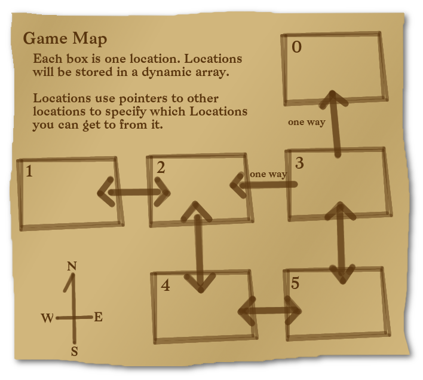
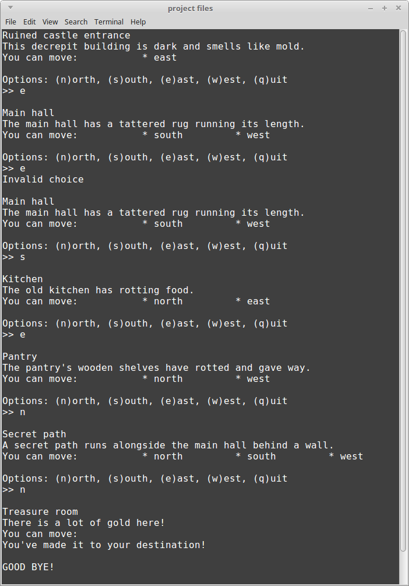

# Homework Project 3: Text Adventure

## Downloads

Download the **starter project**. This folder contains the code, as well as a Visual Studio project and a Code::Blocks project.

Extract the zip file somewhere to your hard drive.

**To open in Visual Studio**

Open the following file:

	project files/HP3 - Visual Studio/HP3 - Visual Studio.sln

This is marked as "Microsoft Visual Studio Solution" in Windows.

**To open in Code::Blocks**

Open the following file:

	project files/HP3 - CodeBlocks/HP3 - CodeBlocks.cbp

This is marked as "CBP File" in Windows.

## Rules

* Open book / Open note:

	* Do research for this assignment as-needed. Use your textbook, the web, class example code, etc.
 
* Solo work:

	* This is a solo assignment and you should be working on this alone. This means...:
	
    	* ✓ You can verbally brainstorm with others to discuss the problem and techniques for problem solving.
    	* ✓ Your work must be your own work.
    	* ✓ Email the instructor, or ask in the Slack channel, if you are stuck or need clarification on the instructions.
    	* ✗ You cannot give your code to somebody else for them to "verify their work" with (more often than not they just copy it, and then you both get 0%!)
    	* ✗ You cannot copy another student's work. I will use a diff tool to compare student assignments (and code online). If there is obvious copying, all people involved will receive a 0%.

## Turn in

When you're ready to turn in your work, upload the following files:

	hp3_program.hpp
	hp3_program.cpp

file to your GitHub repository, and to the D2L Dropbox.

### General turn in information

**You will need to upload your code both to the class D2L Dropbox, and to your CS 200 GitHub repository!**

Locate your source files for this project. They should have the extentions .cpp, .hpp, and/or .h. In Windows, they are labelled as "C++ source file" and/or "Header file". 


**These are the only files you need** - You do not need to upload any Visual Studio files.

Upload these source files to your GitHub repository and to the Dropbox.

## Reference Information

* [How to turn in your source code](https://github.com/Rachels-Courses/Course-Common-Files/blob/master/How-to/Turning%20in%20source%20code.md)
* [Visual Studio - How to create a new project](https://github.com/Rachels-Courses/Course-Common-Files/blob/master/How-to/New%20project%20-%20Visual%20Studio.md)
* [Common programming errors](https://github.com/Rachels-Courses/Course-Common-Files/blob/master/Review/Common-errors.md)

---

# Introduction

## Review

* Pointers
* Memory addresses
* Dynamic arrays

## Files

* hp3_main.cpp
* hp3_program.hpp
* hp3_program.hpp
* hp3_location.hpp

## Unit tests

---

# Don't write everything at once.

Don't write a ton of code all at once - write a small feature, then COMPILE to make sure your program builds, and run to make sure it runs.

---

# Location object

In this game, the user can move between several locations and
is trying to get to a secret end room. The map should be structured
as follows:



A **Location** object has already been declared and is usable for you.
It is in the hp3_location.hpp file:

```c++
class Location
{
	public:
	// ...
	string name;
	string description;

	Location* ptrToNorth;
	Location* ptrToSouth;
	Location* ptrToEast;
	Location* ptrToWest;
};
```

* name: The *name* of the location
* description: A description of the location
* ptrToNorth: A pointer to another location, who is this location's NORTH neighbor.
* ptrToSouth: A pointer to another location, who is this location's SOUTH neighbor.
* ptrToEast: A pointer to another location, who is this location's EAST neighbor.
* ptrToWest: A pointer to another location, who is this location's WEST neighbor.

For example, when the programming is running it will display the current
location's name and description, as well as which directions the player 
can move to. It can look like this:

		Ruined castle entrance
		This decrepit building is dark and smells like mold.
		You can move: 		* east

		Options: (n)orth, (s)outh, (e)ast, (w)est, (q)uit
		>> s

You can give your locations any names and any descriptions,
but you need to use the map as the structure of the world.

For example, Location 4 should have Location 2 to the north, and Location 5 to the east.

---

# Program object

The program contains the functions that you will implement, as well
as some private member variables that you will use within these functions.

```c++
Location* ptrCurrentLocation;
Location* ptrEndLocation;
Location* locationList;
```

* ptrCurrentLocation - this variable will point to the location that 
the player is currently at.
* ptrEndLocation - this variable will point to the ending location
for the game, which will be Location #0.
* locationList - this pointer will be used to create a dynamic array 
of rooms for the game.

As you will be dynamically allocating memory, you should make sure 
that you both *allocate* and *free* memory properly. If your program
contains memory leaks, you will lose points.

---

# Function specifications


## string GetUserInput

* **Return type:** string
* **Parameters:** none

This function should display a list of valid options to the user,
then ask for their input. Input should be retrieved via *cin*.

Once the user's input has been received, that input should be
returned as this function's *return*.

Example output:

		Options: (n)orth, (s)outh, (e)ast, (w)est, (q)uit
		>> (user input goes here)


## void Setup()

* **Return type:** void
* **Parameters:** none

This function sets up the program's Locations. There will be several
steps.

### Create the dynamic array

Using the **locationList** variable, allocate memory for a new
dynamic array. This dynamic array's size should be 6.

### Set up location names and descriptions

Once you've created the dynamic array, you need to set up the
names and descriptions for each room. For example:

		locationList[0].name        = "Treasure room";
		locationList[0].description = "There is a lot of gold here!";

You can give your locations any name and description, but they should
be unique from each other, and every location in the array must have
a name and a description.

### Set up location neighbors

Each Location has pointers to neighbor Locations:

```c++
class Location
{
	public:
	// ...
	string name;
	string description;

	Location* ptrToNorth;
	Location* ptrToSouth;
	Location* ptrToEast;
	Location* ptrToWest;
};
```

You need to set up each Location's neighbors according to the map.


In other words...:

* Location 1
	* Neighbor to east: Location 2
* Location 2
	* Neighbor to west: Location 1
	* Location to south: Location 4
* Location 3
	* Neighbor to south: Location 5
	* Neighbor to north: Location 0
	* Neighbor to west: Location 2
* Location 4
	* Neighbor to east: Location 5
	* Neighbor to north: Location 2
* Location 5
	* Neighbor to west: Location 4
	* Neighbor to north: Location 3

Hint: Remember that **pointers point to memory addresses.** To get a
variable's address, you need to use the **address-of operator**.

### Set start and ending locations

Our program also has two other Location pointers. These are different
from the locationList pointer; locationList is a pointer *used to allocate
memory*. 

The **ptrCurrentLocation** and **ptrEndLocation** pointers
are also pointers, but used in a different way. These point to
variables that already exist. In this case, specific elements of the
locationList array.

* ptrCurrentLocation - This should start by pointing to Location 1's address.
* ptrEndLocation - This should point to Location 0's address.

## void Cleanup()

* **Return type:** void
* **Parameters:** none

This function should check to see if the **locationList** pointer
is currently set to **nullptr**. If locationList is NOT nullptr,
then you need to **free the memory of the dynamic array.**


## void DisplayCurrentLocation()

* **Return type:** void
* **Parameters:** none

Using the **ptrCurrentLocation** variable, display the current
location's *name* and *description* with this statement:

```c++
cout << ptrCurrentLocation->name << endl;
cout << ptrCurrentLocation->description << endl;
```

After that, you will also need to check *ptrToNorth*,
*ptrToSouth*, *ptrToEast*, and *ptrToWest* that also belongs to the
Location object.

If any of these directions **are not nullptr**, you should display
a message that the player may travel in that direction.

Example output:

		Main hall
		The main hall has a tattered rug running its length.
		You can move: 		* south		* west


## void Main()

* **Return type:** void
* **Parameters:** none

Create a game loop with a normal while loop like:

```c++
bool done = false;
while ( !done )
{
	// ...
}
cout << endl << "GOOD BYE!" << endl;
```

Within the game loop, you will:

1. Display the player's current location.
1. Check to see if the player has reached the end (and quit if so, otherwise continue).
1. Get the user's choice on what they want to do next.
1. Handle the user's input

### Display player's current location

This should simply be handled
by calling the **DisplayCurrentLocation** function.

### Check to see if the player has reached the end

To do this, simply compare the *ptrCurrentLocation* pointer and the
*ptrEndLocation* pointer. If they're pointing to the same Location,
then display a message like...

		You have reached your destination!

and then use the **break** command to leave the game loop.

### Get the user's choice

This is handled by
the **GetUserInput** function. Call this function, and *make sure to store
its return value in a string variable.*

### Handle the user's input

Use an if / else if / else statement to check the user's input
(stored in that string variable from above) and decide how to proceed.

* If the user typed "n", AND if the current location's *ptrToNorth*
pointer **is not nullptr**, then:
	* Set the **ptrCurrentLocation** equal to its north neighbor

* If the user typed "s", AND if the current location's *ptrToSouth*
pointer **is not nullptr**, then:
	* Set the **ptrCurrentLocation** equal to its south neighbor

* If the user typed "e", AND if the current location's *ptrToEast*
pointer **is not nullptr**, then:
	* Set the **ptrCurrentLocation** equal to its east neighbor

* If the user typed "w", AND if the current location's *ptrToWest*
pointer **is not nullptr**, then:
	* Set the **ptrCurrentLocation** equal to its west neighbor

* If the user typed "q", then set your *done* variable to *true* so
that the game loop will end.

* Otherwise, just display "invalid choice".

(This part might be tricky! Make sure to ask if you get stuck!)


---

# Sample output 



---

# Grading rubric

<table border="0" cellspacing="0" cellpadding="0" class="ta1"><colgroup><col width="12"/><col width="334"/><col width="339"/><col width="163"/><col width="162"/></colgroup><tr class="ro1"><td style="text-align:left;width:7.71pt; " class="Default"> </td><td colspan="4" style="text-align:left;width:216.34pt; " class="ce1"><p>Grading Rubric</p></td></tr><tr class="ro1"><td style="text-align:left;width:7.71pt; " class="Default"> </td><td style="text-align:left;width:216.34pt; " class="ce2"><p>Name:</p></td><td colspan="3" style="text-align:left;width:220pt; " class="ce8"> </td></tr><tr class="ro1"><td style="text-align:left;width:7.71pt; " class="Default"> </td><td style="text-align:left;width:216.34pt; " class="ce2"><p>Assignment:</p></td><td colspan="3" style="text-align:left;width:220pt; " class="ce9"><p>HP3: Text Adventure, CS 200</p></td></tr><tr class="ro2"><td style="text-align:left;width:7.71pt; " class="Default"> </td><td style="text-align:left;width:216.34pt; " class="Default"> </td><td style="text-align:left;width:220pt; " class="Default"> </td><td style="text-align:left;width:105.76pt; " class="Default"> </td><td style="text-align:left;width:104.94pt; " class="Default"> </td></tr><tr class="ro1"><td style="text-align:left;width:7.71pt; " class="Default"> </td><td colspan="4" style="text-align:left;width:216.34pt; " class="ce1"><p>Breakdown</p></td></tr><tr class="ro3"><td style="text-align:left;width:7.71pt; " class="Default"> </td><td colspan="4" style="text-align:left;width:216.34pt; " class="ce3"><p>IF YOUR PROGRAM DOES NOT BUILD, </p><p>YOU WILL RECEIVE A SCORE OF 0%</p></td></tr><tr class="ro4"><td style="text-align:left;width:7.71pt; " class="Default"> </td><td style="text-align:left;width:216.34pt; " class="ce4"><p>Item</p></td><td style="text-align:left;width:220pt; " class="ce4"><p>Description</p></td><td style="text-align:left;width:105.76pt; " class="ce4"><p>Total %</p></td><td style="text-align:left;width:104.94pt; " class="ce4"><p>Your Score</p></td></tr><tr class="ro5"><td style="text-align:left;width:7.71pt; " class="Default"> </td><td style="text-align:left;width:216.34pt; " class="ce5"><p>Clean code</p></td><td style="text-align:left;width:220pt; " class="ce10"><p>Your code should have consistent indentation and be easy to read.</p></td><td style="text-align:right; width:105.76pt; " class="ce14"><p>5.00%</p></td><td style="text-align:left;width:104.94pt; " class="ce14"> </td></tr><tr class="ro6"><td style="text-align:left;width:7.71pt; " class="Default"> </td><td style="text-align:left;width:216.34pt; " class="ce6"><p>No crashes</p></td><td style="text-align:left;width:220pt; " class="ce11"><p>Most common reason for crashing with arrays will be from going out-of-bounds.</p></td><td style="text-align:right; width:105.76pt; " class="ce15"><p>10.00%</p></td><td style="text-align:left;width:104.94pt; " class="ce15"> </td></tr><tr class="ro6"><td style="text-align:left;width:7.71pt; " class="Default"> </td><td style="text-align:left;width:216.34pt; " class="ce5"><p>No logic errors</p></td><td style="text-align:left;width:220pt; " class="ce10"><p>Logic errors are harder to detect, but make your program inaccurate.</p></td><td style="text-align:right; width:105.76pt; " class="ce14"><p>10.00%</p></td><td style="text-align:left;width:104.94pt; " class="ce14"> </td></tr><tr class="ro1"><td style="text-align:left;width:7.71pt; " class="Default"> </td><td style="text-align:left;width:216.34pt; " class="ce6"><p>Proper memory management</p></td><td style="text-align:left;width:220pt; " class="ce11"><p>No dangling pointers or memory leaks</p></td><td style="text-align:right; width:105.76pt; " class="ce15"><p>10.00%</p></td><td style="text-align:left;width:104.94pt; " class="ce15"> </td></tr><tr class="ro7"><td style="text-align:left;width:7.71pt; " class="Default"> </td><td style="text-align:left;width:216.34pt; " class="ce5"><p>Setup</p></td><td style="text-align:left;width:220pt; " class="ce10"><p>Allocate memory, set up locations</p><p>And pointers</p></td><td style="text-align:right; width:105.76pt; " class="ce14"><p>25.00%</p></td><td style="text-align:left;width:104.94pt; " class="ce14"> </td></tr><tr class="ro1"><td style="text-align:left;width:7.71pt; " class="Default"> </td><td style="text-align:left;width:216.34pt; " class="ce6"><p>Cleanup</p></td><td style="text-align:left;width:220pt; " class="ce11"><p>Free memory</p></td><td style="text-align:right; width:105.76pt; " class="ce15"><p>5.00%</p></td><td style="text-align:left;width:104.94pt; " class="ce15"> </td></tr><tr class="ro1"><td style="text-align:left;width:7.71pt; " class="Default"> </td><td style="text-align:left;width:216.34pt; " class="ce5"><p>Main</p></td><td style="text-align:left;width:220pt; " class="ce10"><p>Game loop, handle user decisions</p></td><td style="text-align:right; width:105.76pt; " class="ce14"><p>20.00%</p></td><td style="text-align:left;width:104.94pt; " class="ce14"> </td></tr><tr class="ro7"><td style="text-align:left;width:7.71pt; " class="Default"> </td><td style="text-align:left;width:216.34pt; " class="ce6"><p>DisplayCurrentLocation</p></td><td style="text-align:left;width:220pt; " class="ce11"><p>Display information about the current</p><p>Location</p></td><td style="text-align:right; width:105.76pt; " class="ce15"><p>10.00%</p></td><td style="text-align:left;width:104.94pt; " class="ce15"> </td></tr><tr class="ro1"><td style="text-align:left;width:7.71pt; " class="Default"> </td><td style="text-align:left;width:216.34pt; " class="ce5"><p>GetUserInput</p></td><td style="text-align:left;width:220pt; " class="ce10"><p>Get and return the user’s input</p></td><td style="text-align:right; width:105.76pt; " class="ce14"><p>5.00%</p></td><td style="text-align:left;width:104.94pt; " class="ce14"> </td></tr><tr class="ro1"><td style="text-align:left;width:7.71pt; " class="Default"> </td><td style="text-align:left;width:216.34pt; " class="ce6"> </td><td style="text-align:left;width:220pt; " class="ce11"> </td><td style="text-align:left;width:105.76pt; " class="ce15"> </td><td style="text-align:left;width:104.94pt; " class="ce15"> </td></tr><tr class="ro1"><td style="text-align:left;width:7.71pt; " class="Default"> </td><td style="text-align:left;width:216.34pt; " class="ce7"> </td><td style="text-align:left;width:220pt; " class="ce7"> </td><td style="text-align:left;width:105.76pt; " class="ce16"> </td><td style="text-align:left;width:104.94pt; " class="ce16"> </td></tr><tr class="ro1"><td style="text-align:left;width:7.71pt; " class="Default"> </td><td style="text-align:left;width:216.34pt; " class="ce2"><p>Totals</p></td><td style="text-align:left;width:220pt; " class="ce2"> </td><td style="text-align:left;width:105.76pt; " class="ce16"> </td><td style="text-align:left;width:104.94pt; " class="ce16"> </td></tr><tr class="ro1"><td style="text-align:left;width:7.71pt; " class="Default"> </td><td style="text-align:left;width:216.34pt; " class="ce7"> </td><td style="text-align:left;width:220pt; " class="ce7"> </td><td style="text-align:right; width:105.76pt; " class="ce16"><p>100.00%</p></td><td style="text-align:right; width:104.94pt; " class="ce18"><p>0.00%</p></td></tr><tr class="ro1"><td style="text-align:left;width:7.71pt; " class="Default"> </td><td style="text-align:left;width:216.34pt; " class="ce7"> </td><td style="text-align:left;width:220pt; " class="ce7"> </td><td style="text-align:left;width:105.76pt; " class="ce7"> </td><td style="text-align:left;width:104.94pt; " class="ce7"> </td></tr><tr class="ro2"><td style="text-align:left;width:7.71pt; " class="Default"> </td><td style="text-align:left;width:216.34pt; " class="Default"> </td><td style="text-align:left;width:220pt; " class="Default"> </td><td style="text-align:left;width:105.76pt; " class="Default"> </td><td style="text-align:left;width:104.94pt; " class="Default"> </td></tr><tr class="ro2"><td style="text-align:left;width:7.71pt; " class="Default"> </td><td style="text-align:left;width:216.34pt; " class="Default"> </td><td style="text-align:left;width:220pt; " class="Default"> </td><td style="text-align:left;width:105.76pt; " class="Default"> </td><td style="text-align:left;width:104.94pt; " class="Default"> </td></tr><tr class="ro2"><td style="text-align:left;width:7.71pt; " class="Default"> </td><td style="text-align:left;width:216.34pt; " class="Default"> </td><td style="text-align:left;width:220pt; " class="Default"> </td><td style="text-align:left;width:105.76pt; " class="Default"> </td><td style="text-align:left;width:104.94pt; " class="Default"> </td></tr><tr class="ro2"><td style="text-align:left;width:7.71pt; " class="Default"> </td><td style="text-align:left;width:216.34pt; " class="Default"> </td><td style="text-align:left;width:220pt; " class="Default"> </td><td style="text-align:left;width:105.76pt; " class="Default"> </td><td style="text-align:left;width:104.94pt; " class="Default"> </td></tr><tr class="ro2"><td style="text-align:left;width:7.71pt; " class="Default"> </td><td style="text-align:left;width:216.34pt; " class="Default"> </td><td style="text-align:left;width:220pt; " class="Default"> </td><td style="text-align:left;width:105.76pt; " class="Default"> </td><td style="text-align:left;width:104.94pt; " class="Default"> </td></tr><tr class="ro2"><td style="text-align:left;width:7.71pt; " class="Default"> </td><td style="text-align:left;width:216.34pt; " class="Default"> </td><td style="text-align:left;width:220pt; " class="Default"> </td><td style="text-align:left;width:105.76pt; " class="Default"> </td><td style="text-align:left;width:104.94pt; " class="Default"> </td></tr><tr class="ro1"><td style="text-align:left;width:7.71pt; " class="Default"> </td><td colspan="4" style="text-align:left;width:216.34pt; " class="ce1"><p>Notes</p></td></tr></table>
