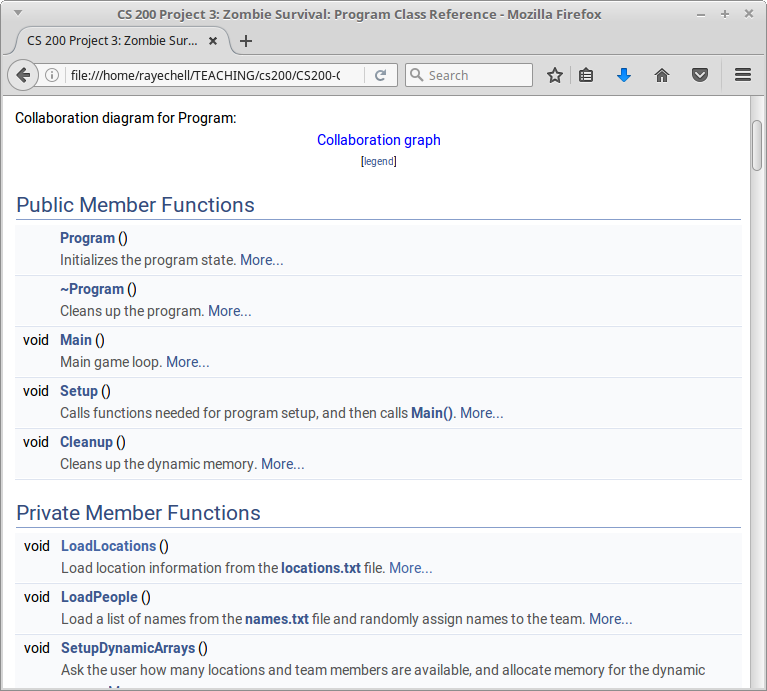
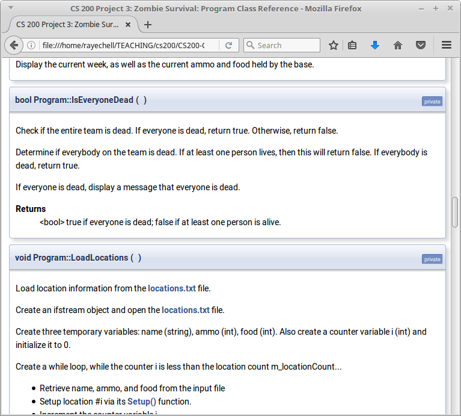
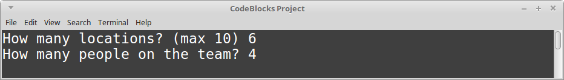
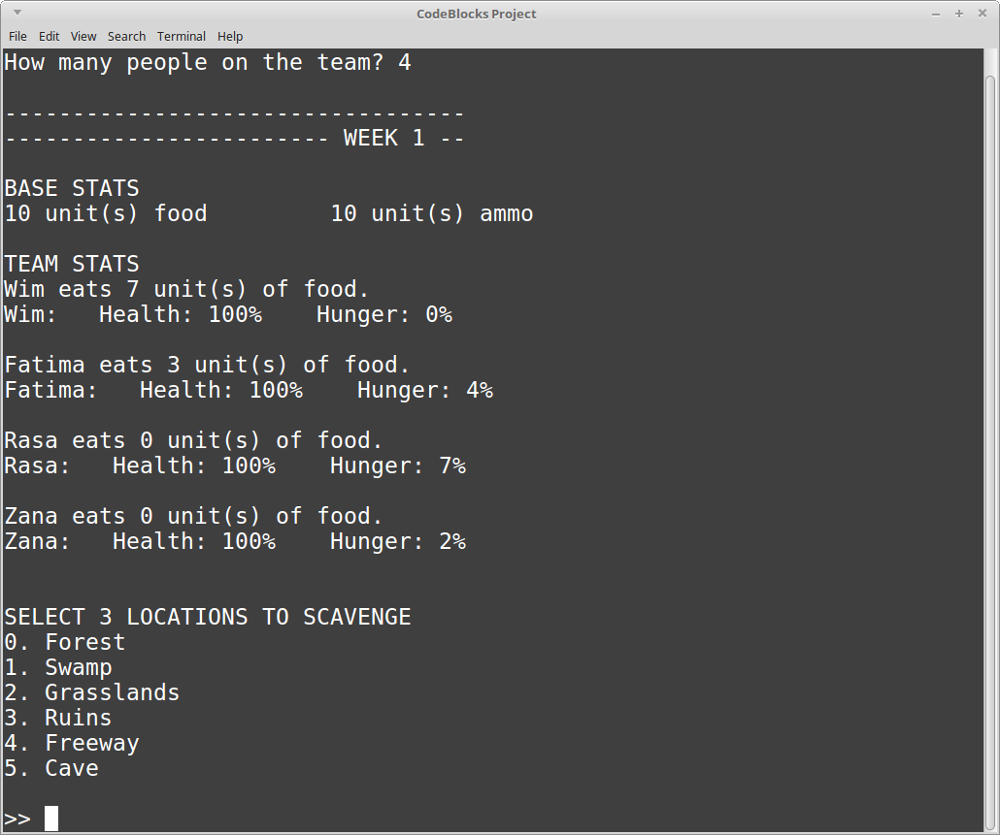
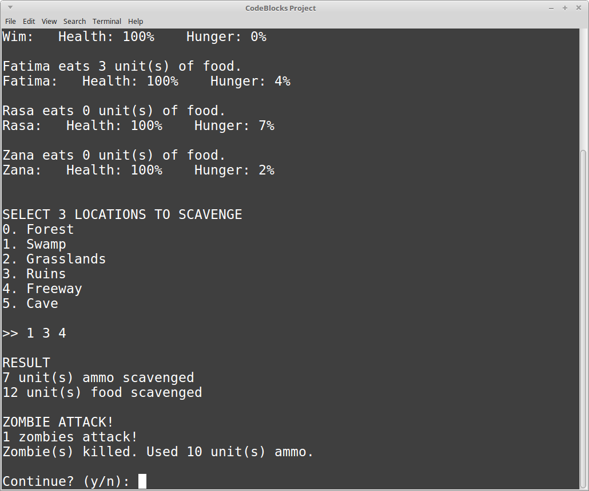
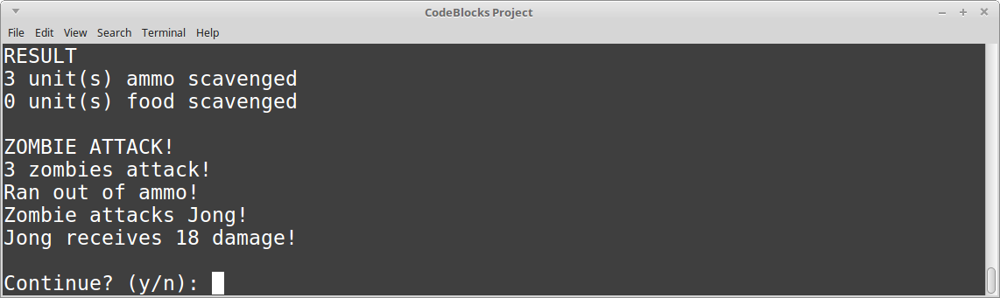

# Homework Project 4: Zombie Survival

## Downloads

Download the **starter project**. This folder contains the code, as well as a Visual Studio project and a Code::Blocks project.

Extract the zip file somewhere to your hard drive.

**To open in Visual Studio**

Open the following file:

	project files/Visual Studio Project/Visual Studio Project.sln

This is marked as "Microsoft Visual Studio Solution" in Windows.

**To open in Code::Blocks**

Open the following file:

	project files/CodeBlocks Project/CodeBlocks Project.cbp

This is marked as "CBP File" in Windows.

## Rules

* Open book / Open note:

	* Do research for this assignment as-needed. Use your textbook, the web, class example code, etc.
 
* Solo work:

	* This is a solo assignment and you should be working on this alone. This means...:
	
    	* ✓ You can verbally brainstorm with others to discuss the problem and techniques for problem solving.
    	* ✓ Your work must be your own work.
    	* ✓ Email the instructor, or ask in the Slack channel, if you are stuck or need clarification on the instructions.
    	* ✗ You cannot give your code to somebody else for them to "verify their work" with (more often than not they just copy it, and then you both get 0%!)
    	* ✗ You cannot copy another student's work. I will use a diff tool to compare student assignments (and code online). If there is obvious copying, all people involved will receive a 0%.

## Turn in

When you're ready to turn in your work, zip up **your entire folder**
and turn in all the source code, VS solution, and text files to D2L.

On GitHub, you can upload just the cpp and hpp files.

### General turn in information

**You will need to upload your code both to the class D2L Dropbox, and to your CS 200 GitHub repository!**

Locate your source files for this project. They should have the extentions .cpp, .hpp, and/or .h. In Windows, they are labelled as "C++ source file" and/or "Header file". 

**These are the only files you need** - You do not need to upload any Visual Studio files.

Upload these source files to your GitHub repository and to the Dropbox.

## Reference Information

* [How to turn in your source code](https://github.com/Rachels-Courses/Course-Common-Files/blob/master/How-to/Turning%20in%20source%20code.md)
* [Visual Studio - How to create a new project](https://github.com/Rachels-Courses/Course-Common-Files/blob/master/How-to/New%20project%20-%20Visual%20Studio.md)
* [Common programming errors](https://github.com/Rachels-Courses/Course-Common-Files/blob/master/Review/Common-errors.md)

---

# Instructions

The source code here has been documented with doxygen comments.

Included in the zip folder is a **docs/** folder which contains the documentation
for each function that you will be working on for this project.

Go to **docs/html/index.html** to get started. Go to **Classes** and it will
contain a list of all classes: Base, Location, Person, and Program.

Clicking on one of these will give you a list of the functions with a quick
summary. Click on a specific function to get more detailed documentation.

---

# Sample output 

Game begins - Setting the amount of locations and people on team

Weekly menu - Base stats, team stats, places to scavenge

After scavenging - Zombie attack (zombie killed)

After scavenging - Zombie attack (zombies hurt team)

---

# Grading rubric

<table border="0" cellspacing="0" cellpadding="0" class="ta1"><colgroup><col width="71"/><col width="320"/><col width="74"/><col width="118"/><col width="88"/><col width="424"/></colgroup><tr class="ro1"><td style="text-align:left;width:45.75pt; " class="ce1">
Assignment: Project 4: Zombie Survival
</td><td style="text-align:left;width:207.64pt; " class="ce1"> </td><td style="text-align:left;width:48.1pt; " class="ce1"> </td><td style="text-align:left;width:76.39pt; " class="ce1"> </td><td colspan="2" style="text-align:left;width:57.09pt; " class="ce22">
Grading breakdown
</td></tr><tr class="ro1"><td style="text-align:left;width:45.75pt; " class="ce1">
Student name:
</td><td style="text-align:left;width:207.64pt; " class="ce1"> </td><td style="text-align:left;width:48.1pt; " class="ce1"> </td><td style="text-align:left;width:76.39pt; " class="ce1"> </td><td style="text-align:left;width:57.09pt; " class="ce23"> </td><td style="text-align:left;width:274.79pt; " class="ce23">
Spring 2017
</td></tr><tr class="ro1"><td style="text-align:left;width:45.75pt; " class="Default"> </td><td style="text-align:left;width:207.64pt; " class="Default"> </td><td style="text-align:left;width:48.1pt; " class="Default"> </td><td style="text-align:left;width:76.39pt; " class="Default"> </td><td style="text-align:left;width:57.09pt; " class="Default"> </td><td style="text-align:left;width:274.79pt; " class="Default"> </td></tr><tr class="ro1"><td colspan="3" style="text-align:left;width:45.75pt; " class="ce2">
Grade key (each item out of 5 points)
</td><td style="text-align:left;width:76.39pt; " class="ce18"> </td><td style="text-align:left;width:57.09pt; " class="ce8"> </td><td style="text-align:left;width:274.79pt; " class="ce8"> </td></tr><tr class="ro1"><td style="text-align:right; width:45.75pt; " class="ce3">
0
</td><td style="text-align:left;width:207.64pt; " class="ce9">
Nothing attempted
</td><td style="text-align:right; width:48.1pt; " class="ce13">
0.00%
</td><td style="text-align:left;width:76.39pt; " class="ce19"> </td><td style="text-align:left;width:57.09pt; " class="Default"> </td><td style="text-align:left;width:274.79pt; " class="Default"> </td></tr><tr class="ro1"><td style="text-align:right; width:45.75pt; " class="ce3">
1
</td><td style="text-align:left;width:207.64pt; " class="ce9">
Something attempted, but wrong
</td><td style="text-align:right; width:48.1pt; " class="ce13">
20.00%
</td><td style="text-align:left;width:76.39pt; " class="Default"> </td><td style="text-align:left;width:57.09pt; " class="Default"> </td><td style="text-align:left;width:274.79pt; " class="Default"> </td></tr><tr class="ro1"><td style="text-align:right; width:45.75pt; " class="ce3">
2
</td><td style="text-align:left;width:207.64pt; " class="ce9">
Incorrect, with a few good items
</td><td style="text-align:right; width:48.1pt; " class="ce13">
40.00%
</td><td style="text-align:left;width:76.39pt; " class="Default"> </td><td style="text-align:left;width:57.09pt; " class="Default"> </td><td style="text-align:left;width:274.79pt; " class="Default"> </td></tr><tr class="ro1"><td style="text-align:right; width:45.75pt; " class="ce3">
3
</td><td style="text-align:left;width:207.64pt; " class="ce9">
Almost correct, a few errors
</td><td style="text-align:right; width:48.1pt; " class="ce13">
60.00%
</td><td style="text-align:left;width:76.39pt; " class="Default"> </td><td style="text-align:left;width:57.09pt; " class="Default"> </td><td style="text-align:left;width:274.79pt; " class="Default"> </td></tr><tr class="ro1"><td style="text-align:right; width:45.75pt; " class="ce3">
4
</td><td style="text-align:left;width:207.64pt; " class="ce9">
Mostly correct, 1 or 2 small errors
</td><td style="text-align:right; width:48.1pt; " class="ce13">
80.00%
</td><td style="text-align:left;width:76.39pt; " class="Default"> </td><td style="text-align:left;width:57.09pt; " class="Default"> </td><td style="text-align:left;width:274.79pt; " class="Default"> </td></tr><tr class="ro1"><td style="text-align:right; width:45.75pt; " class="ce3">
5
</td><td style="text-align:left;width:207.64pt; " class="ce9">
Completely perfect
</td><td style="text-align:right; width:48.1pt; " class="ce13">
100.00%
</td><td style="text-align:left;width:76.39pt; " class="Default"> </td><td style="text-align:left;width:57.09pt; " class="Default"> </td><td style="text-align:left;width:274.79pt; " class="Default"> </td></tr><tr class="ro1"><td style="text-align:left;width:45.75pt; " class="Default"> </td><td style="text-align:left;width:207.64pt; " class="Default"> </td><td style="text-align:left;width:48.1pt; " class="Default"> </td><td style="text-align:left;width:76.39pt; " class="Default"> </td><td style="text-align:left;width:57.09pt; " class="Default"> </td><td style="text-align:left;width:274.79pt; " class="Default"> </td></tr><tr class="ro1"><td style="text-align:left;width:45.75pt; " class="Default"> </td><td style="text-align:left;width:207.64pt; " class="Default"> </td><td style="text-align:left;width:48.1pt; " class="Default"> </td><td style="text-align:left;width:76.39pt; " class="Default"> </td><td style="text-align:left;width:57.09pt; " class="Default"> </td><td style="text-align:left;width:274.79pt; " class="Default"> </td></tr><tr class="ro1"><td style="text-align:left;width:45.75pt; " class="ce4">
Breakdown
</td><td style="text-align:left;width:207.64pt; " class="ce4"> </td><td style="text-align:left;width:48.1pt; " class="ce4"> </td><td style="text-align:left;width:76.39pt; " class="ce4"> </td><td style="text-align:left;width:57.09pt; " class="ce4"> </td><td style="text-align:left;width:274.79pt; " class="ce4"> </td></tr><tr class="ro1"><td style="text-align:left;width:45.75pt; " class="Default"> </td><td style="text-align:left;width:207.64pt; " class="ce10">
Item
</td><td style="text-align:left;width:48.1pt; " class="ce14">
Score
</td><td style="text-align:left;width:76.39pt; " class="ce14">
Item weight %
</td><td style="text-align:left;width:57.09pt; " class="ce24">
Result
</td><td style="text-align:left;width:274.79pt; " class="ce10">
Notes
</td></tr><tr class="ro1"><td style="text-align:left;width:45.75pt; " class="ce5">
Basics
</td><td style="text-align:left;width:207.64pt; " class="ce11">
No syntax errors (it builds)
</td><td style="text-align:right; width:48.1pt; " class="ce15">
0
</td><td style="text-align:right; width:76.39pt; " class="ce20">
10.00%
</td><td style="text-align:right; width:57.09pt; " class="ce25">
0.00%
</td><td style="text-align:left;width:274.79pt; " class="ce28"> </td></tr><tr class="ro1"><td style="text-align:left;width:45.75pt; " class="ce6"> </td><td style="text-align:left;width:207.64pt; " class="ce11">
No logic errors (works as specified)
</td><td style="text-align:right; width:48.1pt; " class="ce15">
0
</td><td style="text-align:right; width:76.39pt; " class="ce20">
10.00%
</td><td style="text-align:right; width:57.09pt; " class="ce25">
0.00%
</td><td style="text-align:left;width:274.79pt; " class="ce28"> </td></tr><tr class="ro1"><td style="text-align:left;width:45.75pt; " class="ce6"> </td><td style="text-align:left;width:207.64pt; " class="ce11">
No run-time errors (doesn’t crash)
</td><td style="text-align:right; width:48.1pt; " class="ce15">
0
</td><td style="text-align:right; width:76.39pt; " class="ce20">
10.00%
</td><td style="text-align:right; width:57.09pt; " class="ce25">
0.00%
</td><td style="text-align:left;width:274.79pt; " class="ce28"> </td></tr><tr class="ro2"><td style="text-align:left;width:45.75pt; " class="ce6"> </td><td style="text-align:left;width:207.64pt; " class="ce11">
Clean code - consistent indentation, good variable/function/class names
</td><td style="text-align:right; width:48.1pt; " class="ce15">
0
</td><td style="text-align:right; width:76.39pt; " class="ce20">
2.00%
</td><td style="text-align:right; width:57.09pt; " class="ce25">
0.00%
</td><td style="text-align:left;width:274.79pt; " class="ce28"> </td></tr><tr class="ro1"><td style="text-align:left;width:45.75pt; " class="ce6"> </td><td style="text-align:left;width:207.64pt; " class="ce11">
No memory errors
</td><td style="text-align:right; width:48.1pt; " class="ce15">
0
</td><td style="text-align:right; width:76.39pt; " class="ce20">
5.00%
</td><td style="text-align:right; width:57.09pt; " class="ce25">
0.00%
</td><td style="text-align:left;width:274.79pt; " class="ce28"> </td></tr><tr class="ro1"><td style="text-align:left;width:45.75pt; " class="ce5">
Project
</td><td style="text-align:left;width:207.64pt; " class="ce11">
Base – Constructor
</td><td style="text-align:right; width:48.1pt; " class="ce15">
0
</td><td style="text-align:right; width:76.39pt; " class="ce20">
1.00%
</td><td style="text-align:right; width:57.09pt; " class="ce25">
0.00%
</td><td style="text-align:left;width:274.79pt; " class="ce28"> </td></tr><tr class="ro1"><td style="text-align:left;width:45.75pt; " class="ce5">
specific
</td><td style="text-align:left;width:207.64pt; " class="ce11">
Base – GetAmmo, GetFood
</td><td style="text-align:right; width:48.1pt; " class="ce15">
0
</td><td style="text-align:right; width:76.39pt; " class="ce20">
1.00%
</td><td style="text-align:right; width:57.09pt; " class="ce25">
0.00%
</td><td style="text-align:left;width:274.79pt; " class="ce28"> </td></tr><tr class="ro1"><td style="text-align:left;width:45.75pt; " class="ce6"> </td><td style="text-align:left;width:207.64pt; " class="ce11">
Base – TakeFood 
</td><td style="text-align:right; width:48.1pt; " class="ce15">
0
</td><td style="text-align:right; width:76.39pt; " class="ce20">
2.00%
</td><td style="text-align:right; width:57.09pt; " class="ce25">
0.00%
</td><td style="text-align:left;width:274.79pt; " class="ce28"> </td></tr><tr class="ro2"><td style="text-align:left;width:45.75pt; " class="ce6"> </td><td style="text-align:left;width:207.64pt; " class="ce11">
Base – SetAmmo, AddAmmo, AddFood, SubtractAmmo, SubtractFood
</td><td style="text-align:right; width:48.1pt; " class="ce15">
0
</td><td style="text-align:right; width:76.39pt; " class="ce20">
1.00%
</td><td style="text-align:right; width:57.09pt; " class="ce25">
0.00%
</td><td style="text-align:left;width:274.79pt; " class="ce28"> </td></tr><tr class="ro1"><td style="text-align:left;width:45.75pt; " class="ce6"> </td><td style="text-align:left;width:207.64pt; " class="ce11">
Location – Setup
</td><td style="text-align:right; width:48.1pt; " class="ce15">
0
</td><td style="text-align:right; width:76.39pt; " class="ce20">
1.00%
</td><td style="text-align:right; width:57.09pt; " class="ce25">
0.00%
</td><td style="text-align:left;width:274.79pt; " class="ce28"> </td></tr><tr class="ro1"><td style="text-align:left;width:45.75pt; " class="ce6"> </td><td style="text-align:left;width:207.64pt; " class="ce11">
Location – GetName, GetAmmo, GetFood
</td><td style="text-align:right; width:48.1pt; " class="ce15">
0
</td><td style="text-align:right; width:76.39pt; " class="ce20">
1.00%
</td><td style="text-align:right; width:57.09pt; " class="ce25">
0.00%
</td><td style="text-align:left;width:274.79pt; " class="ce28"> </td></tr><tr class="ro1"><td style="text-align:left;width:45.75pt; " class="ce6"> </td><td style="text-align:left;width:207.64pt; " class="ce11">
Person – Setup
</td><td style="text-align:right; width:48.1pt; " class="ce15">
0
</td><td style="text-align:right; width:76.39pt; " class="ce20">
1.00%
</td><td style="text-align:right; width:57.09pt; " class="ce25">
0.00%
</td><td style="text-align:left;width:274.79pt; " class="ce28"> </td></tr><tr class="ro1"><td style="text-align:left;width:45.75pt; " class="ce6"> </td><td style="text-align:left;width:207.64pt; " class="ce11">
Person – Update
</td><td style="text-align:right; width:48.1pt; " class="ce15">
0
</td><td style="text-align:right; width:76.39pt; " class="ce20">
2.00%
</td><td style="text-align:right; width:57.09pt; " class="ce25">
0.00%
</td><td style="text-align:left;width:274.79pt; " class="ce28"> </td></tr><tr class="ro1"><td style="text-align:left;width:45.75pt; " class="ce6"> </td><td style="text-align:left;width:207.64pt; " class="ce11">
Person – DisplayStats
</td><td style="text-align:right; width:48.1pt; " class="ce15">
0
</td><td style="text-align:right; width:76.39pt; " class="ce20">
1.00%
</td><td style="text-align:right; width:57.09pt; " class="ce25">
0.00%
</td><td style="text-align:left;width:274.79pt; " class="ce28"> </td></tr><tr class="ro1"><td style="text-align:left;width:45.75pt; " class="ce6"> </td><td style="text-align:left;width:207.64pt; " class="ce11">
Person – IsDead, GetName, GetHunger
</td><td style="text-align:right; width:48.1pt; " class="ce15">
0
</td><td style="text-align:right; width:76.39pt; " class="ce20">
1.00%
</td><td style="text-align:right; width:57.09pt; " class="ce25">
0.00%
</td><td style="text-align:left;width:274.79pt; " class="ce28"> </td></tr><tr class="ro1"><td style="text-align:left;width:45.75pt; " class="ce6"> </td><td style="text-align:left;width:207.64pt; " class="ce11">
Person – Hurt
</td><td style="text-align:right; width:48.1pt; " class="ce15">
0
</td><td style="text-align:right; width:76.39pt; " class="ce20">
2.00%
</td><td style="text-align:right; width:57.09pt; " class="ce25">
0.00%
</td><td style="text-align:left;width:274.79pt; " class="ce28"> </td></tr><tr class="ro1"><td style="text-align:left;width:45.75pt; " class="ce6"> </td><td style="text-align:left;width:207.64pt; " class="ce11">
Person – Eat
</td><td style="text-align:right; width:48.1pt; " class="ce15">
0
</td><td style="text-align:right; width:76.39pt; " class="ce20">
2.00%
</td><td style="text-align:right; width:57.09pt; " class="ce25">
0.00%
</td><td style="text-align:left;width:274.79pt; " class="ce28"> </td></tr><tr class="ro1"><td style="text-align:left;width:45.75pt; " class="ce6"> </td><td style="text-align:left;width:207.64pt; " class="ce11">
Program – Constructor
</td><td style="text-align:right; width:48.1pt; " class="ce15">
0
</td><td style="text-align:right; width:76.39pt; " class="ce20">
2.00%
</td><td style="text-align:right; width:57.09pt; " class="ce25">
0.00%
</td><td style="text-align:left;width:274.79pt; " class="ce28"> </td></tr><tr class="ro1"><td style="text-align:left;width:45.75pt; " class="ce6"> </td><td style="text-align:left;width:207.64pt; " class="ce11">
Program – Destructor
</td><td style="text-align:right; width:48.1pt; " class="ce15">
0
</td><td style="text-align:right; width:76.39pt; " class="ce20">
1.00%
</td><td style="text-align:right; width:57.09pt; " class="ce25">
0.00%
</td><td style="text-align:left;width:274.79pt; " class="ce28"> </td></tr><tr class="ro1"><td style="text-align:left;width:45.75pt; " class="ce6"> </td><td style="text-align:left;width:207.64pt; " class="ce11">
Program – Setup
</td><td style="text-align:right; width:48.1pt; " class="ce15">
0
</td><td style="text-align:right; width:76.39pt; " class="ce20">
1.00%
</td><td style="text-align:right; width:57.09pt; " class="ce25">
0.00%
</td><td style="text-align:left;width:274.79pt; " class="ce28"> </td></tr><tr class="ro1"><td style="text-align:left;width:45.75pt; " class="ce6"> </td><td style="text-align:left;width:207.64pt; " class="ce11">
Program – Cleanup
</td><td style="text-align:right; width:48.1pt; " class="ce15">
0
</td><td style="text-align:right; width:76.39pt; " class="ce20">
5.00%
</td><td style="text-align:right; width:57.09pt; " class="ce25">
0.00%
</td><td style="text-align:left;width:274.79pt; " class="ce28"> </td></tr><tr class="ro1"><td style="text-align:left;width:45.75pt; " class="ce6"> </td><td style="text-align:left;width:207.64pt; " class="ce11">
Program – Main
</td><td style="text-align:right; width:48.1pt; " class="ce15">
0
</td><td style="text-align:right; width:76.39pt; " class="ce20">
2.00%
</td><td style="text-align:right; width:57.09pt; " class="ce25">
0.00%
</td><td style="text-align:left;width:274.79pt; " class="ce28"> </td></tr><tr class="ro1"><td style="text-align:left;width:45.75pt; " class="ce6"> </td><td style="text-align:left;width:207.64pt; " class="ce11">
Program – DisplayWeeklyStats
</td><td style="text-align:right; width:48.1pt; " class="ce15">
0
</td><td style="text-align:right; width:76.39pt; " class="ce20">
2.00%
</td><td style="text-align:right; width:57.09pt; " class="ce25">
0.00%
</td><td style="text-align:left;width:274.79pt; " class="ce28"> </td></tr><tr class="ro1"><td style="text-align:left;width:45.75pt; " class="ce6"> </td><td style="text-align:left;width:207.64pt; " class="ce11">
Program – UpdateTeam
</td><td style="text-align:right; width:48.1pt; " class="ce15">
0
</td><td style="text-align:right; width:76.39pt; " class="ce20">
5.00%
</td><td style="text-align:right; width:57.09pt; " class="ce25">
0.00%
</td><td style="text-align:left;width:274.79pt; " class="ce28"> </td></tr><tr class="ro1"><td style="text-align:left;width:45.75pt; " class="ce6"> </td><td style="text-align:left;width:207.64pt; " class="ce11">
Program – ScavengePhase
</td><td style="text-align:right; width:48.1pt; " class="ce15">
0
</td><td style="text-align:right; width:76.39pt; " class="ce20">
5.00%
</td><td style="text-align:right; width:57.09pt; " class="ce25">
0.00%
</td><td style="text-align:left;width:274.79pt; " class="ce28"> </td></tr><tr class="ro1"><td style="text-align:left;width:45.75pt; " class="ce6"> </td><td style="text-align:left;width:207.64pt; " class="ce11">
Program – ZombiePhase
</td><td style="text-align:right; width:48.1pt; " class="ce15">
0
</td><td style="text-align:right; width:76.39pt; " class="ce20">
5.00%
</td><td style="text-align:right; width:57.09pt; " class="ce25">
0.00%
</td><td style="text-align:left;width:274.79pt; " class="ce28"> </td></tr><tr class="ro1"><td style="text-align:left;width:45.75pt; " class="ce6"> </td><td style="text-align:left;width:207.64pt; " class="ce11">
Program – IsEveryoneDead
</td><td style="text-align:right; width:48.1pt; " class="ce15">
0
</td><td style="text-align:right; width:76.39pt; " class="ce20">
2.00%
</td><td style="text-align:right; width:57.09pt; " class="ce25">
0.00%
</td><td style="text-align:left;width:274.79pt; " class="ce28"> </td></tr><tr class="ro1"><td style="text-align:left;width:45.75pt; " class="ce6"> </td><td style="text-align:left;width:207.64pt; " class="ce11">
Program – DisplaySummary
</td><td style="text-align:right; width:48.1pt; " class="ce15">
0
</td><td style="text-align:right; width:76.39pt; " class="ce20">
1.00%
</td><td style="text-align:right; width:57.09pt; " class="ce25">
0.00%
</td><td style="text-align:left;width:274.79pt; " class="ce28"> </td></tr><tr class="ro1"><td style="text-align:left;width:45.75pt; " class="ce6"> </td><td style="text-align:left;width:207.64pt; " class="ce11">
Program – RoundPause
</td><td style="text-align:right; width:48.1pt; " class="ce15">
0
</td><td style="text-align:right; width:76.39pt; " class="ce20">
1.00%
</td><td style="text-align:right; width:57.09pt; " class="ce25">
0.00%
</td><td style="text-align:left;width:274.79pt; " class="ce28"> </td></tr><tr class="ro1"><td style="text-align:left;width:45.75pt; " class="ce6"> </td><td style="text-align:left;width:207.64pt; " class="ce11">
Program – LoadLocations
</td><td style="text-align:right; width:48.1pt; " class="ce15">
0
</td><td style="text-align:right; width:76.39pt; " class="ce20">
5.00%
</td><td style="text-align:right; width:57.09pt; " class="ce25">
0.00%
</td><td style="text-align:left;width:274.79pt; " class="ce28"> </td></tr><tr class="ro1"><td style="text-align:left;width:45.75pt; " class="ce6"> </td><td style="text-align:left;width:207.64pt; " class="ce11">
Program – LoadPeople
</td><td style="text-align:right; width:48.1pt; " class="ce15">
0
</td><td style="text-align:right; width:76.39pt; " class="ce20">
5.00%
</td><td style="text-align:right; width:57.09pt; " class="ce25">
0.00%
</td><td style="text-align:left;width:274.79pt; " class="ce28"> </td></tr><tr class="ro1"><td style="text-align:left;width:45.75pt; " class="ce6"> </td><td style="text-align:left;width:207.64pt; " class="ce11">
Program – SetupDynamicArrays
</td><td style="text-align:right; width:48.1pt; " class="ce15">
0
</td><td style="text-align:right; width:76.39pt; " class="ce20">
5.00%
</td><td style="text-align:right; width:57.09pt; " class="ce25">
0.00%
</td><td style="text-align:left;width:274.79pt; " class="ce28"> </td></tr><tr class="ro1"><td style="text-align:left;width:45.75pt; " class="ce6"> </td><td style="text-align:left;width:207.64pt; " class="ce11"> </td><td style="text-align:left;width:48.1pt; " class="ce15"> </td><td style="text-align:left;width:76.39pt; " class="ce20"> </td><td style="text-align:left;width:57.09pt; " class="ce25"> </td><td style="text-align:left;width:274.79pt; " class="ce28"> </td></tr><tr class="ro1"><td style="text-align:left;width:45.75pt; " class="ce6"> </td><td style="text-align:left;width:207.64pt; " class="ce6"> </td><td style="text-align:left;width:48.1pt; " class="ce16"> </td><td style="text-align:left;width:76.39pt; " class="ce16"> </td><td style="text-align:left;width:57.09pt; " class="ce26"> </td><td style="text-align:left;width:274.79pt; " class="ce6"> </td></tr><tr class="ro1"><td style="text-align:left;width:45.75pt; " class="ce7">
Totals
</td><td style="text-align:left;width:207.64pt; " class="ce12"> </td><td style="text-align:left;width:48.1pt; " class="ce17"> </td><td style="text-align:right; width:76.39pt; " class="ce21">
100.00%
</td><td colspan="2" style="text-align:right; width:57.09pt; " class="ce27">
0.00%
</td></tr><tr class="ro1"><td style="text-align:left;width:45.75pt; " class="Default"> </td><td style="text-align:left;width:207.64pt; " class="Default"> </td><td style="text-align:left;width:48.1pt; " class="ce3"> </td><td style="text-align:left;width:76.39pt; " class="ce3"> </td><td style="text-align:left;width:57.09pt; " class="ce3"> </td><td style="text-align:left;width:274.79pt; " class="Default"> </td></tr><tr class="ro1"><td style="text-align:left;width:45.75pt; " class="ce4">
Additional notes
</td><td style="text-align:left;width:207.64pt; " class="ce4"> </td><td style="text-align:left;width:48.1pt; " class="ce4"> </td><td style="text-align:left;width:76.39pt; " class="ce4"> </td><td style="text-align:left;width:57.09pt; " class="ce4"> </td><td style="text-align:left;width:274.79pt; " class="ce4"> </td></tr></table>
