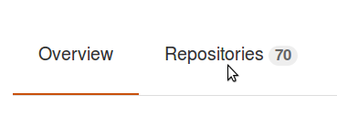
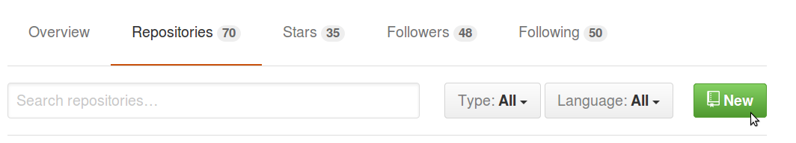
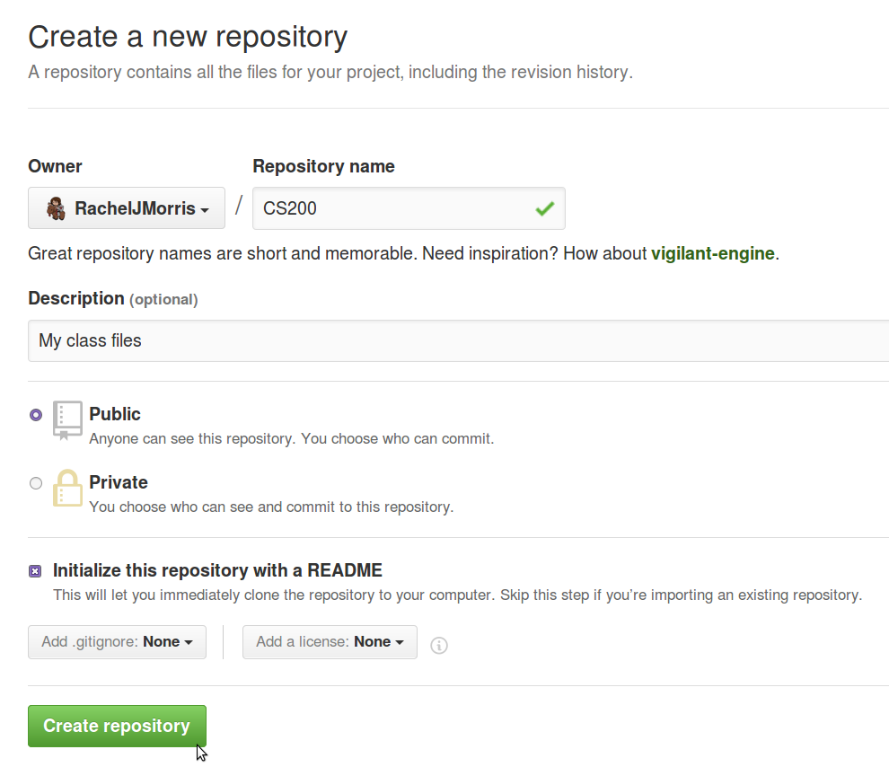
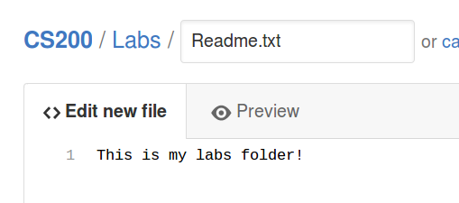
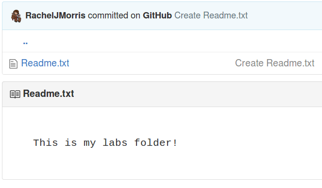
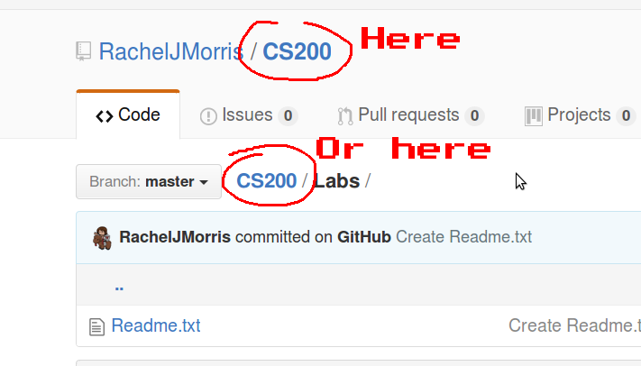
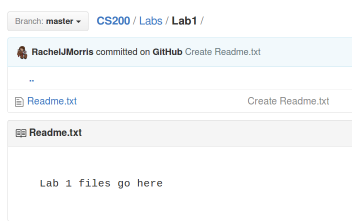
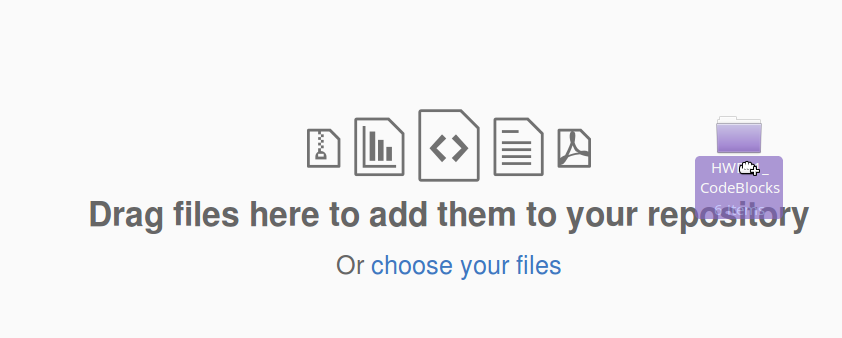
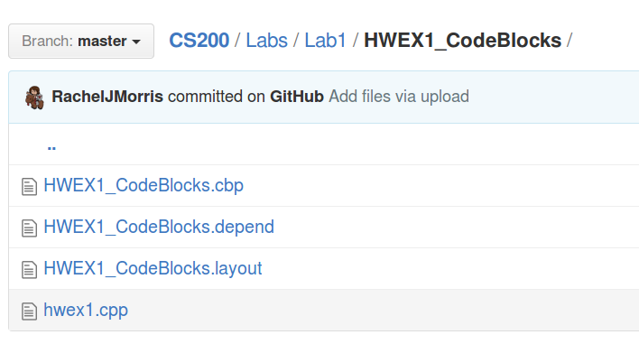

# In-class Lab 1: Intro to GitHub and C++

## Downloads

No downloads

## Rules

* Finishing the lab after class:
   * If you are not able to complete the lab during the class period, please finish it up outside of class and turn it in as soon as you can. The lab dropbox will be open for 1 week after the class session.

* Group work:
   * You may work with other students on labs:
   * All people working together must turn in code in their own dropboxes, and upload the code to their own GitHub repositories.
   * All group work must be noted as such - either put a comment in the code file or in the dropbox upload.
   * If you turn in duplicate works without noting that you worked together, you may get a 0% grade.
   
## Turn in

To complete this assignment, create a **text file** called "lab1.txt". Within this lab file, write in your name and the URL to your CS 200 repository. Then, upload your text file to the D2L dropbox.

---

## What is GitHub?

GitHub is a source code hosting service. It *can* be used along with the [Git](https://git-scm.com/) software program on your dekstop to maintain and update your source code, but we will not be using the desktop program for this class - just the web interface.

Through the web interface, you can **create files and folders**, as well as **view your code's history** (if you go back and update the same file multiple times). You can also use GitHub to **collaborate with others**.

### Grading via GitHub

You should keep your GitHub repository up-to-date. Any time you turn in a programming assignment, your code should be [uploaded to the D2L Dropbox as well as to GitHub](https://github.com/Rachels-Courses/Course-Common-Files/blob/master/How-to/Turning%20in%20source%20code.md).

By uploading your code to GitHub, it makes it easier for your instructor to quickly pull down all your latest code for grading.
  
---

## Project 1: Creating a GitHub account

First, you will register an account on GitHub.
Accounts and using the service is free, so long as your code is
available publicly. (It costs to privately host code on GH).

Go to [GitHub.com](https://github.com/) and register your account.

Create a username (this can be anything) and set an email address.
You can change both of these later on.

Make sure to choose the free plan.

Confirm your email address and we should be ready to go!

## Project 2: Create a repository for class

Now you will create an original repository in your own profile. You will use this repository
to store your class projects during the semester.

Go to your profile page on GitHub. It will be something like github.com/YOURUSERNAME.

Click on the **Repositories** tab.

Then, click on the green **New** button.

### Creating the repository

**MAKE SURE YOU SELECT INITIALIZE WITH README BEFORE CREATING THE REPOSITORY!**

Set up the following information in the repository:

1. **Repository name** - CS200 or something similar
2. **Description** - Optional
3. **Public**
4. **Initialize this repository with a README**

After you're done, click **Create repository**.

It will open the repo, and it will just have one file in it.

### Adding folders and files

Normally, we would use the **Git** program on our desktop to work with our repository
on our local machine. However, we're keeping it simple at first, so we are just using 
the web interface.

Creating folders within the repository is kind of a "hidden feature",
but it is good to utilize folders to keep everything separate and organized.

Let's go ahead and create a folder for your CS 200 labs.

Click on **Create new file**.

In the **Name your file...** textbox, you can enter a file name -
but you can also specify a folder before your filename.

Type in

    Labs/Readme.txt
    
When you hit the slash button / , it will automatically turn **Labs** into a folder.

The readme we're creating really is just a placeholder; Git won't store
empty folders, so we have to put a readme in it so that the folder sticks around.

At the bottom of the page, click **Commit new file**.

After you commit, whatever you typed into your readme will be displayed when
you go into your Labs folder:

You can go into **Readme.txt** and edit it if you want to use this as a place
for notes or something.

### Add folders for all assignment types

To go back to the root directory of your repository, click on the repository name.

Now, follow the previous steps to make folders for **Exercises** and **Projects** as well.

### Upload files

You can also use the web interface to upload files as well. Let's try it out
by uploading the code we did earlier into the **Labs** folder.

Click on **Labs**, and create a folder for **Lab1**:

Then, click on the **Upload files** button:

There will be a big gray box to drag your files to. You can either upload
files individually, or move the whole folder over.

It will display a list of all the files it wants to add, and you can remove
any unneeded files.

For example, you will never need these in a repository:

* .o files
* .exe files
* anything in a bin, Debug, or Release folder

Go ahead and use "x" to remove those.

Then click **Commit changes** to finish the upload.

If you dragged a folder over, it will create that folder in the repository as well.

### Add your instructor as a collaborator

In case you need help organizing or fixing a file in your repository, you should add the instructor as a collaborator. Do the following:

* In your CS 200 repository's main page, click on **Settings**.
* Select **Collaborators & teams** 
* Under the **Collaborators** section, add your instructor's username. (Mine is RachelJMorris)
