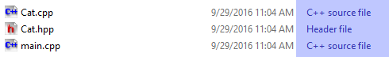

# CS 200 Lab 10: Arrays

## Chrome!

Please read this in chrome so that the solutions are collapsed by default!

## Topics

* Arrays
* For-loops

## Turn in

**You will need to upload your code both to the class D2L Dropbox, and to your CS 200 GitHub repository!**

Locate your source files for this project. They should have the extentions .cpp, .hpp, and/or .h. In Windows, they are labelled as "C++ source file" and/or "Header file". 

**These are the only files you need** - You do not need to upload any Visual Studio files.

Upload these source files to your GitHub repository and to the Dropbox.

See also: 
[TURNING IN SOURCE CODE instructions](https://github.com/Rachels-Courses/Course-Common-Files/blob/master/How-to/Turning%20in%20source%20code.md)

## Rules

* Finishing the lab after class:
   * If you are not able to complete the lab during the class period, please finish it up outside of class and turn it in as soon as you can. The lab dropbox will be open for 1 week after the class session.

* Group work:
   * You may work with other students on labs:
   * All people working together must turn in code in their own dropboxes, and upload the code to their own GitHub repositories.
   * All group work must be noted as such - either put a comment in the code file or in the dropbox upload.
   * If you turn in duplicate works without noting that you worked together, you may get a 0% grade.

---

## Part 1: Arrays

An array is a list of items - it can be any data-type, but an array must only contain one data-type (e.g., an array of ints can only contain ints).

An array has **elements**, where each element is essentially a single variable of the specified data-type.

Each **element** has a position in the array, otherwise known as an **index**.

The first element of the array is at position 0.

If an array is of size *n*, then the last element of the array is at position *n-1*.

So if we **declare** an array of 3 prices:

	float prices[3];

we have 3 prices, so we will have access to elements:

	prices[0] = 9.99;
	prices[1] = 8.99;
	prices[2] = 6.99;

But **prices[3]** is **NOT VALID**! If the size of your array is 3 and you try to access index 3, your program will crash - and this is a pretty common mistake! Keep an eye out!

These *static* arrays cannot be resized, either, so we need to know
what their size will be when we're writing the code. (There are *data structures* that exist to alleviate this problem further down the road!)

---

### Practice A. Create an array of names

1. Declare an array. Its data type is **string**, the name of the variable is **names**, and it is of size 5.
2. Assign the first element of the array (at index 0) the value of "Xia".
3. Assign the second element of the array (at index 1) the value of "Shang".
3. Assign the third element of the array (at index 2) the value of "Zhou".
3. Assign the fourth element of the array (at index 3) the value of "Qin".
3. Assign the fifth element of the array (at index 4) the value of "Han".
1. After assigning all of these elements, display every element to the screen with cout.

Sample Output:

	Xia
	Shang
	Zhou
	Qin
	Han

	
<strong>
		Program solution
	</strong>

	#include <iostream>
	#include <string>
	using namespace std;
	
	int main()
	{
		string names[5];
		names[0] = "Xia";
		names[1] = "Shang";
		names[2] = "Zhou";
		names[3] = "Qin";
		names[4] = "Han";
	
		cout << names[0] << endl
			<< names[1] << endl
			<< names[2] << endl
			<< names[3] << endl
			<< names[4] << endl;
	
		return 0;
	}

### Note: Keeping track of the array size

C++ doesn't automatically keep track of how many elements are in the array, so we will have to keep track of the size ourselves with an integer variable.

We can also use a variable to get an element of the list, rather than using hard-coded numbers like names[0], names[1]. If a variable is an integer, we can access a specific element of the list like: **names[varName]**.

	int current = 2;
	cout << names[ current ] << endl;
	// This displays item at index 2.

### Practice B. Keeping track of the amount of items in the list

---

Modify 1A to do the following:

1. Erase the cout with all the elements - we are going to do this with a loop.
2. Create a variable called **index**, and assign it to 0.
3. Create a variable called **arraySize**, and assign it to 5.
4. Create a while loop. Its condition will be, "continue looping while index is less than arraySize". Within the loop:
	1. Display the array element at position *index*.
	2. Increment index by 1.

	
<strong>
		Program solution
	</strong>

	#include <iostream>
	#include <string>
	using namespace std;
	
	int main()
	{
		string names[5];
		names[0] = "Xia";
		names[1] = "Shang";
		names[2] = "Zhou";
		names[3] = "Qin";
		names[4] = "Han";
	
		int index = 0;
		int arraySize = 5;
	
		while (index < arraySize)
		{
			cout << names[index] << endl;
			index++;
		}
	
		return 0;
	}

### Note: Creating arrays that are bigger than we need

Sometimes, we might create an array that is bigger than what we actually need. Because we can't resize the arrays while the program is running, we have to overshoot the amount of items we need so that we can store everything.

Because of this, we might have 100 elements but only be storing information in, say, items 0 through 15. Any elements after position 15 will have "garbage data" in them because they haven't been initialized.

This is fine - but we now also have to keep track of the items in our list, as well as the array size.

Therefore, for our list of 100 names, with only 15 names currently being stored in it, our **arraySize** integer variable would be 100, and our **itemCount** integer variable would be 15.

This also helps because we can check to see if an array is full before adding a new item: if **arraySize == itemCount**, then the array is full, and don't allow any more items added to the list.

Second, **itemCount** is useful because it also ends up tracking **the next available index** in the array: it starts at 0, we add our first item at position 0, then it increments to 1, which is where we will add our next item.

Here is some sample code:

	string names[5];		// Create an array of size 5
	int arraySize = 5;		// Keep track of the array size with this
	int itemCount = 0;		// Keep track of the amount of items with this

	// While the array is not full, add items to the list.
	while (itemCount != arraySize)
	{
		// Ask the user to enter item #___:
		cout << "Enter name " << itemCount << ": ";

		// Get the user's input and store it in the array at the
		// next available position.
		cin >> names[itemCount];

		// Add to the amount of total items we have.
		itemCount++;
	}

It might take some practice to get used to, so let's get to it!

---

### Practice C: Two arrays

1. Declare an array of strings. Its name is **items** and its size is 3.
2. Declare an array of floats. Its name is **prices** and its size is 3.
3. Declare an integer named **arraySize**. Set it to 3.
4. Declare an integer named **itemCount**. Set it to 0.
5. Create a while loop... while the itemCount is less than the arraySize:
	1. Display a message to the user: "Enter item name: " (cout)
	2. Get the user's input and store it in **items** at the position **itemCount**. (cin)
	3. Display a message to the user: "Enter price: "
	4. Get the user's input and store it in the **prices** array at the position **itemCount**
	5. Add 1 to **itemCount**
6. Once that while loop is finished, declare a new integer variable named **counter** and initialize it to 0.
7. Create a second while loop... while the counter is less than itemCount:
	1. Display the item # (counter), and then the item name and item price.
	Use the counter variable to access one item of the array.
	2. Increment counter by 1.
	
In each case, the loop is written to access one element of the array at a time.
The loop cycles 3 times, going from 0, 1, and 2, and allows us to access
every element of the array through variables instead of manually
adding things by hard-coding them.

Sample output:

	Enter item name: hamburger
	Enter price: 5.99
	Enter item name: burrito
	Enter price: 3.99
	Enter item name: churro
	Enter price: 0.99

	Item #0: hamburger, $5.99
	Item #1: burrito, $3.99
	Item #2: churro, $0.99

	
<strong>
		Program solution
	</strong>

	#include <iostream>
	#include <string>
	using namespace std;

	int main()
	{
		string items[3];
		float prices[3];
		int arraySize = 3;
		int itemCount = 0;
		
		while ( itemCount < arraySize )
		{
			cout << "Enter item name: ";
			cin >> items[itemCount];
			cout << "Enter price: ";
			cin >> prices[itemCount];
			itemCount++;
		}
		
		cout << endl;
		
		int counter = 0;
		while ( counter < itemCount )
		{
			cout << "Item #" << counter << ": " << items[counter] << ", $" << prices[counter] << endl;
			counter++;
		}
		
		return 0;
	}

---

### Practice D. Using a for-loop with an array

For the following code:

	#include <iostream>
	#include <string>
	using namespace std;

	int main()
	{
		string letters[5] = { "A", "B", "C", "D", "E" };
		
		return 0;
	}

Add a for loop that iterates over every element of the **letters** array
and displays it to the screen.

	
<strong>
		Program solution
	</strong>

	#include <iostream>
	#include <string>
	using namespace std;

	int main()
	{
		string letters[5] = { "A", "B", "C", "D", "E" };
		
		for ( int i = 0; i < 5; i++ )
		{
			cout << letters[i] << endl;
		}
		
		return 0;
	}

---

### Practice E. More for loops with an array

Modify 1C to use two for-loops instead of two while-loops

	
<strong>
		Program solution
	</strong>

	#include <iostream>
	#include <string>
	using namespace std;

	int main()
	{
		string items[3];
		float prices[3];
		int arraySize = 3;
		int itemCount = 0;
		
		for ( itemCount = 0; itemCount < arraySize; itemCount++ )
		{
			cout << "Enter item name: ";
			cin >> items[itemCount];
			cout << "Enter price: ";
			cin >> prices[itemCount];
		}
		
		cout << endl;
		
		for ( int counter = 0; counter < itemCount; counter++ )
		{
			cout << "Item #" << counter << ": " << items[counter] << ", $" << prices[counter] << endl;
		}
		
		return 0;
	}

---

### Practice F. More loops with an array!

For the following code:

	#include <iostream>
	#include <string>
	using namespace std;

	int main()
	{
		string cities[20];
		int arraySize = 20;
		cities[0] = "Lee's Summit";
		cities[1] = "Raytown";
		cities[2] = "Independence";
		cities[3] = "Belton";
		int itemCount = 4;
		
		return 0;
	}

Write a for-loop that iterates over all elements of the array that contain a value,
displaying the value of each element.

	
<strong>
		Program solution
	</strong>

	#include <iostream>
	#include <string>
	using namespace std;

	int main()
	{
		string cities[20];
		int arraySize = 20;
		cities[0] = "Lee's Summit";
		cities[1] = "Raytown";
		cities[2] = "Independence";
		cities[3] = "Belton";
		int itemCount = 4;
		
		for ( int i = 0; i < itemCount; i++ )
		{
			cout << cities[i] << endl;
		}
		
		return 0;
	}

