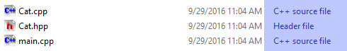

# CS 200 Lab 16: More with Classes

## Topics

* Classes
* Constructors and Destructors
* Operator Overloading
* Static Members
* Const functions
* Multiple files

## Turn in

**You will need to upload your code both to the class D2L Dropbox, and to your CS 200 GitHub repository!**

Locate your source files for this project. They should have the extentions .cpp, .hpp, and/or .h. In Windows, they are labelled as "C++ source file" and/or "Header file". 




**These are the only files you need** - You do not need to upload any Visual Studio files.

Upload these source files to your GitHub repository and to the Dropbox.

See also: 
[TURNING IN SOURCE CODE instructions](https://github.com/Rachels-Courses/Course-Common-Files/blob/master/How-to/Turning%20in%20source%20code.md)

## Rules

* Finishing the lab after class:
   * If you are not able to complete the lab during the class period, please finish it up outside of class and turn it in as soon as you can. The lab dropbox will be open for 1 week after the class session.

* Group work:
   * You may work with other students on labs:
   * All people working together must turn in code in their own dropboxes, and upload the code to their own GitHub repositories.
   * All group work must be noted as such - either put a comment in the code file or in the dropbox upload.
   * If you turn in duplicate works without noting that you worked together, you may get a 0% grade.

---

All parts of this lab should be within one project - you will create
different files for each class.

# Starting Out

First, create a ```main.cpp``` file. This will be the file that contains
our main function...:

```c++

#include <iostream>
using namespace std;

// UNCOMMENT THESE OUT AS YOU ADD THE FILES
//#include "DynamicArray.hpp"
//#include "Kitten.hpp"
//#include "Button.hpp"
//#include "Fraction.hpp"

const string TEST_DATA[] = {
    "Aardvark", "Albatross", "Alligator",
    "Bandicoot", "Bird", "Bison",
    "Cheetah", "Chipmunk", "Cow",
    "Elephant", "Emu", "Echidna",
    "Falcon", "Fox", "Fish",
    "Gecko", "Goat", "Goose",
    "Heron", "Horse", "Hyena",
    "Iguana", "Insect", "Impala",
    "Jackal", "Jellyfish", "Jaguar"
};

// UNCOMMENT THSE OUT AS YOU IMPLEMENT THE CLASSES!

void DynamicArrayProgram()
{
    /*
    DynamicArray arr( 5 );

    for ( int i = 0; i < arr.GetSize(); i++ )
    {
        arr.Set( i, TEST_DATA[i] );
    }

    arr.Display();
    */
}

void KittenProgram()
{
    /*
    Kitten happyCat( TEST_DATA[2] );
    happyCat.Display();

    Kitten angryCat( TEST_DATA[4] );
    angryCat.Display();

    Kitten sadCat( TEST_DATA[6] );
    sadCat.Display();

    Kitten curiousCat( TEST_DATA[8] );
    curiousCat.Display();
    */
}

void ButtonProgram()
{
    /*
    Button btn;
    btn.SetText( "Button!" );
    btn.Draw();

    btn.SetText( "Another Button!" );
    btn.Draw();
    */
}

void FractionProgram()
{
    /*
    Fraction f1, f2, f3;

    f1.Setup( 1, 3 );
    f2.Setup( 2, 5 );

    f3 = f1 * f2;

    cout << f1 << " * " << f2 << " = " << f3 << endl;
    */
}

int main()
{
    DynamicArrayProgram();
    KittenProgram();
    ButtonProgram();
    FractionProgram();

    return 0;
}


```

As you add each class, you will have to ```#include``` your new file
into ```main.cpp```, to let it know that it can use your class.

Name your new files as specified in each *lab item*.

# Multiple files

Once your programs are growing and containing multiple classes, it is
standard to put these classes in their own source files.

In C++, there are two types of source files: 

* Header Files
	* Saved as ```.h``` or ```.hpp```
	* Stores class and function **declarations** (prototypes)
* Source Files
	* Saved as ```.cpp```
	* Stores function **definitions**

So, say that we're going to create a ```Square``` class.
The class declaration and its function declarations would go in a .hpp file:

```c++
// Square.hpp
#ifndef _SQUARE_HPP
#define _SQUARE_HPP

class Square
{
	public:
	void SetWidth( float value );
	void SetLength( float value );
	float GetWidth();
	float GetLength();
	float GetArea();
	
	private:
	float m_width, m_length;
};

#endif
```

And then our function definitions would go in the .cpp file:

```c++
// Square.cpp
#include "Square.hpp"

void Square::SetWidth( float value )
{
	m_width = value;
}

void Square::SetLength( float value )
{
	m_length = value;
}

float Square::GetWidth()
{
	return m_width;
}

float Square::GetLength()
{
	return m_length;
}

float Square::GetArea()
{
	return m_width * m_length;
}
```

**Scope resolution operator ::**

When a member function is *defined* outside of the class declaration,
it must be prefixed with the class name and the *scope resolution operator*, 
like ```Square::```.

**ifndef preprocessors**

In our header files, we need to tell the compiler to not allow the file
to be included multiple times. 

If we didn't, then the compiler would get
confused if we have multiple source files including the same header file.
The compiler would complain about *multiple definitions* of the same
classes and functions, because it is essentially "copy-and-paste"ing
the source from the headers into each source file that ```#include```s it.

So, we put the following in every header:

```c++
#ifndef _UNIQUE_NAME
#define _UNIQUE_NAME

#endif
```

This prevents this duplication error.

# Constructors and Destructors introduction

## Terminology - Objects, Instances, Instantiation

When you declare a class, you're essentially creating a new *data-type*.

```c++
class CoordPair
{
public:
	int x, y;
};
```

When you declare a variable whose data-type is a class, you're
**instantiating an object of that class-type**.

```c++
int main()
{
	CoordPair origin;	// An instance of the CoordPair class

	return 0;
}
```

## Constructors

When a new object is created, a **constructor function** is called.
If you don't define your own constructor, C++ will make one *implicitly*.
However, you can write your own constructor (or constructors) to add
some code that will be **automatically executed when a new object
is instantiated.**

In other words, the constructor is automatically run when we create a 
new object of that class' data-type.

The constructor MUST match the class' name:

```c++
class CoordPair()
{
public:
	CoordPair()
	{
		// The constructor is initializing
		// default values for x and y here.
		x = 0;
		y = 0;
	}

	int x, y;
}
```

## Constructor Overloading

You can also **overload** your constructors and have more than one.
To overload a constructor, each subsequent constructor must have a
unique parameter list...:

```c++
class CoordPair()
{
public:
	CoordPair()
	{
		// The constructor is initializing
		// default values for x and y here.
		x = 0;
		y = 0;
	}
	
	CoordPair( int newX, int newY )
	{
		// Initialize x and y with values
		// passed in when the object was created.
		x = newX;
		y = newY;
	}

	int x, y;
}
```

Now, if we were going to declare object variables that will call
both of these constructors, it would look like:

```c++
int main()
{
	CoordPair origin;			// Calls the constructor with no parameters
	
	CoordPair position( 2, 5 ); // Calls the constructor with two int parameters

	return 0;
}
```

If you only have one constructor, but that constructor has parameters,
then you **will not be able to declare an object without passing in parameters.**

```c++
class Cat
{
public:
	Cat( string name )
	{
		m_name = name;
	}
	
private:
	string m_name;
};
```

```c++
int main()
{
	Cat myCat( "Kabe" );		// OK
	
	Cat anonyCat;				// Will cause compile error
	
	return 0;
}
```

## Destructors

**Destructors** are also functions that are automatically called
given some circumstances. Whereas constructors are called when an
object is created, a destructor is called when **the object is destroyed.**

This can be when the **delete** command is used on a dynamic variable,
or when a local variable loses scope (e.g., function ends).

**You cannot overload destructors** - you can only have one, and it has
no parameters. Usually, destructors are used to clean up data.

```c++
class FileWriter
{
	FileWriter( string filename )
	{
		// Open file when the writer is created
		m_file.open( filename );
	}
	
	~FileWriter()
	{
		// Close the file when the writer is destroyed
		m_file.close();
	}
	
	void Write( string text )
	{
		m_file << text << endl;
	}
	
private:
	ofstream m_file;
};
```

---

# Item 1: Constructor/Destructor project

Create two new files: ```DynamicArray.hpp``` and ```DynamicArray.cpp```.

Start off the DynamicArray.hpp file with:

```c++
#ifndef _DYNAMIC_ARRAY_HPP
#define _DYNAMIC_ARRAY_HPP

#endif
```

and the DynamicArray.cpp with:

```c++
#include "DynamicArray.hpp"
```

Note: You will also need to make sure to ```#include "DynamicArray.hpp"```
in main.cpp as well!

Here is the **UML (Unified Modeling Language) Diagram** of the DynamicArray class.
Use this to create the class declaration in your .hpp file:


The top portion of the diagram are member variables, and the bottom portion
are member functions.

Items prefixed with - are private, and items prefixed with + are public.

After you're done with the declarations in DynamicArray.hpp, fill out
the function definitions in DynamicArray.cpp:

## DynamicArray functions

Use this starter code to fill in:

```c++
#include "DynamicArray.hpp"

#include <iostream>
#include <string>
using namespace std;

DynamicArray::DynamicArray( int size )
{
    cout << "DynamicArray constructor" << endl;
}

DynamicArray::~DynamicArray()
{
    cout << "DynamicArray destructor" << endl;
}

void DynamicArray::Set( int index, string value )
{
}

string DynamicArray::Get( int index )
{
}

int DynamicArray::GetSize()
{
}

void DynamicArray::Display()
{
}
```

### DynamicArray Constructor

* Input parameters: 
	* ```int size```

Within the constructor, first initialize our ```m_arr``` pointer
to *nullptr*.

Check to make sure that ```size``` is valid:
a size of 0 or smaller is invalid, and we're not going to allocate
memory for the array then.

But if size is valid, then set the member variable ```m_size```
equal to the parameter size.

Then, using the ```m_arr``` pointer, allocate memory - create
a dynamic array with the given *size*.

### DynamicArray Destructor

Within the destructor, we need to check and see if the ```m_arr``` pointer
is *nullptr*. If it is nullptr, then we don't need to free it.

However, if m_arr is **not** *nullptr*, then free the memory allocated
via the *m_arr* pointer.

### Set

* Input parameters: 
	* ```int index```
	* ```string value```

Check to see if the *index* passed in is valid. An invalid index is
less than 0, or equal to or greater than ```m_size```.

If the index is invalid, don't make any changes!

Otherwise, if we have a valid *index*, then set the element of ```m_arr```
at the given index to the value passed in.

### Get

* Input parameters:
	* ```int index```
* Return type: ```string```

Check to see if the *index* passed in is valid. If it is invalid,
return an empty string ```""```.

Otherwise, return the element at the given *index*.

### GetSize

* Return type: ```int```

Return the value of the ```m_size``` member.

### Display

Use a for loop and display every element of the ```m_arr```, including
the index as well as the value.

### Example output


---

# Static member introductions

We can use the keyword **static** with a member variable of a class
in order to create a variable that is shared by all *instantiations*
of that class.

So, let's say we have a class like *Student*, and we can make
many Students. Each Student will have names, grades, classes, etc.

But, we can also embed a *static* variable in the Student class,
which will be shared by *all students* - if the value changes
through StudentA, then that value is also the same for StudentB,
StudentC, and so on. With our normal variables, if we change
StudentA's name, it only updates StudentA and none of the others.

We can declare a static member like this:

```c++
class Counter
{
	public:
	static int sharedCounter;
	int individualCounter;
};
```

Within the corresponding .cpp file, we would have to also add
a *definition* for our static member, outside of any functions...

```c++
int Counter::sharedCounter = 0;
```

Elseware in the program, we can create some counters. We can
update the *sharedCounter* through an *instance* (a variable whose
data-type is *Counter*), or directly via the Counter class...

```c++
int main()
{
	Counter count_a;
	Counter count_b;
	
	count_a.sharedCounter++;	// sharedCounter is now 1
	count_b.sharedCounter++;	// sharedCounter is now 2
	Counter::sharedCounter++;	// sharedCounter is now 3
}
```

We can also write static member functions as well as static member variables,
and sometimes writing a class with static members can be useful if
we have one class that is going to only need *one instantiation*.

For example: An image manager in a program might be responsible for
loading and freeing images as they're loaded in to display. We wouldn't need
multiple versions of an image manager, because the one manager would
handle all that is relevant.

---


# Item 2: Static Members

Create two new files: ```Kitten.hpp``` and ```Kitten.cpp```.

Kitten.hpp:

```c++
#ifndef _KITTEN_HPP
#define _KITTEN_HPP

#include <string>
#include <iostream>
using namespace std;


#endif
```

Declare the Kitten class according to this diagram:


Kitten.cpp:

```c++
#include "Kitten.hpp"

// This is needed for our static member variable
int Kitten::m_kittenCount = 0;

Kitten::Kitten( string name )
{
}

void Kitten::Display()
{
}
```

## Kitten functions

### Kitten constructor

In this function, set the kitten's ```m_name``` member variable to 
the passed in parameter.

Also increment the static ```m_kittenCount``` by one.

### Display

Use ```cout``` to display the kitten's name and the kitten count.

### Example output


---

# Const introduction

We can declare named constants in our programs, such as the fixed
size of an array, as a way to get away from "magic numbers" and
clearly label everything in our code...

```c++
Employee eeList[30]; // why is this thirty?
```

```c++
Employee eeList[ EMPLOYEE_MAX ]; // ah, it is the limit.
```

We can also make sure our pass-by-reference parameters are const,
so that the values can't change within the function, but the function
will be able to access that data:

```c++
int Sum( const int arr[], int size )
{
	// (Remember that arrays are passed by-reference automatically.)
	// We can access elements of arr, but we can't change them.
}
```

Within classes, we may have certain functions where we don't want the
*internal member variables* of the class to change. Generally, this will
be functions that only need to be "read only", like returning information
or displaying information.

In order to protect the private data inside a class, we can create 
**const functions** to make sure member data can't change within a function.

To make a const member function, we put the keyword **const** at the *end*
of the function:

```c++
class CoordPair
{
public:
	void Set( float x, float y ); // WILL change m_x and m_y
	float GetX() const; // won't change values
	float GetY() const; // won't change values

private:
	float m_x, m_y;
};
```

And then the function definition will look like:

```c++
float CoordPair::GetX() const
{
	return m_x;
}
```


---

# Item 3: Const Functions

Create two new files: ```Button.hpp``` and ```Button.cpp```

Create your button class according to this diagram:


The *SetText* function will take the parameter ```text``` and assign its value
to the private member variable ```m_text```.

The *Draw* function is const, but will display the button as a frame
plus the text:

```c++
	int len = m_text.size() + 4;

	for ( int i = 0; i < len; i++ )
	{
		cout << "*";
	}
	cout << endl;
	cout << "* " << m_text << " *" << endl;

	for ( int i = 0; i < len; i++ )
	{
		cout << "*";
	}
	cout << endl;
```

When the function is run, it will look like:


---

# Friend introduction

When we declare member variables and functions as **private** within a class,
only that class itself can access those members.

If we want something accessible to anything, we use **public**.

However, there are some design cases where you may want to give a certain
function or other class special access to the private member variables of
another class.

This is where **friends** come in handy. By declaring a class or function
as a *friend* within a class' definition, the other class will be able to access
private member variables...

```c++
class Book
{
public:
	friend class Librarian; // The librarian has special access to private members.

private:
	string m_title;
};

class Librarian
{
	// ... stuff goes here ...
};
```

---

# Operator Overloading introduction

An interesting feature of C++ is that we can **overload** operators such as

```+```, ```-```, ```*```, ```/```, ```=```, ```==```, ```!=```

and more!

For example, we can concatenate ```string``` objects with the + sign:

```c++
string last = "Morris";
string first = "Rachel";
string format = last + ", " + first;
```

In any of our classes we're writing, we can also overload these operators.
Some operators are stored **within the class**, and some operators are
**external to the class**.

When we're overloading these operators, it is **up to us** to decide
what the + operator (or any other) means for our object. Do we have
any private member variables to combine?

Use the following code snippets for reference on how to overload each...

## Operator Overloading reference

### Arithmetic operators

In the class declaration:

```c++
class MyClass
{
public:
	friend MyClass operator+( const MyClass& item1, const MyClass& item2 );
	friend MyClass operator­( const MyClass& item1, const MyClass& item2 );
	friend MyClass operator*( const MyClass& item1, const MyClass& item2 );
	friend MyClass operator/( const MyClass& item1, const MyClass& item2 );
};
```

Implementation:

```c++
MyClass operator+( const MyClass& item1, const MyClass& item2 )
{
	// ...
}
```

### Comparison operators

Class declaration:

```c++
class MyClass
{
public:
	friend bool operator==( MyClass& item1, MyClass& item2 );
	friend bool operator!=( MyClass& item1, MyClass& item2 );
	friend bool operator<( MyClass& item1, MyClass& item2 );
	friend bool operator>( MyClass& item1, MyClass& item2 );
	friend bool operator<=( MyClass& item1, MyClass& item2 );
	friend bool operator>=( MyClass& item1, MyClass& item2 );
};
```

Implementation:

```c++
bool operator==( MyClass& item1, MyClass& item2 )
{
	// ...
}
```

### Stream operators

Class declaration:

```c++
#include <fstream>
class MyClass
{
public:
	friend ostream& operator<<( ostream& out, MyClass& item );
	friend istream& operator>>( istream& in, MyClass& item );
};
```

Implementation:

```c++
ostream& operator<<( ostream& out, MyClass& item )
{
	out << item.textField << endl;
	return out;
}

istream& operator>>( istream& in, MyClass& item )
{
	in >> item.loadedField;
}
```

### Subscript operator

Class declaration:

```c++
class MyClass
{
public:
	int& operator[]( const int index );
	private:
	int m_data[];
};
```

Implementation:

```c++
int&  MyClass ::operator[]( const int index )
{
	return m_data[ index ];
}
```

### Assignment operator


Class declaration:

```c++
class MyClass
{
public:
	MyClass& operator=( const MyClass& rhs ); // "rhs" stands for "right-hand side", i.e., a = b, b is on rhs.
	private:
	int variable1;
	float variable2;
};
```

Implementation:

```c++
MyClass&  MyClass ::operator=( const MyClass& rhs )
{
	if ( this == &rhs )	// REQUIRED: Must check for self-assignment!
		return *this;
		
	variable1 = rhs.variable1;
	variable2 = rhs.variable2;
	return *this; 
}
```


---

# Item 4: Operator Overloading

Create two new files: ```Fraction.hpp``` and ```Fraction.cpp```.

Paste in this class declaration into *Fraction.hpp*:

```c++
#ifndef _FRACTION_HPP
#define _FRACTION_HPP

#include <ostream>
using namespace std;

class Fraction
{
public:
    void Setup( int n, int d );

    // assignment operator
    Fraction& operator=( const Fraction& rhs );

    // multiplication operator
    friend Fraction operator*( const Fraction& a, const Fraction& b );

    // equality operator
    friend bool operator==( Fraction& a, Fraction& b );

    // output stream operator
    friend ostream& operator<<( ostream& out, Fraction& a );

private:
    int m_n;
    int m_d;
};

#endif
```

We are going to overload ```=```, ```*```, ```==```, and ```<<```.
Notice that ```=``` is the only member function, and the other three are friend functions.

Start out *Fraction.cpp* with:

```c++
#include "Fraction.hpp"

void Fraction::Setup( int n, int d )
{
}

Fraction& Fraction::operator=( const Fraction& rhs )
{
	// do stuff
	return *this;
}

// Friend functions

ostream& operator<<( ostream& out, Fraction& a )
{
}

bool operator==( Fraction& a, Fraction& b )
{
}

Fraction operator*( const Fraction& a, const Fraction& b )
{
}
```

### Setup

This function should assign the private member variable ```m_n```
to the value of the ```n``` parameter, and also set ```m_d``` to the
```d``` parameter.

### operator<<

This function will be used to display a fraction.

```c++
Fraction f1;
f1.Setup( 1, 3 );
cout << f1 << endl;
```

We are overloading this function because, for a fraction, we would
want to dispaly both the numerator AND the denominator.

We can use the ```out``` parameter just like ```cout``` - because they're family!

So, to output the fraction, you will output ```Fraction& a``` 's
numerator (```a.m_n```), then a slash (```"/"```), then the denominator (```a.m_d```).


### operator==

This function's purpose is to return *true* or *false* based on whether the
two fractions passed in, ```Fraction& a``` and ```Fraction& b```, are the same.

Note that we are NOT going to worry about reducing fractions here! For
this function, we are going to say that they're the same only if
both the numerators and both the denominators match.

So, accessing each fraction's data...

* ```a.m_n```
* ```a.m_d```
* ```b.m_n```
* ```b.m_d```

... use ```==``` operators to check if these two fractions are equivalent,
and either return true or false.

### operator*

This function is going to multiply the two fractions, ```const Fraction& a```
and ```const Fraction& b```, and return the result.

Remember that when multiplying fractions, we go straight across:


It is simpler than addition!

So within this function, we will need to create a new Fraction object,
then multiply ```a``` and ```b```'s numerators and denominators,
and then assign the new values to the product,
and finally return the product.

```c++
Fraction operator*( const Fraction& a, const Fraction& b )
{
    Fraction product;
    // Do math 
    return product;
}
```

### operator=

The usage of this funtion will look like...:

```c++
Fraction f1, f2;
f1.Setup( 1, 3 );
f2 = f1;
```

Where we can assign one fraction to another fraction (f2 is assigned f1).

In the function, there is a parameter: ```const Fraction& rhs```.
This would be the item we're assigning our fraction *to*.

To copy a fraction, you would have to copy both its numerator and its denominator.

We can access the numerator and denominator for the "copy new values FROM" fraction with
```rhs.m_d``` and ```rhs.m_n```, and we can access the "copy new values TO" fraction with
```m_d``` and ```m_n```.

So, copy over the new values to the old values.


### Example output


