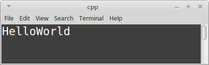
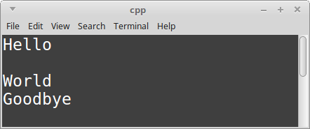
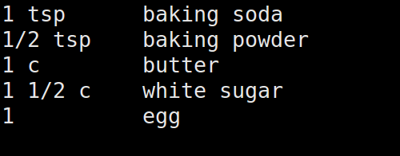
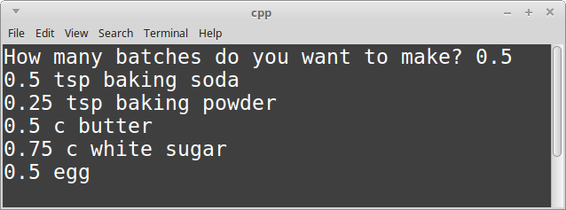
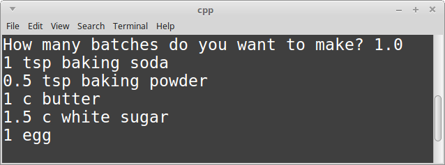
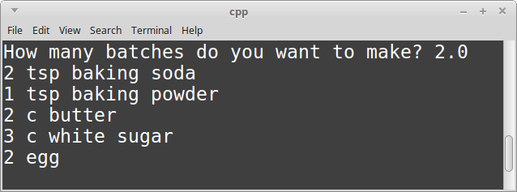

# CS 200 Lab 1a: Recipes

---

[Information](#information) | [Introduction](#introduction) | [Lab](#lab) | [Questions](#questions)

---

## Information

### Lab topics

* Variables
* Input/Output

### Rules

* For **in-class labs**, collaboration is allowed.
    * If you work with another student on an assignment, make sure that you both
    turn in a copy of the work, and also mention in the D2L comments who you worked with.
    * You can also ask classmates questions if you're unsure on something.
    * You can ask the instructor for help at any time.

### Turn in

Once you are finished with a project, zip up the entire folder that contains
all source files and project/solution files. Turn in this zip file to **Desire2Learn**.

Also make sure to turn in a text file with your answers to the [question](#questions) section.

---

## Introduction

*This is an introduction to the topics covered in this lab. Scroll down
to the [*Lab*](#lab) section if you want to get started.*

### Creating a program

When we create a C++ project, generally it will begin empty. All programs
need *at least one* source file, but for more sophisticated programs,
there may be multiple source files.

**C++ source files have the endings: .cpp, .hpp, and/or .h**. We will work
with .hpp/.h (header) files later, but for now we are just working with
.cpp (source) files.

To create a project in Visual Studio:

1. Create a new project. *File > New > Project...*
    1. Select **Visual C++** from the left category list.
    2. Select **Empty Project** from the template list.
    3. Set the project **Name** to "lab01a_recipes".
    4. Set the project **Location**.
    5. Click **OK**.

And to add your lab source file in Visual Studio:

2. Create your source file. In the **Solution Explorer**, right-click your project file. *Add > New Item...*
    1. Select **C++ File (.cpp)** and name it **main.cpp**.
    2. Click **Add**.

#### Bare-minimum program

Your source file will also start out blank. The bare-minimum code you need
for a C++ program is:

```c++
int main()
{
    return 0;
}
```

Every program needs an **entry point** -- a place to begin -- and for C++
it is always in the ```main()``` **function**. We will learn more about
functions later.

Within the ```main()``` function, we have ```return 0;``` - this marks
the **end of our program**. We will be adding code within the curly braces ```{ }```,
and before ```return 0;```.

#### Adding libraries

C++ has multiple **libraries** included with it. A **library** is a set of code
that has been pre-written, and packaged so that it is reusable across many projects.

For example, C++ has an **input-output** library called *iostream* that allows
us to write text to the screen, and get user input from the keyboard.

To add this functionality to our program, we need to use an ```#include``` statement.

```c++
#include <iostream>     // add this
using namespace std;    // add this

int main()
{
    return 0;
}
```

#### Comments

In C++, you can add comments to the code in two ways:

```c++
// Single-line comment!
```

```c++
/*
    Multi-
    line
    comment!
*/
```

The program doesn't do anything with comments; they are for programmer-use!

#### Stopping the program

In Visual Studio, if you run your program in debug mode, it will begin running at ```main()```,
execute its code, and once it hits ```return 0;``` the program will end and the
program window will disappear immediately.

Later on, we will write programs that will continue running until the user explicitly tells it to quit,
but for now we need a *workaround* to make sure our program doesn't stop once its finished.

For now, we can add an **infinite loop** at the end of our program... this is just a workaround!
You can add a while loop like below to prevent the program from reaching the ```return 0;```:

```c++
#include <iostream>
using namespace std;

int main()
{

    while ( true ) ;    // Program stops here
    return 0;
}
```

### Displaying output

Once you have the *iostream* library included in your program, you can
display text output to the screen, as well as get input from the user.

To display output, you use the ```cout``` command, as well as the stream
operator ```<<```. A simple output will look like:

```c++
cout << "Hello, world!";
```

Any time you add text to the program, such as during a *cout*, the
text within the double-quotes is known as a **string literal**.

You can also display values of variables with a *cout* statement,
but we will get to that in a minute.

When we use several *cout* statements, new lines are not automatically added:

```c++
#include <iostream>
using namespace std;

int main()
{
    cout << "Hello";
    cout << "World";

    while ( true ) ;    // Program stops here
    return 0;
}
```



In C++, we have to tell the program *manually* when to add a new line.
There are two ways we can do this:

```c++
cout << "Hello\nWorld";                 // Way 1: use \n
cout << "Hello" << endl << "World";     // Way 2: use endl
```

The ```\n``` **escape character** is a way that you can add a new-line
into your message without ending your **string literal** (within double-quotes).

The ```endl``` is another command that you can use to add new lines,
but notice that it *cannot go within double-quotes*: You must end the
string literal, then chain together the endl via the **stream operator** ```<<```.

You can chain together as many endls and string literals and variable values
as you'd like, so long as there is a stream operator ```<<``` in-between each item.

```c++
cout << "Hello" << endl << endl;
cout << "World" << endl;
cout << "Goodbye";
```



### Variables

Variables are a location where you store data. This data can be numbers, strings, boolean values, memory addresses, and many other things. Eventually, we will be creating our own data types and store data in our own custom variables.

In C++, you must **declare** a variable before you can use it. When you
declare a variable, you let the program know what kind of data that the
variable will store: integers? numbers with decimals? symbols? a string of letters? etc.


Some common data-types are:

<table class="table">
<thead>
<tr>
<th>
Data type
</th>
<th>
Keyword
</th>
<th>
Description
</th>
<th>
Example values
</th>
</tr>
</thead>
<tbody>
<tr>
<td>
Integer
</td>
<td>
<pre>int</pre>
</td>
<td>
Whole numbers
</td>
<td>
<pre>
-5
0
100
</pre>
</td>
</tr>
<tr>
<td>
Float and Double
</td>
<td>
<pre>
float
double
</pre>
</td>
<td>
Numbers with decimal points.
</td>
<td>
<pre>
-10.00
9.99
3.14159
</pre>
</td>
</tr>
<tr>
<td>
Boolean
</td>
<td>
<pre>
bool (C++)
boolean (Java)
</pre>
</td>
<td>
Only stores <strong>true</strong> or <strong>false</strong>.
</td>
<td>
<pre>
true
false
</pre>
</td>
</tr>
<tr>
<td>
Character
</td>
<td>
<pre>char</pre>
</td>
<td>
Single letters, numbers, symbols, etc.<br>Characters values must be contained within single-quotes.
</td>
<td>
<pre>
'a'
'A'
'$'
'0'
</pre>
</td>
</tr>
<tr>
<td>
String
</td>
<td>
<pre>
string (C++)
String (Java)
</pre>
</td>
<td>
Text, numbers, letters, anything.<br>String values must be contained within double-quotes.
</td>
<td>
<pre>
"Hello!"
"12345 College Blvd"
"1... 2... 3..."
</pre>
</td>
</tr>
</tbody>
</table>

A **variable declaration** must contain the **data-type** and the **variable name**:

```c++
int amountOfKittens;
double pricePerSandwich;
bool isSaved;
string username;
```

Once a variable has been declared, its type cannot change.

**Declare once, use multiple times:** Once you declare a variable,
you do not need to keep adding the data-type to the variable name whenever you use it;
this is only for the declaration!

```c++
int amountOfKittens; // declaration

amountOfKittens = 20; // assigning a value

amountOfKittens = amountOfKittens + 5; // adding 5 to the existing value
```

The ```=``` is known as the **assignment operator** and is used to assign
values to variables. On the **left-hand side (LHS)** of the = sign is the
variable that will get the new value. The **right-hand side (RHS)** will
be the new value. The new value can be a hard-coded value, or a computation.

You can generally name your variable anything that you'd like, but there are a few rules to follow when doing so...:

1.    A variable name must begin with a letter (a-z, A-Z), underscore (_), or a dollar sign ($).
2.    You can include numbers in a variable name (0-9), but it cannot be the first character.
3.    The variable name can have virtually any length.
4.    You can use upper-case and lower-case letters in your variable names, but there is a naming convention that you should try to follow. Also, remember that variable names are case-sensitive.
5.    Reserved keywords (such as "if", "int", "public") cannot be used as variable names.


### Getting user input

In our programs, we may want to ask the user a question, which may affect
the calculations done, or the program flow, or other behavior.
We can ask for user input with the ```cin``` command:

```c++
int number;
cout << "Please enter a number: ";
cin >> number;
```

When getting user input, you *must* have some variable that you're storing
your information in. As long as it is a basic data-type like *integers*,
*floats*, *strings*, or *chars*, C++ will handle putting the user's input
into the variable.

However, if you're trying to store input into an *integer* variable and the
user enters a *letter*, your program will crash. Adding error detection
to validate the inputted data type is a little tricky, so we won't worry
about that in this class.

**Good practice:** Always add a message with ```cout``` prior to your
```cin``` statement - this lets the user know that you're expecting
some input! Otherwise, it will look like the program has crashed (but it hasn't!)
because it sits there waiting for input, but hasn't told the user this!

**Common error:** ```cin``` statements will never have an ```endl``` at the end;
endl is only for cout!


## Lab

*This lab will have multiple parts. You only need to turn in the *final version*
of this program, as it will keep building up.*

### Part 1: Create a new project and add a source file

To create a project in Visual Studio:

1. Create a new project. *File > New > Project...*
    1. Select **Visual C++** from the left category list.
    2. Select **Empty Project** from the template list.
    3. Set the project **Name** to "lab01a_recipes".
    4. Set the project **Location**.
    5. Click **OK**.

And to add your lab source file in Visual Studio:

2. Create your source file. In the **Solution Explorer**, right-click your project file. *Add > New Item...*
    1. Select **C++ File (.cpp)** and name it **main.cpp**.
    2. Click **Add**.

Begin with the following starter code in your .cpp source file:

```c++
#include <iostream>     // Input/output library
using namespace std;    // Standard C++ library namespace

int main()
{
    // Program begins

    while ( true ) ;    // Program stops here
    return 0;
}
```

#### About main()

Every program needs an **entry point** -- a place to begin -- and for C++
it is always in the ```main()``` **function**. We will learn more about
functions later.

Within the ```main()``` function, we have ```return 0;``` - this marks
the **end of our program**. We will be adding code within the curly braces ```{ }```,
and before ```return 0;```.

#### About #include <iostream>

C++ has multiple **libraries** included with it. A **library** is a set of code
that has been pre-written, and packaged so that it is reusable across many projects.

For example, C++ has an **input-output** library called *iostream* that allows
us to write text to the screen, and get user input from the keyboard.

To add this functionality to our program, we need to use an ```#include``` statement.

#### About comments

In C++, you can add comments to the code in two ways:

```c++
// Single-line comment!
```

```c++
/*
    Multi-
    line
    comment!
*/
```

The program doesn't do anything with comments; they are for programmer-use!

---

For this lab, we will write a program that will display a list of ingredients for
sugar cookies. We will add several features, so that eventually the user (the person
who is using your program) will be able to enter the amount of batches of cookies
that they want to make, and our program will recalculate the ingredient amounts.

But for now, we will start with these ingredients and amounts:

        Sugar Cookie Recipe:

        1 tsp baking soda
        1/2 tsp baking powder
        1 c butter
        1 1/2 c white sugar
        1 egg

---

### Part 1: Output the recipe

Your first task is to *display* all of the ingredients to the
screen using the ```cout``` command. Try to experiment so that
things are spaced nicely (hint: I am just manually adding spaces here
and running the program to check how it looks.)

#### Using cout to display text to the screen

> Once you have the *iostream* library included in your program, you can
display text output to the screen, as well as get input from the user.

> To display output, you use the ```cout``` command, as well as the stream
operator ```<<```. A simple output will look like:

```c++
cout << "Hello, world!";
```

> Any time you add text to the program, such as during a *cout*, the
text within the double-quotes is known as a **string literal**.

> You can also display values of variables with a *cout* statement:

```c++
cout << cups_of_butter;
```

> If you want to add a line break to the text output (that is, put text on
the next line down), we can use the ```endl``` command with ```cout```:

```c++
cout << "Butter: " << cups_of_butter << " cups" << endl;
```





**Make sure to build and run the program before continuing!** --
Test often to make sure you catch build errors. It is easier to fix one
build error than a dozen!

---

### Part 2: Variables to store amounts

Right now, we are just displaying all the ingredients within a hard-coded
string literal. Instead of storing the amounts this way, lets create variables
to store each of the following:

1. tsp_baking_soda
2. tsp_baking_powder
3. cups_butter
4. cups_sugar
5. amount_eggs

Each of these should be **float** or **double** variables.

#### About variables

Variables are a location where you store data. This data can be numbers, strings, boolean values, memory addresses, and many other things. Eventually, we will be creating our own data types and store data in our own custom variables.

In C++, you must **declare** a variable before you can use it. When you
declare a variable, you let the program know what kind of data that the
variable will store: integers? numbers with decimals? symbols? a string of letters? etc.

A **variable declaration** must contain the **data-type** and the **variable name**:

```c++
int amountOfKittens;
double pricePerSandwich;
bool isSaved;
string username;
```

Once a variable has been declared, its type cannot change.

**Declare once, use multiple times:** Once you declare a variable,
you do not need to keep adding the data-type to the variable name whenever you use it;
this is only for the declaration!

```c++
int amountOfKittens; // declaration

amountOfKittens = 20; // assigning a value

amountOfKittens = amountOfKittens + 5; // adding 5 to the existing value
```


**Variable naming:** Your variable names *cannot* contain spaces. Your
variable names should be descriptive, however, so the normal way to create
variable names with multiple words is either ```camelCaseNaming``` or
```underscores_instead_of_spaces```.

---

Once you've declared each of these variables, store the amounts in these
variables with an *assignment statement*.

For reference, the amounts are:

        1 tsp baking soda
        1/2 tsp baking powder
        1 c butter
        1 1/2 c white sugar
        1 egg

Instead of using 1/2, store 0.5; instead of 1 1/2, store 1.5.

Then, within your ```cout``` statements, remove the hard-coded
amount values, and instead display the values of your variables.

Example:

```c++
cout << cups_of_butter << " cups of butter" << endl;
```

**Clean UI:** Make sure that you add a *space* at the beginning of the
string literal, ```" cups of butter"``` (etc.) If you do not, your
variable # and the label will be smooshed together like ```5cups of butter```.
This is ugly! Don't do it!


---

### Part 3: Ratios

Sometimes, we want to make double the cookies, or only a half-batch.
Let's allow the user to adjust the batch size and display the correct
ingredient amount for each.

Create a variable called ```ratio```; it should be either a float or a double.

Before getting the user's input, **prompt them!** - Use ```cout``` to ask
the user how many batches they want to make.

Get the user's input with the ```cin``` command, and store it in the ```ratio``` variable.
1.0 would be a normal batch, 0.5 would be a half batch, and 2.0 would be
a double batch.

Then, we will re-calculate the ingredient amounts. There are a few ways
we could do this!

**Approach 1: Calculate during declaration** ```float cups_of_butter = 1.0 * ratio;```

**Approach 2: Calculate *after* declaration** ```cups_of_butter = cups_of_butter * ratio;```

**Approach 3: Calculate *during* cout** ```cout << ( cups_of_butter * ratio ) << " cups of butter" << endl;```

Here, the ```*``` sign is known as the **multiplication operator**.

Do this math for all of the ingredients.


**Half batch:**



**Normal batch:**



**Double batch:**




## Questions

*Answer these questions in a text editor and turn them in with your project.
Valid file formats are: .txt, .rtf, .docx, .odt, .pdf*

1. Integers can store what kind of information?
2. Strings can store what kind of information?
3. Booleans can store what kind of information?
4. What is the entry-point function of all C++ programs?
5. What is the command to display output to the screen?
6. What is the command to retrieve input from the user?
7. What are the ```<<``` and ```>>``` operators known as?
8. What is the assignment operator?


