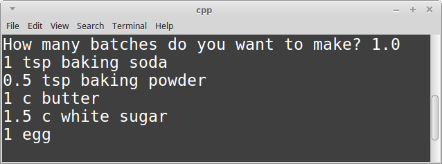

# CS 200 Lab 1a: Recipes - Instructions

---

[Information](#information) |
[Helper](https://github.com/Rachels-Courses/CS200-Concepts-of-Progamming-Algorithms/blob/2017-06-Summer/Assignments/In-class%20Labs/Lab%2001a%20-%20Recipes%20-%20Helper.MD) |
[Lab](#lab) |
[Questions](#questions)

---

## Information

### Lab topics

* Variables
* Input/Output

### Rules

* For **in-class labs**, collaboration is allowed.
    * If you work with another student on an assignment, make sure that you both
    turn in a copy of the work, and also mention in the D2L comments who you worked with.
    * You can also ask classmates questions if you're unsure on something.
    * You can ask the instructor for help at any time.

### Turn in

Once you are finished with a project, zip up the entire folder that contains
all source files and project/solution files. Turn in this zip file to **Desire2Learn**.

Also make sure to turn in a text file with your answers to the [question](#questions) section.


---


## Lab

*This lab will have multiple parts. You only need to turn in the *final version*
of this program, as it will keep building up.*

### Part 1: Create a new project and add a source file

To create a project in Visual Studio:

1. Create a new project. *File > New > Project...*
    1. Select **Visual C++** from the left category list.
    2. Select **Empty Project** from the template list.
    3. Set the project **Name** to "lab01a_recipes".
    4. Set the project **Location**.
    5. Click **OK**.

And to add your lab source file in Visual Studio:

2. Create your source file. In the **Solution Explorer**, right-click your project file. *Add > New Item...*
    1. Select **C++ File (.cpp)** and name it **main.cpp**.
    2. Click **Add**.

Begin with the following starter code in your .cpp source file:

```c++
#include <iostream>     // Input/output library
using namespace std;    // Standard C++ library namespace

int main()
{
    // Program begins

    while ( true ) ;    // Program stops here
    return 0;
}
```

For this lab, we will write a program that will display a list of ingredients for
sugar cookies. We will add several features, so that eventually the user (the person
who is using your program) will be able to enter the amount of batches of cookies
that they want to make, and our program will recalculate the ingredient amounts.

But for now, we will start with these ingredients and amounts:

        Sugar Cookie Recipe:

        1 tsp baking soda
        1/2 tsp baking powder
        1 c butter
        1 1/2 c white sugar
        1 egg

---

### Part 1: Output the recipe

Your first task is to *display* all of the ingredients to the
screen using the ```cout``` command. Try to experiment so that
things are spaced nicely (hint: I am just manually adding spaces here
and running the program to check how it looks.)


**Make sure to build and run the program before continuing!** --
Test often to make sure you catch build errors. It is easier to fix one
build error than a dozen!

---

### Part 2: Variables to store amounts

Right now, we are just displaying all the ingredients within a hard-coded
string literal. Instead of storing the amounts this way, lets create variables
to store each of the following:

1. tsp_baking_soda
2. tsp_baking_powder
3. cups_butter
4. cups_sugar
5. amount_eggs

Each of these should be **float** or **double** variables.


**Variable naming:** Your variable names *cannot* contain spaces. Your
variable names should be descriptive, however, so the normal way to create
variable names with multiple words is either ```camelCaseNaming``` or
```underscores_instead_of_spaces```.

---

Once you've declared each of these variables, store the amounts in these
variables with an *assignment statement*.

For reference, the amounts are:

        1 tsp baking soda
        1/2 tsp baking powder
        1 c butter
        1 1/2 c white sugar
        1 egg

Instead of using 1/2, store 0.5; instead of 1 1/2, store 1.5.

Then, within your ```cout``` statements, remove the hard-coded
amount values, and instead display the values of your variables.

Example:

```c++
cout << cups_of_butter << " cups of butter" << endl;
```

**Clean UI:** Make sure that you add a *space* at the beginning of the
string literal, ```" cups of butter"``` (etc.) If you do not, your
variable # and the label will be smooshed together like ```5cups of butter```.
This is ugly! Don't do it!


---

### Part 3: How many batches?

Sometimes, we want to make double the cookies, or only a half-batch.
Let's allow the user to adjust the batch size and display the correct
ingredient amount for each.

Declare a variable called ```batch```; it should be either a float or a double.

Before getting the user's input, **prompt them!** - Use ```cout``` to ask
the user how many batches they want to make.

```cout << "How many batches? ";```

Get the user's input with the ```cin``` command, and store it in the ```batch``` variable.
1.0 would be a normal batch, 0.5 would be a half batch, and 2.0 would be
a double batch.

```cin >> batch;```

Then, using the *batch* variable, modify your existing 5 ingredient variables, multiplying
their original values by the *batch* size.

1. tsp_baking_soda
2. tsp_baking_powder
3. cups_butter
4. cups_sugar
5. amount_eggs

For example,

```c++
cups_butter = 1.0 * ratio;
```

Here, the ```*``` sign is known as the **multiplication operator**.

Do this math for all of the ingredients.

---

Test your program by plugging in 0.5, 1.0, and 2.0 for batches to make sure the math is correct.

**Half batch:**


**Normal batch:**



**Double batch:**


## Questions

*Answer these questions in a text editor and turn them in with your project.
Valid file formats are: .txt, .rtf, .docx, .odt, .pdf*

1. Integers can store what kind of information?
2. Strings can store what kind of information?
3. Booleans can store what kind of information?
4. What is the entry-point function of all C++ programs?
5. What is the command to display output to the screen?
6. What is the command to retrieve input from the user?
7. What are the ```<<``` and ```>>``` operators known as?
8. What is the assignment operator?


