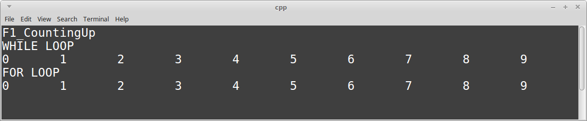
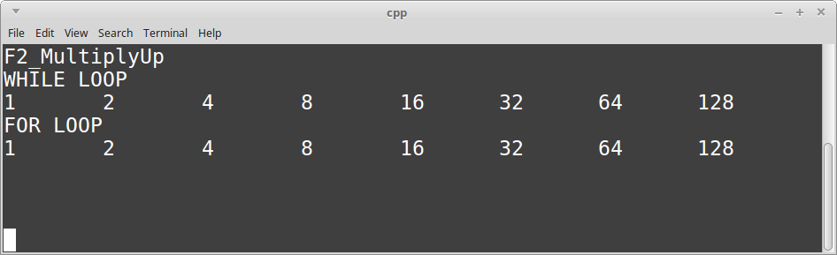
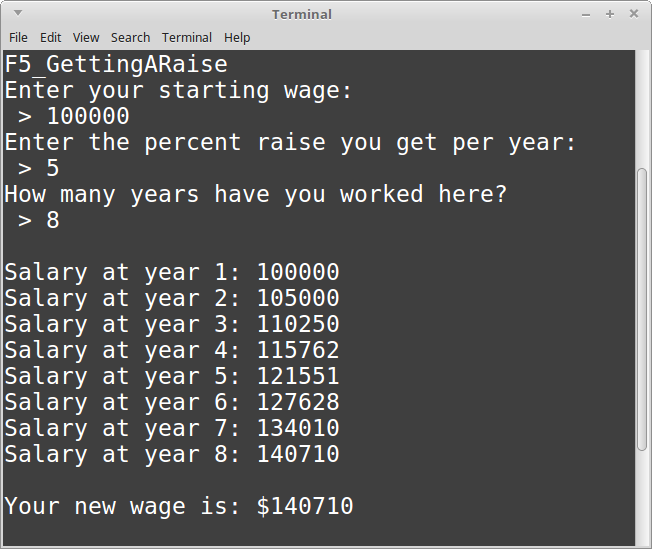

# CS 200 Lab 01c: Loops

---

[Information](#information) |
[Helper](https://github.com/Rachels-Courses/CS200-Concepts-of-Progamming-Algorithms/blob/2017-06-Summer/Assignments/In-class%20Labs/Lab%2001c%20-%20Loops%20-%20Helper.MD) |
[Lab](#lab) | [
Questions](#questions)

---

## Information

### Lab topics

* While loops
* For loops

### Rules

* For **in-class labs**, collaboration is allowed.
    * If you work with another student on an assignment, make sure that you both
    turn in a copy of the work, and also mention in the D2L comments who you worked with.
    * You can also ask classmates questions if you're unsure on something.
    * You can ask the instructor for help at any time.

### Setting up a project in Visual Studio

1. Create a new project. *File > New > Project...*
    1. Select **Visual C++** from the left category list.
    2. Select **Empty Project** from the template list.
    3. Set the project **Name** to "Lab 01c Loops".
    4. Set the project **Location**.
    5. Click **OK**.
2. Create your source file. In the **Solution Explorer**, right-click your project file. *Add > New Item...*
    1. Select **C++ File (.cpp)** and name it **lab01c.cpp**.
    2. Click **Add**.

### Turn in

Once you are finished with a project, zip up the entire folder that contains
all source files and project/solution files. Turn in this zip file to **Desire2Learn**.

Also make sure to turn in a text file with your answers to the [question](#questions) section.


## Lab

*For this lab, you will create one project and one source file.
Copy in the following code as your starting point:*

### Starting code

```c++
#include <iostream>
#include <string>
using namespace std;

// Function 1
void F1_CountingUp()
{
    cout << "F1_CountingUp" << endl;
}

// Function 2
void F2_MultiplyUp()
{
    cout << "F2_MultiplyUp" << endl;
}

// Function 3
void F3_NumberGuesser()
{
    cout << "F3_NumberGuesser" << endl;
}

// Function 4
void F4_InputValidator()
{
    cout << "F4_InputValidator" << endl;
}

// Function 5
void F5_GettingARaise()
{
    cout << "F5_GettingARaise" << endl;
}

// Function 6
void F6_Summation()
{
    cout << "F6_Summation" << endl;
}

/* Don't modify the code below! ****************************************/

int main()
{
    F1_CountingUp();
    cout << endl << endl;

    F2_MultiplyUp();
    cout << endl << endl;

    F3_NumberGuesser();
    cout << endl << endl;

    F4_InputValidator();
    cout << endl << endl;

    F5_GettingARaise();
    cout << endl << endl;

    F6_Summation();
    cout << endl << endl;


    cout << endl << endl;
    while ( true );
    return 0;
}
```

A function is just a way to pull code out and give it a label.
The ```main()``` function is **calling** all the other functions,
which allow them to execute, then it returns back to main().

Since this lab has several parts to it, each part gets its own function
so that you don't have to make a bunch of different projects.


### Function 1: Counting up from 1 to 10

Here you will be working within the function ```F1_CountingUp```.

You will use both a **while loop** and a **for loop** and a **counter variable**
to display numbers from 0 to 9, like this:

	WHILE LOOP
	0	1	2	3	4	5	6	7	8	9
	FOR LOOP
	0	1	2	3	4	5	6	7	8	9


Note that you can use the escape character ```\t``` to add a tab with in a ```cout`` statement...

```cout << "Hi \t there!";```

You can increment variables in a few different ways:

```c++
++countUp; 					// Increment countUp by 1, ++ can only be used for + 1
countUp++; 					// Increment countUp by 1, ++ can only be used for + 1
countUp += 1; 				// Increment countUp by 1
countUp = countUp + 1;		// Increment countUp by 1
```


#### Hints

<details>
	<summary><strong><em>
		View hints
	</em></strong></summary>

1. Create an integer variable called **counter** and initialize it to 0.
1. Display the message "WHILE LOOP"
1. Create a while loop. It should loop while **counter** is less than 10.
Inside the while loop...
	1. Display the current value of **counter** with a cout statement.
	2. Increment the value of **counter** by one.
1. Display the message "FOR LOOP"
1. Create a for loop with the parameters:
    * Beginning: set counter to 0
    * Condition: counter is less than 10
    * Execute each time: increment counter by 1.
1. Within the for loop, just display the value of counter each time.

</details>

#### Screenshot



---

### Function 2: Multiply Up

Here you will be working within the function ```F2_MultiplyUp```.

This one will be similar to the CountUp, but this time we will multiply
our counter variable each time.

For both loops:
* The counter should start at 1.
* Every time the loop completes one cycle, the counter should be multiplied by 2.
* The loops will keep looping while the counter is less than 200.


You can multiply the variable in the following ways:

* ```counter = counter * 2;```
* ```counter *= 2;```


#### Hints

<details>
	<summary><strong><em>
		Step-by-step
	</em></strong></summary>

1. Create an integer variable called **counter** and initialize it to 1.
1. Display the message "WHILE LOOP"
1. Create a while loop. It should loop while **counter** is less than 200.
Inside the while loop...
	1. Display the current value of **counter** with a cout statement.
	2. Multiply the counter by 2.
1. Display the message "FOR LOOP"
1. Create a for loop with the parameters:
    * Beginning: set counter to 1
    * Condition: counter is less than 200
    * Execute each time: multiply the counter by 2.
1. Within the for loop, just display the value of counter each time.

</details>


#### Screenshot



---

### Function 3: Number Guesser

Here you will be working within the function ```F3_NumberGuesser```.

Write a number-guesser game. The user will continue to guess numbers
until they get it right.
We will use a while loop to have the program keep asking the player for a guess,
until they finally get it right.

For this one, you will need a do-while loop. These look like:

```c++
do
{
    // code to execute
} while ( condition );
```

And they are guaranteed to run the internal code *at least once*.

1. Create an integer variable called **secretNumber**, and set it to
your favorite number.

2. Create another integer variable called **playerGuess**. It does not need to be initialized.

3. Create a **do-while** loop. Inside the loop:
	
	1. Display a message to the user, asking them to enter a number guess. (cout)
	
	2. Get the player's guess and store it in the **playerGuess** variable. (cin)
	
	3. Compare the **playerGuess** value to the **secretNumber** value...
	
		1. If playerGuess is less than secretNumber, display the message "too low!"
		
		2. Otherwise, if playerGuess is greater than secretNumber, display the message "too high!"
		
4. At the end of the do-while loop you will put the condition for looping.
Make the condition: while playerGuess is not equal to secretNumber.

5. Outside the do-while loop, display the message "You win!" - this is displayed
once the loop is "escaped", which only happens once the player has 
correctly guessed the number.


#### Screenshot


---

### Function 4: Input validator

Here you will be working within the function ```F4_InputValidator```.

Write a program that will act as an "input validator" for user input.
Basically, it expects the input to be between a certain range,
and if it is not, it requires the user to re-enter their choice.

1. Display a message that says "Please enter a number between 0 and 5."

2. Create a variable called **choice**, which is an integer.

3. Use cin to get the user's input and store it in **choice**.

4. Create a while loop. While **choice** is either
less than 0 or greater than 5...

	1. Display the message "invalid entry. Try again:"
	
	2. Get the user's input again (with cin) and store it in **choice**.

5. Outside of the loop, display the message "Thank you".


#### Screenshot


---

### Function 5: Getting a raise

Here you will be working within the function ```F5_GettingARaise```.

Create four variables:

* startingWage, a float
* percentRaisePerYear, a float
* adjustedWage, a float
* yearsWorked, an integer

Ask the user to enter their *startingWage*, *percentWagePerYear*, and *yearsWorked*.

Then, calculate their new wage by using a for-loop. Each year,
their salary will be increased by the *percent* specified; we're not going
to keep taking the same percent from the original wage. Instead, we have to
recalculate the wage amount by multiplying the raise % by the current year's salary.

So in other words - before the for loop, set the *adjustedWage* to the *startingWage*.

So, use a for loop to iterate *yearsWorked* amount of times, recalculating
the new wage.

The equation to calculate the new wage is

*n = (ar) + a*

where *n* is the new wage, *a* is the adjusted wage's current value, and *r* is the raise % per year (as a decimal value.)
This new wage value should overwrite the ```adjustedWage``` value each time in the loop.

You can use this table to check your math, assuming the raise per year is 5%.

<table>
<tr> <th> Years completed </th><th> Salary </th><th> Notes </th> </tr>
<tr> <td> 0 </td><td> $100,000 </td><td> Starting salary would be 100000. </td> </tr>
<tr> <td> 1 </td><td> $105,000 </td><td> Raise is (0.05 * 100000), or $5,000. </td> </tr>
<tr> <td> 2 </td><td> $110,250 </td><td> Raise is (0.05 * 105000), or $5,250. </td> </tr>
<tr> <td> 3 </td><td> $115,762.50 </td><td> Raise is (0.05 * 110250), or $5,512.50. </td> </tr>
</table>

Finally, after the for loop, display the new current wage.


</details>

#### Screenshot




#### Hints

First, try to write code that will calculate the raises for each year, outside of the for loop.

*firstYearSalary = ( percentRaisePerYear * startingSalary ) + startingSalary*

*secondYearSalary = ( percentRaisePerYear * firstYearSalary ) + firstYearSalary*

*thirdYearSalary = ( percentRaisePerYear * thirdYearSalary ) + thirdYearSalary*

Do you see the pattern? 

The challenge is to figure out how to write a loop to do this same thing.

Instead of having variables like ```firstYearSalary```, ```secondYearSalary```, ```thirdYearSalary```, we aren't going to use those. We have one variable that will store the new salary every year, we just keep overwriting it: ```adjustedWage```.

Year 1: ```adjustedWage = ( adjustedWage * percentRaisePerYear ) + adjustedWage```

Year 2: ```adjustedWage = ( adjustedWage * percentRaisePerYear ) + adjustedWage```

Year 3: ```adjustedWage = ( adjustedWage * percentRaisePerYear ) + adjustedWage```

And so on.

Now do you see how we might turn this into a loop?

If the employee has worked for *n* years, then we want to loop from year 1 to year *n*. Each time through the loop, we will recompute the latest salary with ```adjustedWage = ( adjustedWage * percentRaisePerYear ) + adjustedWage```.


<details>
	<summary><strong><em>
		View hints on the for loop
	</em></strong></summary>

```java
for ( int years = 1; years < yearsWorked; years++ )
{
	// Calculation goes in here
}
```

---

### Function 6: Summation

Here you will be working within the function ```F6_Summation```.

Write a program that will sum the numbers from 1 to 10 by using a for loop.

You will need to declare a "sum" variable. It can be an int or a float.

Your program should display the sum at the end. (You don't have to list out
all the numbers like in the example output, just the sum.)


1. Declare the ```sum``` variable and **initialize it to 0**! This is important!
2. Create a for loop to go from 1 to 10, going up by 1 each time.
3. Within the loop, add the current value of your loop's counter variable to the sum.


#### Screenshot


## Questions

*Answer these questions in a text editor and turn them in with your project.
Valid file formats are: .txt, .rtf, .docx, .odt, .pdf*

1. The code within a while loop's code block is executed while the condition is...
2. An infinite loop is caused by...
3. The first parameter of a for loop is...
3. The second parameter of a for loop is...
3. The third parameter of a for loop is...


