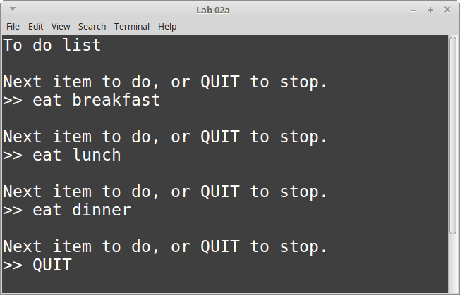
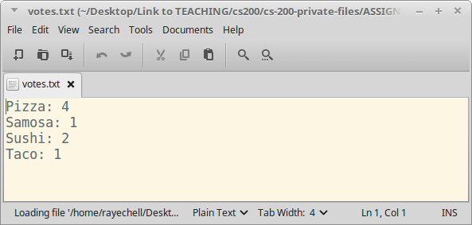

# CS 200 Lab 02a: File I/O - Helper

---

[Information](#information) |
[Helper](https://github.com/Rachels-Courses/CS200-Concepts-of-Progamming-Algorithms/blob/2017-06-Summer/Assignments/In-class%20Labs/Lab%2001c%20-%20Loops%20-%20Helper.MD) |
[Lab](#lab) | [
Questions](#questions)

---

## Information

### Lab topics

* File I/O

### Rules

* For **in-class labs**, collaboration is allowed.
    * If you work with another student on an assignment, make sure that you both
    turn in a copy of the work, and also mention in the D2L comments who you worked with.
    * You can also ask classmates questions if you're unsure on something.
    * You can ask the instructor for help at any time.

### Reference

* [Creating a new project in Visual Studio](https://github.com/Rachels-Courses/Course-Common-Files/blob/master/Visual-Studio/New%20project%20howto.md)

### Turn in

Once you are finished with a project, zip up the entire folder that contains
all source files and project/solution files. Turn in this zip file to **Desire2Learn**.

Also make sure to turn in a text file with your answers to the [question](#questions) section.


## Lab

Each of these programs will require their own projects and source files.
Make sure that, for each program, you **create a new Visual Studio project**.

When you're turning them in, you can select all program folders and zip
them all together.

**Make sure to open the [HELPER]() file for info on how to use file streams**

---

### Program 1: To Do List

Start with the following code:

```c++
#include <iostream>
#include <fstream>
using namespace std;

int main()
{
    string toDoItem;
    int toDoCounter = 1;

    ofstream file;
    file.open( "todo.txt" );

    file << "to do list" << endl;   // write to text file
    cout << "to do list" << endl;   // write to screen

    while ( true )
    {
        // Get item in to do list
        cout << endl;
        cout << "Next item to do, or QUIT to stop." << endl;
        cout << ">> ";
        getline( cin, toDoItem );

        if ( toDoItem == "QUIT" ) { break; }

        // TODO: Output the "toDoItem" variable to the text file

        toDoCounter++;
    }

    file.close();

    return 0;
}
```





---

### Program 2: Voting

Make sure to create a new **Visual Studio project!**

For this program, we will display a poll and the user can vote on
some option. We keep running the program, allowing multiple votes,
until the program is quit.

Finally, we display the tallies to an output file.

Start with the following code:

```c++
#include <iostream>
#include <fstream>
using namespace std;

int main()
{
    int menuChoice;

    int pizzaVotes = 0;
    int samosaVotes = 0;
    int sushiVotes = 0;
    int tacoVotes = 0;

    while ( true )
    {
        cout << endl << endl
            << "What is the best food?" << endl << endl;
        cout << "1. Vote for PIZZA" << endl;
        cout << "2. Vote for SAMOSA" << endl;
        cout << "3. Vote for SUSHI" << endl;
        cout << "4. Vote for TACO" << endl;
        cout << "5. Quit and tally votes" << endl;

        cin >> menuChoice;

        if ( menuChoice == 5 )
        {
            break;
        }

        // TODO: Depending on what the user voted for,
        // add +1 to the votes variable.
    }

    // TODO: Output tallies to output file

    return 0;
}
```

Depending on the user's selection, you will add 1 to the vote counts for
that item. For example, if someone selects option ```1```, then
we are going to add 1 to ```pizzaVotes```.

After the user selects option ```5``` to quit, outside of the while loop
you will open a text file, write the results to the text file, and then
close the test file.

<details>
	<summary><strong><em>
		View more hints
	</em></strong></summary>

1. Declare a variable whose **type** is ```ofstream``` and **name** is ```file```
2. Write "Pizza:" to the output file, followed by the ```pizzaCount```.
2. Write "Samosa:" to the output file, followed by the ```samosaVotes```.
2. Write "Sushi:" to the output file, followed by the ```sushiVotes```.
2. Write "Taco:" to the output file, followed by the ```tacoVotes```.
3. Close the ```file```.
    
</details>





## Questions

1. 
