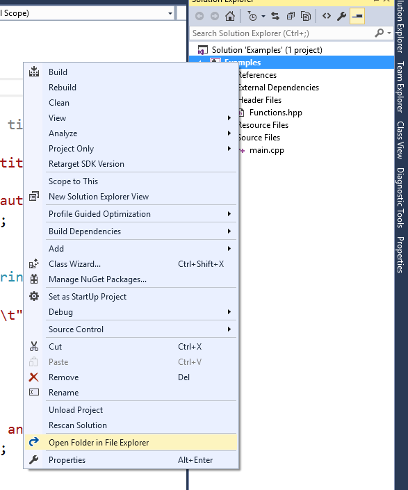
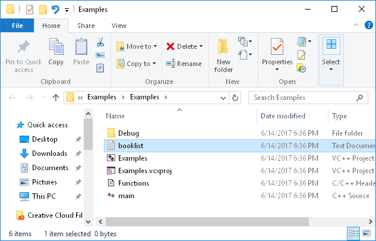
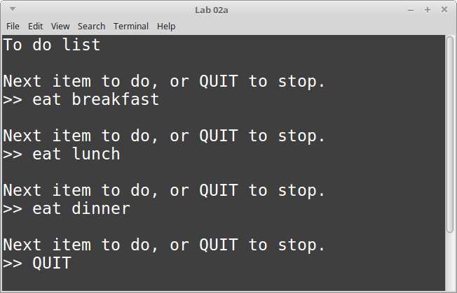
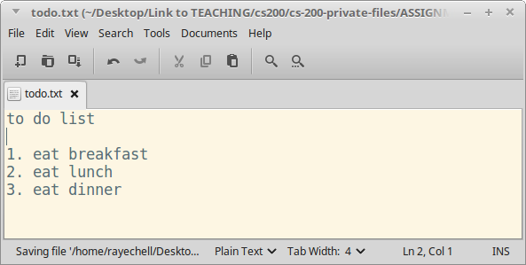
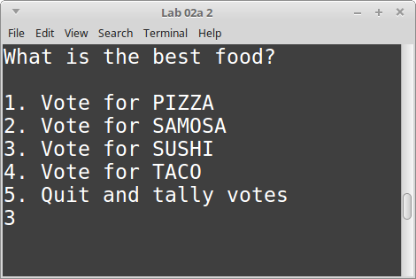
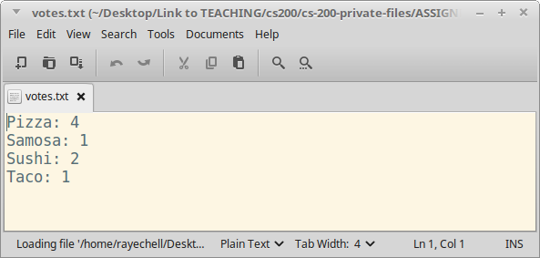
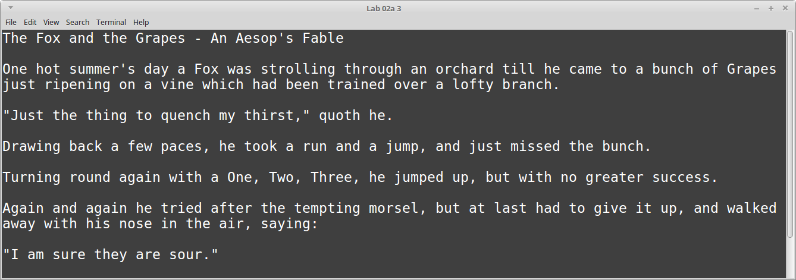

# CS 200 Lab 02a: File I/O

---

[Information](#information) |
[Helper](https://github.com/Rachels-Courses/CS200-Concepts-of-Progamming-Algorithms/blob/2017-06-Summer/Assignments/In-class%20Labs/Lab%2002a%20-%20File%20IO%20-%20Helper.MD) |
[Lab](#lab) | [
Questions](#questions)

---

## Information

### Lab topics

* File I/O

### Rules

* For **in-class labs**, collaboration is allowed.
    * If you work with another student on an assignment, make sure that you both
    turn in a copy of the work, and also mention in the D2L comments who you worked with.
    * You can also ask classmates questions if you're unsure on something.
    * You can ask the instructor for help at any time.

### Reference

* [How to use Visual Studio](https://github.com/Rachels-Courses/Course-Common-Files/blob/organized/STUDENT_REFERENCE/HOW_TO/Visual_Studio.md)
* [How to use Code::Blocks](https://github.com/Rachels-Courses/Course-Common-Files/blob/organized/STUDENT_REFERENCE/HOW_TO/Code_Blocks.md)
* [How to turn in code](https://github.com/Rachels-Courses/Course-Common-Files/blob/organized/STUDENT_REFERENCE/HOW_TO/Turning_in_code.md)


### Turn in

Once you are finished with a project, zip up the entire folder that contains
all source files and project/solution files. Turn in this zip file to **Desire2Learn**.

Also make sure to turn in a text file with your answers to the [question](#questions) section.


## Lab

Each of these programs will require their own projects and source files.
Make sure that, for each program, you **create a new Visual Studio project**.

When you're turning them in, you can select all program folders and zip
them all together.

**Make sure to open the [HELPER](https://github.com/Rachels-Courses/CS200-Concepts-of-Progamming-Algorithms/blob/2017-06-Summer/Assignments/In-class%20Labs/Lab%2002a%20-%20File%20IO%20-%20Helper.MD) file for info on how to use file streams**

### Text files as input and output

For these projects, you will be working with text files. 

When you run a program that uses ```ofstream```, it will generate an output file in the directory where your source files are at.

When you run a program that uses ```ifstream```, it is expecting to read a text file in the directory where your source files are at.

To get to this directory, right-click on your project in the Solution Explorer and select **Open Folder in File Explorer**



And your text file will go in this directory.



* FOR OFSTREAM: The text file will be created by the program and put in this directory
* FOR IFSTREAM: You will need to **create** the text file in this directory, which your program will read.

(booklist is just an example file - I'm just showing you where the text files go for this lab.)

---

### Program 1: To Do List

Start with the following code:

```c++
#include <iostream>
#include <fstream>
#include <string>
using namespace std;

int main()
{
    string toDoItem;
    int toDoCounter = 1;

    ofstream file;
    file.open( "todo.txt" );

    file << "to do list" << endl;   // write to text file
    cout << "to do list" << endl;   // write to screen

    while ( true )
    {
        // Get item in to do list
        cout << endl;
        cout << "Next item to do, or QUIT to stop." << endl;
        cout << ">> ";
        getline( cin, toDoItem );

        if ( toDoItem == "QUIT" ) { break; }

        // TODO: Output the "toDoItem" variable to the text file

        toDoCounter++;
    }

    file.close();

    return 0;
}
```

Here, you will fill in the code at the line that has the comment: ```// TODO: Output the "toDoItem" variable to the text file```

The output file has already been opened (```file.open( "todo.txt" );```), and some text has already been written out to it (```file << "to do list" << endl;```).

At the given step in the program, you will output the variable ```toDoItem``` to the text file. Use the ```file << "to do list" << endl;``` code for reference.

Make sure to open up your project directory to find the **todo.txt** file
that should be output by the program. You might have to go several
folders deep to find the file.

#### Screenshots





---

### Program 2: Voting

Make sure to create a new **Visual Studio project!**

For this program, we will display a poll and the user can vote on
some option. We keep running the program, allowing multiple votes,
until the program is quit.

Finally, we display the tallies to an output file.

Start with the following code:

```c++
#include <iostream>
#include <fstream>
using namespace std;

int main()
{
    int menuChoice;

    int pizzaVotes = 0;
    int samosaVotes = 0;
    int sushiVotes = 0;
    int tacoVotes = 0;

    while ( true )
    {
        cout << endl << endl
            << "What is the best food?" << endl << endl;
        cout << "1. Vote for PIZZA" << endl;
        cout << "2. Vote for SAMOSA" << endl;
        cout << "3. Vote for SUSHI" << endl;
        cout << "4. Vote for TACO" << endl;
        cout << "5. Quit and tally votes" << endl;

        cin >> menuChoice;

        if ( menuChoice == 5 )
        {
            break;
        }

        // TODO: Depending on what the user voted for,
        // add +1 to the votes variable.
    }

    // TODO: Output tallies to output file

    return 0;
}
```

Depending on the user's selection, you will add 1 to the vote counts for
that item. For example, if someone selects option ```1```, then
we are going to add 1 to ```pizzaVotes```.

After the user selects option ```5``` to quit, outside of the while loop
you will open a text file, write the results to the text file, and then
close the test file.

#### Hints

<details>
	<summary><strong><em>
		Steps
	</em></strong></summary>

1. Declare a variable whose **type** is ```ofstream``` and **name** is ```file```
2. Write "Pizza:" to the output file, followed by the ```pizzaCount```.
2. Write "Samosa:" to the output file, followed by the ```samosaVotes```.
2. Write "Sushi:" to the output file, followed by the ```sushiVotes```.
2. Write "Taco:" to the output file, followed by the ```tacoVotes```.
3. Close the ```file```.
    
</details>

#### Screenshots





---

### Program 3: Storybook

Make sure to create a new **Visual Studio project!**

For this program, you will read in a story from a text file and
display it to the screen.

In your project folder (the same directory as your source files),
create a new file ```story.txt``` and add the following:

        The Fox and the Grapes - An Aesop's Fable

        One hot summer's day a Fox was strolling through an orchard till he came to a bunch of Grapes just ripening on a vine which had been trained over a lofty branch.

        "Just the thing to quench my thirst," quoth he.

        Drawing back a few paces, he took a run and a jump, and just missed the bunch.

        Turning round again with a One, Two, Three, he jumped up, but with no greater success.

        Again and again he tried after the tempting morsel, but at last had to give it up, and walked away with his nose in the air, saying:

        "I am sure they are sour."


And start with the following code:

```c++
#include <iostream>
#include <string>
#include <fstream>
using namespace std;

int main()
{
    // TODO: Create an ifstream variable named "input"
    
    // TODO: Open the story.txt file

    string line;

    while ( getline( input, line ) )    // Keep reading in lines of text
    {
        cout << line << endl;   // Display text to the screen
    }

    // TODO: Close the input file

    return 0;
}
```

Fill in the parts of code labelled with ```// TODO:```, with the instructions given.

Once it's finished, running the program should just display the story to the screen.

#### Screenshots




## Questions

1. Which **data-type** is used for a variable that can read text from a file, ifstream or ofstream?
1. Which **data-type** is used for a variable that can write text to a file, ifstream or ofstream?
1. What library is required to ```#include``` in order to use file input and output?
