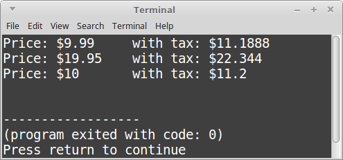
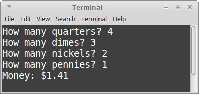
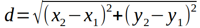
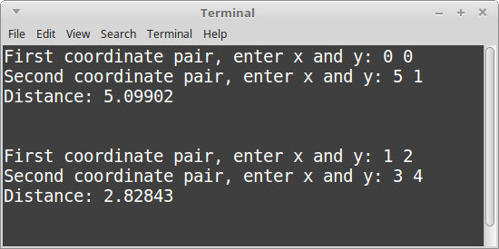

# CS 200 Lab 02b: Functions

---

[Information](#information) |
[Helper](https://github.com/Rachels-Courses/CS200-Concepts-of-Progamming-Algorithms/blob/2017-06-Summer/Assignments/In-class%20Labs/Lab%2002b%20-%20Functions%20-%20Helper.MD) |
[Lab](#lab) | [
Questions](#questions)

---

## Information

### Lab topics

* Functions

### Rules

* For **in-class labs**, collaboration is allowed.
    * If you work with another student on an assignment, make sure that you both
    turn in a copy of the work, and also mention in the D2L comments who you worked with.
    * You can also ask classmates questions if you're unsure on something.
    * You can ask the instructor for help at any time.

### Reference

* [Creating a new project in Visual Studio](https://github.com/Rachels-Courses/Course-Common-Files/blob/master/Visual-Studio/New%20project%20howto.md)

### Turn in

Once you are finished with a project, zip up the entire folder that contains
all source files and project/solution files. Turn in this zip file to **Desire2Learn**.

Also make sure to turn in a text file with your answers to the [question](#questions) section.


## Lab

Each of these programs will require their own projects and source files.
Make sure that, for each program, you **create a new Visual Studio project**.

When you're turning them in, you can select all program folders and zip
them all together.

**Make sure to open the [HELPER](https://github.com/Rachels-Courses/CS200-Concepts-of-Progamming-Algorithms/blob/2017-06-Summer/Assignments/In-class%20Labs/Lab%2002b%20-%20Functions%20-%20Helper.MD) file for some info on functions**

---

### Program 1: Calling a function

Start off with the following code:

	#include <iostream>
	using namespace std;

	// Input: A percent value (0% - 100%, no percent sign though)
	// Output: The decimal equivalent (0.0 - 1.0)
	float PercentToDecimal( float percent )
	{
		float decimal = percent / 100;
		return decimal;
	}

	int main()
	{
		return 0;
	}

This code has a function called **PercentToDecimal**.

Within **main()**, you'll make several calls to this function.

First, create the following variables. All of these are floats. **a**, **b**, and **c** are OK for now.

Since our function returns a value, we can store its return value in a variable. To do this, 
we assign the variable to the function **call**:

	a = PercentToDecimal( 100 );
	
Assign the following values to the variables, then output their values:

* a: 50 percent converted to 0.5 via the PercentToDecimal function.
* b: 12.5 percent converted to 0.125 via the PercentToDecimal function.
* c: 99.99 percent converted to 0.9999 via the PercentToDecimal function.

### Example output


### Solution

<details>
	<summary><strong><em>
		View the solution
	</em></strong></summary>

```c++
#include <iostream>
using namespace std;

// Input: A percent value (0% - 100%, no percent sign though)
// Output: The decimal equivalent (0.0 - 1.0)
float PercentToDecimal( float percent )
{
    float decimal = percent / 100;
    return decimal;
}

int main()
{
    float a, b, c;
    
    a = PercentToDecimal( 50 );
    b = PercentToDecimal( 12.5 );
    c = PercentToDecimal( 99.99 );
    
    cout << "a: " << a << endl;
    cout << "b: " << b << endl;
    cout << "c: " << c << endl;
    
    return 0;
}
```

</details>

---

## Program 2: Price and tax

Start off with the following code:

```c++
#include <iostream>
using namespace std;

// Declare function here

int main()
{
    cout << "Price: $" << 9.99 << " \t with tax: $" << AddTax( 9.99 ) << endl;
    cout << "Price: $" << 19.95 << " \t with tax: $" << AddTax( 19.95 ) << endl;
    cout << "Price: $" << 10.00 << " \t with tax: $" << AddTax( 10.00 ) << endl;
    
    return 0;
}
```

This program initially won't build; notice that it is expecting an **AddTax** function.
You will have to implement this.

For the **AddTax** function, it should return a **float** type as its output,
and its input will be a **float** named **dollar**.

Within the function, calculate the price plus tax and return that value.

First, to get the additional tax amount, you will multiply *dollar* by 0.12 (12% tax).
Then, add this value to the original *dollar* amount.
This is the value you will return as the function's output.

Once you've written it, the program should build and look similar to below.


### Example output



---

Start off with the following code:

```c++
#include <iostream>
#include <string>
using namespace std;

// Declare function here

int main()
{	
    while ( true )
    {
        int quarters, dimes, nickels, pennies;
        
        cout << "How many quarters? ";
        cin >> quarters;
        
        cout << "How many dimes? ";
        cin >> dimes;
        
        cout << "How many nickels? ";
        cin >> nickels;
        
        cout << "How many pennies? ";
        cin >> pennies;
        
        float money = CountChange( quarters, dimes, nickels, pennies );	
        cout << "Money: $" << money << endl;
        
        cout << endl << endl;
    }
    
    return 0;
}
```

This program needs a function called **CountChange**. You will declare it.

Its inputs will be, in order:

* quarterCount, an integer
* dimeCount, an integer
* nickelCount, an integer
* pennyCount, an integer

And its output will be a float. The output will be the money value
calculated from the change.

For example, if quarterCount is 4, then the resulting money
would be 4 * 0.25, or 1.00.

Return the calculated money value.

### Example output



---

Start off with the following code:

```c++
#include <iostream>
#include <string>
#include <cmath> // needed for square root
using namespace std;


int main()
{	
    while ( true )
    {
        float x1, y1, x2, y2;
        
        cout << "First coordinate pair, enter x and y: ";
        cin >> x1 >> y1;
        
        cout << "Second coordinate pair, enter x and y: ";
        cin >> x2 >> y2;
        
        float distance = GetDistance( x1, y1, x2, y2 );
        cout << "Distance: " << distance << endl;
        
        cout << endl << endl;
    }
    
    return 0;
}
```

This program needs a function called **GetDistance**. You will declare it.

Its inputs will be, in order:

* x1, a float
* y1, a float
* x2, a float
* y2, a float

And its output will be a float. The output will be the distance between
the two points.

Within the function, you will need to use the distance formula...:



But you will have to translate it into programming code!

To calculate a square root, we call the square root function...:

	float a = sqrt( 4 ); // a = 2 now

And if you want to calculate an exponent you can use the pow function:

```c++
float b = pow( 5, 2 ); // 5 to the 2nd power
```

Or simply multiple something by itself:

```c++
float c = 5 * 5; // Also basically 5 to the 2nd power.
```


### Example output




## Questions

1. Which **data-type** is used for a variable that can read text from a file, ifstream or ofstream?
1. Which **data-type** is used for a variable that can write text to a file, ifstream or ofstream?
1. What library is required to ```#include``` in order to use file input and output?
