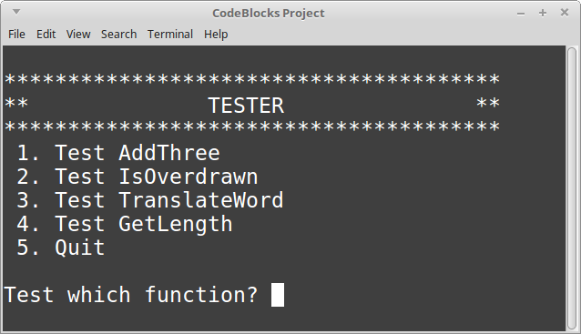
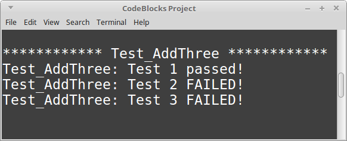

# CS 200 Lab 03a: Testing

---

[Information](#information) |
[Lab](#lab)

---

## Information

### Lab topics

* Functions
* Testing

### Rules

* For **in-class labs**, collaboration is allowed.
    * If you work with another student on an assignment, make sure that you both
    turn in a copy of the work, and also mention in the D2L comments who you worked with.
    * You can also ask classmates questions if you're unsure on something.
    * You can ask the instructor for help at any time.

### Reference

* [How to use Visual Studio](https://github.com/Rachels-Courses/Course-Common-Files/blob/organized/STUDENT_REFERENCE/HOW_TO/Visual_Studio.md)
* [How to use Code::Blocks](https://github.com/Rachels-Courses/Course-Common-Files/blob/organized/STUDENT_REFERENCE/HOW_TO/Code_Blocks.md)
* [How to turn in code](https://github.com/Rachels-Courses/Course-Common-Files/blob/organized/STUDENT_REFERENCE/HOW_TO/Turning_in_code.md)


### Turn in

Once you are finished with a project, zip up the entire folder that contains
all source files and project/solution files. Turn in this zip file to **Desire2Learn**.

Also make sure to turn in a text file with your answers to the [question](#questions) section.


# Lab

For this lab, the instructor has already implemented several functions.

Rather than writing functions that do some procedure, instead you will
be writing functions to **test** the existing functions.
A function that tests another function is known as a **unit test**.

The project should contain **five** source files:

* lab03a_testing.cpp    - contains the main() function
* lab03a_function1.hpp  - contains AddThree
* lab03a_function2.hpp  - contains IsOverdrawn
* lab03a_function3.hpp  - contains TranslateWord
* lab03a_function4.hpp  - contains GetLength

You **will not modify** main() or anything in lab03a_testing.cpp!
You will be filling in the **Test** functions in each of the header (.hpp) files.

---

## Testing functions

Here's how we test functions:

1. We choose a function that receives *input* and gives *output*.
1. We recognize that we know what **should** be *output* for any specific *inputs*.
1. We write *test cases* to specify that, for *these inputs*, *this output* is expected.
1. If the function gives something other than the expected output, then the test has failed.

So, let's say we have a function that doubles numbers. Let's look at it in algebraic terms:

*f(x) = 2x*

This is the function itself. If we wanted to *test* it, we would come up with test cases, like:

* If the input x is 1, then the output f(x) is 2.
* If the input x is 2, then the output f(x) is 4.
* If the input x is 3, then the output f(x) is 6.
* If the input x is -5, then the output f(x) is -10.
* If the input x is 0, then the output f(x) is 0.

When writing test cases, we try to cover as many possible scenarios as possible.
Here, we don't have to test for *every number*, but it is good to test for
positive integers, negative integers, and 0.

We can apply this same idea for testing functions in our code:
**For some given input, we know what the output SHOULD be**,
so our test will pass in some inputs, and investigate the output
to see if it matches our expectations.

---

## Program 1: AddThree

### The AddThree function

The **AddThree** function has the following **input parameters**:

* int a
* int b
* int c

The purpose of the **AddThree** function is to add together a, b, and c,
and **return** the result.

### The Test_AddThree function

**You will be working with this function.**

Test 1 is already filled out for you:

```c++
    /* TEST 1 ********************************************/
    input1 = 1; input2 = 1; input3 = 1;
    expectedOutput = 3;

    actualOutput = AddThree( input1, input2, input3 );
    if ( actualOutput == expectedOutput )
    {
        cout << "Test_AddThree: Test 1 passed!" << endl;
    }
    else
    {
        cout << "Test_AddThree: Test 1 FAILED!" << endl;
    }
```

#### Testing overview

* For each of tehse tests, we have variables for *inputs*, for the
*expectedOutput*, and for the *actualOutput*.
* Every test will set up the *inputs* and the *expected output*.
* Every test will call the function-to-test, and store its return value
in the *actualOutput* variable.
* Every test will use an if/else statement to compare ```expectedOutput```
with ```actualOutput```.
* If the expected output matches the actual output, display a "pass!" message.
* If the expected output does not match the actual output, display a "fail!" message.

#### Writing your tests

You will work on Test 2 and Test 3 for this tester. All you need to do
is update the following variable assignments:

```c++
    /* TEST 2 ********************************************/
    // CREATE YOUR OWN TEST
    input1 = 0;             // change me
    input2 = 0;             // change me
    input3 = 0;             // change me
    expectedOutput = -1;    // change me
```

So you will assign some values to input1, input2, and input3,
and based on your own calculations in your head (or on paper),
you will figure out the expected output, and assign the expected output
to the ```expectedOutput``` variable.

#### COMMON ERROR!!!

For the tests, **YOU DO NOT IMPLEMENT THE AddThree FUNCTION'S FUNCTIONALITY!!**

The test shouldn't be COMPUTING any data - don't re-implement what should
be in the original function.

We are simply recognizing what the output *should* be for some given inputs,
and testing the function (by *calling it*) to make sure the actual output
matches our expected output.

#### Running the test

When you run the program, a main menu will pop up with options for what
to test.



To test AddThree, select option ```1``` and hit enter.



#### Failures!

Each test will have some failures at first. This is by design.

Use the failing tests to diagnose the functions to try to find
the logic errors in each function.

After you have working tests in order, fix the original **AddThree** function
so that all tests pass.

---

## Program 2: IsOverdrawn

With the **IsOverdrawn** function, there is one logic error.

Write your tests in **Test_IsOverdrawn**, and try to make sure
several scenarios are covered. Your tests may pass at first, but there
is a specific scenario that will give the wrong output.

<!-- HINT ~~~~~~~~~~~~~~~~~~~~~~~~~~~~~~~~~~~~~~~~ -->
<details>
<summary><strong><em>       Hints        </em></strong></summary>
* If the balance is a positive number, is there an overdraft?
* If the balance is a negative number, is there an overdraft?
* If the balance is zero, is there an overdraft?
</details>
<!-- HINT ~~~~~~~~~~~~~~~~~~~~~~~~~~~~~~~~~~~~~~~~ -->

---

## Program 3: TranslateWord

With the **TranslateWord** function, the input is some word in English.
The output is that word translated into Esperanto. The translations are as follows:

<table>
<tr> <th> English </th> <th> Esperanto </th> </tr>
<tr> <td> cat </td> <td> kato </td> </tr>
<tr> <td> dog </td> <td> hundo </td> </tr>
<tr> <td> mouse </td> <td> muso </td> </tr>
<tr> <td> bird </td> <td> birdo </td> </tr>
</table>

Write out the tests to make sure all scenarios are covered. There should be
five possible different outputs.

This function contains a typo.

<!-- HINT ~~~~~~~~~~~~~~~~~~~~~~~~~~~~~~~~~~~~~~~~ -->
<details>
<summary><strong><em>       Hints       </em></strong></summary>
The possible outputs are 4 for each of the animals, and one for the unknown option.
</details>
<!-- HINT ~~~~~~~~~~~~~~~~~~~~~~~~~~~~~~~~~~~~~~~~ -->

---

## Program 4: GetLength

The **GetLength** function takes in some word as the input,
and returns the length of that text as the output.

This function contains a logic error.

Write out the test cases to try to locate the logic error.

<!-- HINT ~~~~~~~~~~~~~~~~~~~~~~~~~~~~~~~~~~~~~~~~ -->
<details>
<summary><strong><em>       Hints        </em></strong></summary>
* Check for an empty string
* Check for words of several lengths
</details>
<!-- HINT ~~~~~~~~~~~~~~~~~~~~~~~~~~~~~~~~~~~~~~~~ -->


