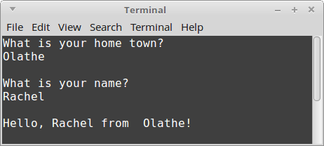
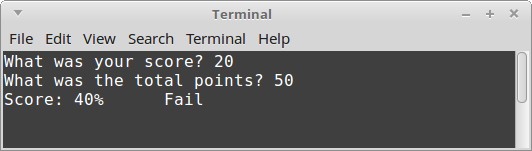
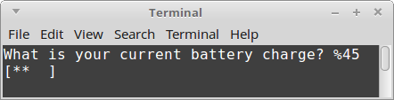
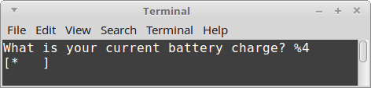
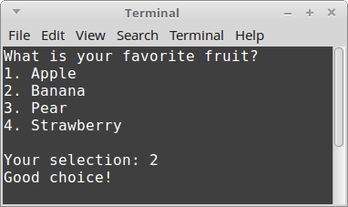
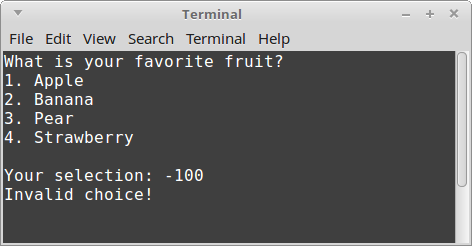
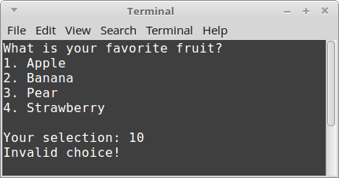
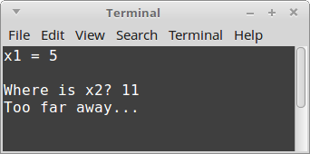

# CS 200 Lab 4: Branching

## Chrome!

Please read this in chrome so that the solutions are collapsed by default!

## Introduction

Follow along step-by-step to work on this program. 

## Review

* Variables, Data Types
* Output (cout)
* Input (cin)
* If Statements
* Switch Statements

---

## Setting up your project

### Visual Studio

1. Create a new project. *File > New > Project...*
    1. Select **Visual C++** from the left category list.
    2. Select **Empty Project** from the template list.
    3. Set the project **Name** to "CL2 Branching".
    4. Set the project **Location**.
    5. Click **OK**.
2. Create your source file. In the **Solution Explorer**, right-click your project file. *Add > New Item...*
    1. Select **C++ File (.cpp)** and name it **CL2.cpp**.
    2. Click **Add**.

### Code::Blocks

1. Create a new project. *File > New > Project...*
2. Select **Empty project** and click **Go**.
    1. Enter a **Project title** (e.x., "CL2 Branching"),
    2. Choose a **Folder to create project in**.
    3. Click **Next >**
    4. Leave defaults checked for **Compiler**, **Create "Debug" configuration**, and **Create "Release" configuration**.
    5. Click **Finish**
3. Create your source file. **File > New > Empty File*
    1. It will ask if you want to save it. Select **Yes**.
    2. Save it in your project directory as **CL2.cpp**.
    3. Click **Save**
    4. Leave the default **Debug** and **Release** checked and click **OK**.

## Starter code

Paste the following into your .cpp file to start with:

    #include <iostream>
    #include <string>
    using namespace std;

    int main()
    {
        return 0;
    }
    
---

## Tiny App 1: Hometown

### Summary

Write a program that will ask the user for their home town.

If the length of the home town's name is longer than 6 letters,
it will display a message "That's a long name!" - otherwise, it won't comment
before continuing on.

After that, it will ask for the user's name.

Finally, it will display "Hello, (NAME) from (LOCATION)"

### Knowledge

* You can get the length of a string by using the **size()** function. For example:

    cout << homeTown.size() << endl;
    
* When the instructions say "Display", this means use **cout**.

* When the instructions say to get the user's input, you will need to use **cin**.

* You can keep linking together string-literals (stuff between " and ") and variables with <<:

    cout << "Hi there " << name << "!" << endl << "How are you this fine " << dayOfWeek << "?!" << endl;

### Steps

1. Create two string variables: **homeTown** and **name**.
2. Display a message: "What is your home town?"
3. Get the user's input, and store it in the **homeTown** variable.
    1. NOTE: If you're using **cin >>**, the home town name will have to be all one word!
4. Create an if statement. If the homeTown's name is longer than 6 letters, then:
    1. Display the message, "That's a long name!"
5. Display a message: "What is your name?"
6. Get the user's input, and store it in the **name** variable.
7. Finally, display the message: "Hello, (NAME) from (HOMETOWN)", by replacing (NAME) with **name**, and (HOMETOWN) with **homeTown**.

### Example output

**Long town name:**

**Short town name:**

### Solution

	
<strong><em>
		View the solution
	</em></strong>

    #include <iostream>
    #include <string>
    using namespace std;
        
    int main()
    {
        string homeTown, name;
        
        cout << "What is your home town?" << endl;
        cin >> homeTown;
        
        if ( homeTown.size() > 6 )
        {
            cout << endl << "That's a long name!" << endl;
        }
        
        cout << endl << "What is your name?" << endl;
        cin >> name;
        
        cout << endl << "Hello, " << name << " from  " << homeTown << "!" << endl;
        
        return 0;
    }
    

---

## Tiny App 2: Pass/Fail

### Summary

Write a program that will ask the user for their score on an assignment,
and the maximum points of the assignment.

It will check the ratio, and either display "Pass" or "Fail" based on whether
the assignment is 70% or higher (for pass), or less than 70% (for fail)

### Knowledge

* The logical opposite of ( percent > 50 ) is ( percent <= 50 )
* The logical opposite of ( percent >= 50 ) is ( percent < 50 )
* Note the different relational operators!
* By utilizing **else**, we don't need to specify that failing is less than 70, 
    if we've already specified that passing is 70 or greater.

### Steps

1. Create two float variables: **studentPoints** and **totalPoints**.
2. Ask the user to enter their score. Store their score in the **studentPoints** variable.
3. Ask the user to enter the total points. Store the total points in the **totalPoints** variable.
4. Create another float variable called **percent**. Assign it to **( studentPoints / totalPoints ) * 100**.
5. Display the score, displaying the **percent** variable.
6. Create an if statement. If **percent** is greater than or equal to 70%, display "Pass".
7. Otherwise, display "Fail".

### Example output

**Pass:**

**Fail:**

### Solution

	
<strong><em>
		View the solution
	</em></strong>

    #include <iostream>
    #include <string>
    using namespace std;
        
    int main()
    {
        float studentPoints, totalPoints;
        
        cout << "What was your score? ";
        cin >> studentPoints;
        
        cout << "What was the total points? ";
        cin >> totalPoints;
        
        float percent = ( studentPoints / totalPoints ) * 100;
        
        cout << "Score: " << percent << "% \t";
        
        if ( percent >= 70 )
        {
            cout << "Pass" << endl;
        }
        else
        {
            cout << "Fail" << endl;
        }
        
        return 0;
    }

    

---

## Tiny App 3: Battery charge

### Summary

Write a program that will ask the user to enter the amount of charge of their phone battery.
Then, draw a picture for an estimate of whether it's 1/4 charge, 1/2 charge, 3/4 charge, or full charge.

### Steps

1. Create a float variable called **battery**.
2. Ask the user what their current battery charge is. Store their response in **battery**.
3. If battery is 75% or greater, display the drawing: 
3. If battery is 50% or greater, display the drawing: 
3. If battery is 25% or greater, display the drawing: 
3. Otherwise, display the drawing: 

### Example output

**Full charge:**

**3/4ths charge:**

**1/2 charge:**

**1/4th charge:**

### Solution

	
<strong><em>
		View the solution
	</em></strong>

    #include <iostream>
    using namespace std;
        
    int main()
    {
        float battery;
        
        cout << "What is your current battery charge? %";
        cin >> battery;
        
        if ( battery >= 75 )
        {
            cout << "[****]" << endl;
        }
        else if ( battery >= 50 )
        {
            cout << "[*** ]" << endl;
        }
        else if ( battery >= 25 )
        {
            cout << "[**  ]" << endl;
        }
        else
        {
            cout << "[*   ]" << endl;
        }
        
        return 0;
    }

    

---

## Tiny App 4: Input validation

### Summary

Write a program that displays a list of fruits and asks the user to choose one.
If the user selects an invalid input, display an error message. Otherwise, display "good choice!"

### Knowledge

Logical operators:

* && AND
* || OR
* ! NOT

### Steps

* Display the following menu:

    What is your favorite fruit?
    1. Apple
    2. Banana
    3. Pear
    4. Strawberry
    
* Create an integer variable called **choice**.
* Get the user's selection and store it in **choice**.
* If the user's selection is invalid (their choice is less than 1, or it is greater than 4), display an error message, "Invalid choice!"
* Otherwise, display "Good choice!"

When checking for valid input, it should be all in one statement! Use a logical operator to combine two boolean expressions into one.

### Example output

**Valid input:**

**Invalid input:**

### Solution

    #include <iostream>
    using namespace std;
        
    int main()
    {    
        cout << "What is your favorite fruit?" << endl;
        cout << "1. Apple" << endl;
        cout << "2. Banana" << endl;
        cout << "3. Pear" << endl;
        cout << "4. Strawberry" << endl;
        
        cout << endl << "Your selection: ";
        
        int choice;
        cin >> choice;
        
        if ( choice < 1 || choice > 4 )
        {
            cout << "Invalid choice!" << endl;
        }
        else
        {
            cout << "Good choice!" << endl;
        }
        
        return 0;
    }

---

## Tiny App 5: Range

### Summary

Write a program that tells whether the point x2 is within 5 units from point x1.

### Knowledge

If you have a range, a < x < b, which means that x is between a and b, we
cannot write a boolean expression that looks exactly the same.

Instead, you have to split it up into two different expressions:

* a < x
* x < b

and then combine it with an and statement:

* ( a < x && x < b )

### Steps

1. Create two variables, both floats: **x1** and **x2**.
2. Assign x1 the value of 5.00.
3. Display the label "x1" and the value of the variable **x1**.
4. Ask the user, "Where is x2?". Get their input and store it in **x2**.
5. Create an if statement to check if x2 is within the range:
    1. (x1 - 5) <= x2 <= (x1 + 5)
6. If x2 is within the range, display the message "Within 5 units from x1!"
7. Otherwise, display the message "Too far away...".

### Example output

**Within range:**

**Outside of range:**

### Solution

	
<strong><em>
		View the solution
	</em></strong>

    #include <iostream>
    using namespace std;
        
    int main()
    {
        float x1 = 5.00;
        float x2;
        
        cout << "x1 = " << x1 << endl;
        
        cout << endl << "Where is x2? ";
        cin >> x2;
        
        if ( x1 - 5 <= x2 && x2 <= x1 + 5 )
        {
            cout << "Within 5 units from x1!" << endl;
        }
        else
        {
            cout << "Too far away..." << endl;
        }
        
        return 0;
    }

    

---

## Tiny App 6: 

### Summary

Write a program that asks the user to enter two numbers. Then, ask them
whether they want to add, subtract, multiply, or divide.

Use a switch statement to decide what kind of operation to do, and display the result.

### Knowledge

A switch statement does not use a boolean expression - instead,
it can operate on **integers**, **characters**, and **booleans**.

Each **case** in a switch statement is essentially asking, "is the value of the switch variable this?",
and the lines of code after the case statement are what gets executed.

The case statement ends at a **break** statement.

The **default** case is used like an "else".

Example:

    switch( letter )
    {
        case 'a':
            cout << "ABC!" << endl;
        break;
        
        case 'z':
            cout << "XYZ!" << endl;
        break;
        
        
        default:
            cout << "I don't like that letter." << endl;
    }

### Steps

1. Create two float variables: **a** and **b**.
2. Ask the user to enter a value for a, and store it in the **a** variable.
2. Ask the user to enter a value for b, and store it in the **b** variable.
3. Display a menu for the user to select what kind of operation:
    * 1. Add
    * 2. Subtract
    * 3. Multiply
    * 4. Divide
4. Ask the user for their selection.
5. Create a new variable, an integer called **choice**. Store the user's selection in this variable.
6. Use a switch statement to check the value of **choice**.
    * If choice is 1, show the result of a + b.
    * If choice is 2, show the result of a - b.
    * If choice is 3, show the result of a * b.
    * If choice is 4, show the result of a / b.
    * Otherwise, display an error: "Invalid choice."

### Example output

**Add:**

**Subtract:**

**Multiply:**

**Divide:**

**Invalid:**

### Solution

	
<strong><em>
		View the solution
	</em></strong>

    
    #include <iostream>
    using namespace std;
        
    int main()
    {
        float a, b;
        
        cout << "Enter a: ";
        cin >> a;
        cout << "Enter b: ";
        cin >> b;
        
        cout << endl << "What kind of operation? (1) Add, (2) Subtract, (3) Multiply, (4) Divide" << endl;
        
        int choice;
        cout << "Choice: ";
        cin >> choice;
        
        switch( choice )
        {
            case 1:
            cout << a + b << endl;
            break;
            
            case 2:
            cout << a - b << endl;
            break;
            
            case 3:
            cout << a * b << endl;
            break;
            
            case 4:
            cout << a / b << endl;
            break;
            
            default:
            cout << "Invalid choice" << endl;
        }
        
        return 0;
    }

    

---

# Turn In

Make sure to zip your entire project folder and upload it in the dropbox on D2L.

Also upload the .cpp file(s) to your class repository. [See Lab 1 for instructions](https://github.com/Rachels-Courses/CS200-Concepts-of-Progamming-Algorithms/blob/master/Assignments/In-class%20Labs/Lab%2001%20-%20Intro%20to%20GitHub%20and%20CPP.md#upload-files)
