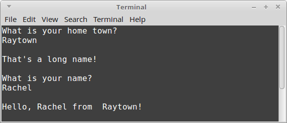

# CS 200 Lab 3: Branching

## Chrome!

Please read this in chrome so that the solutions are collapsed by default!

## Introduction

Follow along step-by-step to work on this program. 

## Review

* Variables, Data Types
* Output (cout)
* Input (cin)
* If Statements
* Switch Statements

---

## Setting up your project

### Visual Studio

1. Create a new project. *File > New > Project...*
    1. Select **Visual C++** from the left category list.
    2. Select **Empty Project** from the template list.
    3. Set the project **Name** to "CL2 Branching".
    4. Set the project **Location**.
    5. Click **OK**.
2. Create your source file. In the **Solution Explorer**, right-click your project file. *Add > New Item...*
    1. Select **C++ File (.cpp)** and name it **CL2.cpp**.
    2. Click **Add**.

### Code::Blocks

1. Create a new project. *File > New > Project...*
2. Select **Empty project** and click **Go**.
    1. Enter a **Project title** (e.x., "CL2 Branching"),
    2. Choose a **Folder to create project in**.
    3. Click **Next >**
    4. Leave defaults checked for **Compiler**, **Create "Debug" configuration**, and **Create "Release" configuration**.
    5. Click **Finish**
3. Create your source file. **File > New > Empty File*
    1. It will ask if you want to save it. Select **Yes**.
    2. Save it in your project directory as **CL2.cpp**.
    3. Click **Save**
    4. Leave the default **Debug** and **Release** checked and click **OK**.

## Starter code

Paste the following into your .cpp file to start with:

    #include <iostream>
    #include <string>
    using namespace std;

    int main()
    {
        return 0;
    }
    
---

## Tiny App 1

### Summary

Write a program that will ask the user for their home town.

If the length of the home town's name is longer than 6 letters,
it will display a message "That's a long name!" - otherwise, it won't comment
before continuing on.

After that, it will ask for the user's name.

Finally, it will display "Hello, (NAME) from (LOCATION)"

### Knowledge

* You can get the length of a string by using the **size()** function. For example:

    cout << homeTown.size() << endl;
    
* When the instructions say "Display", this means use **cout**.

* When the instructions say to get the user's input, you will need to use **cin**.

* You can keep linking together string-literals (stuff between " and ") and variables with <<:

    cout << "Hi there " << name << "!" << endl << "How are you this fine " << dayOfWeek << "?!" << endl;

### Steps

1. Create two string variables: **homeTown** and **name**.
2. Display a message: "What is your home town?"
3. Get the user's input, and store it in the **homeTown** variable.
    1. NOTE: If you're using **cin >>**, the home town name will have to be all one word!
4. Create an if statement. If the homeTown's name is longer than 6 letters, then:
    1. Display the message, "That's a long name!"
5. Display a message: "What is your name?"
6. Get the user's input, and store it in the **name** variable.
7. Finally, display the message: "Hello, (NAME) from (HOMETOWN)", by replacing (NAME) with **name**, and (HOMETOWN) with **homeTown**.

### Example output

**Long town name:**

**Short town name:**

### Solution

	
<strong><em>
		View the solution
	</em></strong>

    #include <iostream>
    #include <string>
    using namespace std;
        
    int main()
    {
        string homeTown, name;
        
        cout << "What is your home town?" << endl;
        cin >> homeTown;
        
        if ( homeTown.size() > 6 )
        {
            cout << endl << "That's a long name!" << endl;
        }
        
        cout << endl << "What is your name?" << endl;
        cin >> name;
        
        cout << endl << "Hello, " << name << " from  " << homeTown << "!" << endl;
        
        return 0;
    }

	

---

# Turn In

Make sure to zip your entire project folder and upload it in the dropbox on D2L.

Also upload the .cpp file(s) to your class repository. [See Lab 1 for instructions](https://github.com/Rachels-Courses/CS200-Concepts-of-Progamming-Algorithms/blob/master/Assignments/In-class%20Labs/Lab%2001%20-%20Intro%20to%20GitHub%20and%20CPP.md#upload-files)
