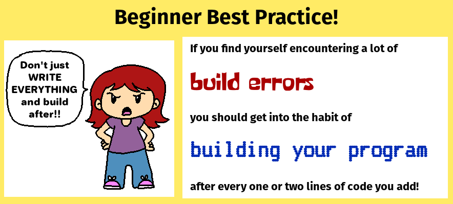
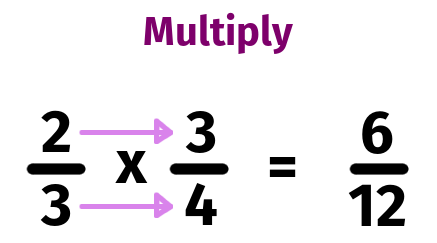
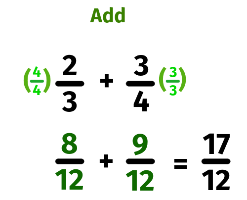
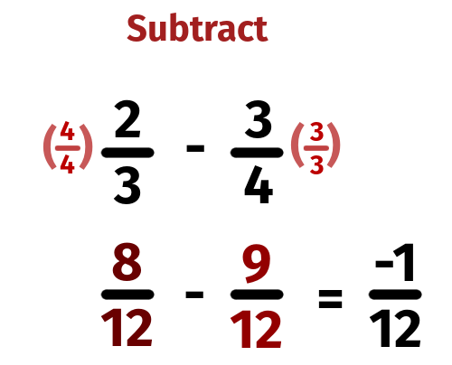
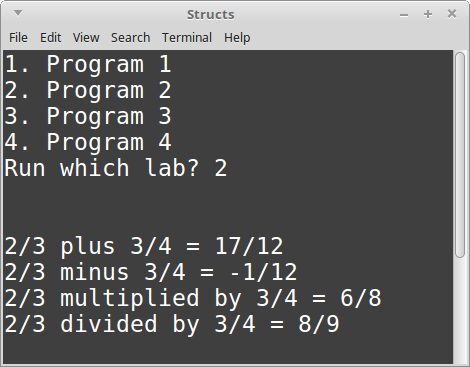
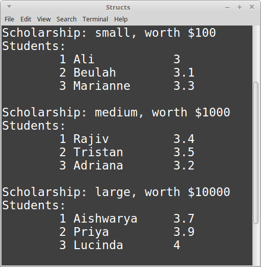

# CS 200 Lab 05: Structs

---

[Information](#information) |
[Helper](https://github.com/Rachels-Courses/CS200-Concepts-of-Progamming-Algorithms/blob/2017-06-Summer/Assignments/In-class%20Labs/Lab%2005%20-%20Structs%20-%20Helper.md) |
[Lab](#lab) | [
Questions](#questions)

---

# Information

## Lab topics

* Pointers
* Dynamic variables
* Dynamic arrays

## Rules

* For **in-class labs**, collaboration is allowed.
    * If you work with another student on an assignment, make sure that you both
    turn in a copy of the work, and also mention in the D2L comments who you worked with.
    * You can also ask classmates questions if you're unsure on something.
    * You can ask the instructor for help at any time.

## Reference

* [How to use Visual Studio](https://github.com/Rachels-Courses/Course-Common-Files/blob/organized/STUDENT_REFERENCE/HOW_TO/Visual_Studio.md)
* [How to use Code::Blocks](https://github.com/Rachels-Courses/Course-Common-Files/blob/organized/STUDENT_REFERENCE/HOW_TO/Code_Blocks.md)
* [How to turn in code](https://github.com/Rachels-Courses/Course-Common-Files/blob/organized/STUDENT_REFERENCE/HOW_TO/Turning_in_code.md)


## Turn in

Once you are finished with a project, zip up the entire folder that contains
all source files and project/solution files. Turn in this zip file to **Desire2Learn**.

Also make sure to turn in a text file with your answers to the [question](#questions) section.


## Make sure it builds!





---

# Lab

Start by creating a project. We will have separate source files for each struct,
and the main source file will contain functions for each lab.

Create these source files:

* main.cpp
* Student.hpp
* Fraction.hpp
* Scholarship.hpp

Your **main.cpp** file should start out with the following:

```c++
#include <iostream>
#include <string>
using namespace std;

#include "Student.hpp"
#include "Fraction.hpp"
#include "Scholarship.hpp"

void Program1()
{
}

void Program2()
{
}

void Program3()
{
}

int main()
{
    while ( true )
    {
        cout << "1. Program 1" << endl;
        cout << "2. Program 2" << endl;
        cout << "3. Program 3" << endl;
        cout << "Run which lab? ";
        int choice;
        cin >> choice;

        cout << endl << endl;

        switch( choice )
        {
            case 1:     Program1();     break;
            case 2:     Program2();     break;
            case 3:     Program3();     break;
        }

        cout << endl << endl;
    }

    return 0;
}
```

---


# Program 1: Student struct

**Just member variables**

## Student.hpp

Within **Student.hpp**, start with the following:

```c++
#ifndef _STUDENT_HPP
#define _STUDENT_HPP

#include <string>
using namespace std;

struct Student
{
};

#endif
```

Declare the following variables within this struct:

* name, a string
* degree, a string
* gpa, a double

## Progam1() in main.cpp

Back in **main.cpp**, in the **Program1()** function, do the following:

**1.** Declare a new variable whose data type is ```Student``` named ```newStudent```.

**2.** The Student data-type has the name, degree, and gpa variables. Assign values to these variables.

Remember that to assign a value to a variable that *belongs to a class*, you need to use
the dot operator ```.```, for example:

```c++
myClassObject.variable = 123;
```

**3.** After assigning values to the variables, display the values of these variables with a ```cout``` statement. For example:

```c++
cout << myClassObject.variable << endl;
```


## Example output

        Student name:   Ashu
        Degree:         CS
        GPA:            3.0


## Hints

<details><summary><strong> Declaring a variable whose data type is a struct/class </strong></summary>

```c++
Student newStudent;
```

</details>

<details><summary><strong> Assign values to the struct/class' member variables </strong></summary>

```c++
newStudent.name = "Bob";
newStudent.degree = "English";
newStudent.gpa = 2.8;
```

</details>

<details><summary><strong> Display member variables </strong></summary>

```c++
cout << newStudent.name << "\n" << newStudent.degree << "\n" << newStudent.gpa << endl;
```

</details>


---

# Program 2: Fraction

**A struct with member variables and fractions**

## Fraction.hpp

In the **Fraction.hpp** file, begin with the following:

```c++
#ifndef _FRACTION_HPP
#define _FRACTION_HPP

struct Fraction
{
};

#endif
```

Create two member variables:

* numerator, an integer
* denominator, an integer

And create member functions:

1. Setup
    * return type: void
    * parameters: ```int n, int d```

1. Display
    * return type: void
    * parameters: none

1. Add
    * return type: Fraction
    * parameters: ```Fraction other```

1. Subtract 
    * return type: Fraction
    * parameters: ```Fraction other```

1. Multiply
    * return type: Fraction
    * parameters: ```Fraction other```

1. Divide
    * return type: Fraction
    * parameters: ```Fraction other```


These functions will be created *inside* the struct. Include your
opening and closing curly braces ```{``` and ```}```.

If you have trouble writing the struct, expand the following hint:

<details><summary><strong> Struct declaration </strong></summary>

```c++
#ifndef _FRACTION_HPP
#define _FRACTION_HPP

struct Fraction
{
    int numerator;
    int denominator;

    void Setup( int n, int d )
    {
    }

    void Display()
    {
    }

    Fraction Add( Fraction other )
    {
    }

    Fraction Subtract( Fraction other )
    {
    }

    Fraction Multiply( Fraction other )
    {
    }

    Fraction Divide( Fraction other )
    {
    }
};

#endif


```

</details>


Now it's time to define the functions.

### Setup

Here, the input parameter variables are ```n``` and ```d```.

Set your member variable ```numerator``` to the value of ```n```,
and set your member variable ```denominator``` to the value of ```d```.

### Display

Use ```cout``` to display the values of the two member variables
```numerator``` and ```denominator```.

For example, if numerator is 1 and denominator is 2:

        1/2


### Math functions

For these math functions, we are doing the math between:

1. **The object the function is being called from** and
2. The **object being passed in as a parameter**

And the return type is a third Fraction -- the result.

For each of these, you will need to start by creating a variable for the result: ```Fraction result;```


We're not at this step yet, but when we are calling the function, it will look like this:

        // This is just an example
    
        Fraction frac1;
        frac1.Setup( 2, 3 );
        
        Fraction frac2;
        frac2.Setup( 3, 4 );

        Fraction frac3 = frac1.Multiply( frac2 );


Inside the **Multiply** function, we will have access to the following:

* ```this->numerator``` - the numerator of the first fraction
* ```this->denominator``` - the denominator of the first fraction
* ```other.numerator``` - the numerator of the second fraction
* ```other.denominator``` - the denominator of the second fraction

And once you create a Fraction named ```result```, we will also have:

* ```result.numerator``` - where to store the result's numerator
* ```result.denoinator``` - where to store the result's denominator


Note that for all these functions, we **will not** reduce the fractions! (Keep it simple!)


#### Multiply



To multiply two fractions, you multiply both numerators and denominators together.
The math is pretty simple:

        a       c       ac
        -   x   -   =   --
        b       d       bd


1. Declare a **Fraction** variable named ```result```.
2. For the ```result```'s ```numerator```, set it equal to ```this->numerator``` times ```second.numerator```.
2. For the ```result```'s ```denominator```, set it equal to ```this->denominator``` times ```second.denominator```.
2. Return ```result```.

<details><summary><strong> Multiplication </strong></summary>

```c++
    Fraction Multiply( Fraction other )
    {
        Fraction result;
        result.numerator = this->numerator * other.numerator;
        result.denominator = this->numerator * other.denominator;
        return result;
    }
```

</details>


#### Divide


To divide a fraction, we perform a multiplication, but we cross over:

        a       c       ad
        -   ÷   -   =   --
        b       d       bc

1. Declare a **Fraction** variable named ```result```.
2. For the ```result```'s ```numerator```, set it equal to ```this->numerator``` times ```second.denominator```.
2. For the ```result```'s ```denominator```, set it equal to ```this->denominator``` times ```second.numerator```.
2. Return ```result```.

<details><summary><strong> Division </strong></summary>

```c++
    Fraction Divide( Fraction other )
    {
        Fraction result;
        result.numerator = this->numerator * other.denominator;
        result.denominator = this->denominator * other.numerator;
        return result;
    }
```

</details>

#### Add



To add a fraction, first we need to find a common denominator.
For this function, we will do it in the "stupid way", where we can
get a common denominator just by multiplying both denominators together.

        a       c       
        -   +   -   
        b       d       

            d   a       b   c
        =   - * -   +   - * -
            d   b       b   d

            da + bc
        =   -------
               db

This one will be a little harder, because we need a common denominator first.

1. Declare a **Fraction** variable named ```result```.

2. Declare a **Fraction** variable named ```common1```.

2. Declare a **Fraction** variable named ```common2```.

3. For ```common1```, call the ```Setup``` function:
    * for the first input, pass in ```this->numerator * other.denominator```
    * For the second input, pass in ```this->denominator * other.denominator```

3. For ```common2```, call the ```Setup``` function:
    * for the first input, pass in ```other.numerator * this->denominator```
    * For the second input, pass in ```other.denominator * this->denominator```

4. Assign values to the ```result``` fraction:
    * For the numerator, set it to ```common1.numerator + common2.numerator```.
    * For the denominator, set it to ```common1.denominator```.

5. Return the ```result```.


<details><summary><strong> Addition </strong></summary>

```c++
    Fraction Add( Fraction other )
    {
        Fraction result;
        Fraction common1;
        Fraction common2;

        common1.Setup( this->numerator * other.denominator, this->denominator * other.denominator );
        common2.Setup( other.numerator * this->denominator, other.denominator * this->denominator );

        result.numerator = common1.numerator + common2.numerator;
        result.denominator = common1.denominator;

        return result;
    }
```

</details>


#### Subtract



For subtraction, we also need to find a common denominator:


        a       c       
        -   -   -   
        b       d       

            d   a       b   c
        =   - * -   -   - * -
            d   b       b   d

            da - bc
        =   -------
               db


The steps for this one are almost exactly like for addition, but instead you calculate the result's numerator with ```common1.numerator - common2.numerator```.


<details><summary><strong> Subtraction </strong></summary>

```c++
    Fraction Add( Fraction other )
    {
        Fraction result;
        Fraction common1;
        Fraction common2;

        common1.Setup( this->numerator * other.denominator, this->denominator * other.denominator );
        common2.Setup( other.numerator * this->denominator, other.denominator * this->denominator );

        result.numerator = common1.numerator - common2.numerator;
        result.denominator = common1.denominator;

        return result;
    }
```

</details>


## Program2() function in main.cpp

Within the **Program2()** function, do the following:

1. Create ```frac1```, a Fraction
1. Create ```frac2```, a Fraction
2. Set ```frac1``` to 2/3 with its ```Setup``` function.
2. Set ```frac1``` to 3/4 with its ```Setup``` function.
3. Create four additional Fractions: ```sum```, ```difference```, ```product```, and ```quotient```.

4. Do math for each of the fractions:
    4. Set ```sum```            equal to ```frac1``` plus   ```frac2``` using the ```Add```         function.
    4. Set ```difference```     equal to ```frac1``` minus ```frac2```  using the ```Subtract```    function.
    4. Set ```product```        equal to ```frac1``` times ```frac2```  using the ```Multiply```    function.
    4. Set ```quotient```       equal to ```frac1``` divided by  ```frac2```  using the ```Divide```    function.

5. Show the result for each fraction using the ```Display()``` function for sum, difference, product, and quotient.


## Example output



## Solution

<details><summary><strong> Struct declaration </strong></summary>

```c++
#ifndef _FRACTION_HPP
#define _FRACTION_HPP

struct Fraction
{
    int numerator;
    int denominator;

    void Setup( int n, int d )
    {
        numerator = n;
        denominator = d;
    }

    void Display()
    {
        cout << numerator << "/" << denominator;
    }

    Fraction Add( Fraction other )
    {
        Fraction result;
        Fraction common1;
        Fraction common2;

        common1.Setup( this->numerator * other.denominator, this->denominator * other.denominator );
        common2.Setup( other.numerator * this->denominator, other.denominator * this->denominator );

        result.numerator = common1.numerator + common2.numerator;
        result.denominator = common1.denominator;

        return result;
    }

    Fraction Subtract( Fraction other )
    {
        Fraction result;
        Fraction common1;
        Fraction common2;

        common1.Setup( this->numerator * other.denominator, this->denominator * other.denominator );
        common2.Setup( other.numerator * this->denominator, other.denominator * this->denominator );

        result.numerator = common1.numerator - common2.numerator;
        result.denominator = common1.denominator;

        return result;
    }

    Fraction Multiply( Fraction other )
    {
        Fraction result;
        result.numerator = this->numerator * other.numerator;
        result.denominator = this->numerator * other.denominator;
        return result;
    }

    Fraction Divide( Fraction other )
    {
        Fraction result;
        result.numerator = this->numerator * other.denominator;
        result.denominator = this->denominator * other.numerator;
        return result;
    }
};

#endif
```

</details>

<details><summary><strong> Lab function </strong></summary>

```c++
void Program2()
{
    Fraction frac1;
    frac1.Setup( 2, 3 );

    Fraction frac2;
    frac2.Setup( 3, 4 );

    Fraction sum, difference, product, quotient;
    sum         = frac1.Add( frac2 );
    difference  = frac1.Subtract( frac2 );
    product     = frac1.Multiply( frac2 );
    quotient    = frac1.Divide( frac2 );

    frac1.Display();
    cout << " plus ";
    frac2.Display();
    cout << " = ";
    sum.Display();

    cout << endl;

    frac1.Display();
    cout << " minus ";
    frac2.Display();
    cout << " = ";
    difference.Display();

    cout << endl;

    frac1.Display();
    cout << " multiplied by ";
    frac2.Display();
    cout << " = ";
    product.Display();

    cout << endl;

    frac1.Display();
    cout << " divided by ";
    frac2.Display();
    cout << " = ";
    quotient.Display();

    cout << endl;
}
```

</details>

---

# Program 3: Scholarship

**Private member variables and a class containing another class**

## Scholarship.hpp

Start out your Scholarship.hpp file with:

```c++
#ifndef _SCHOLARSHIP_HPP
#define _SCHOLARSHIP_HPP

#include <string>
using namespace std;

#include "Student.hpp"

struct Scholarship
{
public:     // accessible outside the struct


private:    // only accessible within the struct
};

#endif

```

Create the following **private member variables:**

* ```name```, a string
* ```amount```, a float
* ```studentPtrList```, an array of ```Student*``` pointers, size 3.

Wait, what does an array of pointers look like again?

Oh yeah, this:

```c++
Student* studentPtrList[3];
```

And create the following **public member functions**:

1. Display
    * return type: void
    * parameters: none

1. Setup
    * return type: void
    * parameters:
        * ```newName```, a string
        * ```newAmount```, a float
        * ```student1```, a Student pointer
        * ```student2```, a Student pointer
        * ```student3```, a Student pointer


### Setup

1. Set the private member variable ```name``` to the value passed in as ```newName```.
1. Set the private member variable ```amount``` to the value passed in as ```newAmount```.
1. Set the 0th element of ```studentPtrList``` to the ```student1``` parameter.
1. Set the 1st element of ```studentPtrList``` to the ```student2``` parameter.
1. Set the 2nd element of ```studentPtrList``` to the ```student3``` parameter.

<details><summary><strong> Setup </strong></summary>

```c++
void Setup( string newName, float newAmount, Student* student1, Student* student2, Student* student3 )
{
    name = newName;
    amount = newAmount;
    studentPtrList[0] = student1;
    studentPtrList[1] = student2;
    studentPtrList[2] = student3;
}
```

</details>

### Display

In this function, you will use ```cout``` to display the scholarship's
```name``` and ```amount``` value, as well as each student's name.

Using a **for loop**, iterate from ```i = 0``` to ```2``` to display the three students.
Use the following code:

```c++
cout << "\t" << (i+1) << " "
    << (*studentPtrList[i]).name << "\t"
    << (*studentPtrList[i]).gpa << endl;
```

This part might look weird: ```(*studentPtrList[i]).name```
this is because we're mixing using structs/classes with using pointers.
We will go into this more later on.

<details><summary><strong> Display </strong></summary>

```c++
    void Display()
    {
        cout << endl;
        cout << "Scholarship: " << name << ", worth $" << amount << endl;
        cout << "Students:" << endl;

        for ( int i = 0; i < 3; i++ )
        {
            cout << "\t" << (i+1) << " "
                << (*studentPtrList[i]).name << "\t"
                << (*studentPtrList[i]).gpa << endl;
        }
    }
```

</details>


## Program3() in main.cpp

Create an array of **Students**, size 9. Name is ```students```.

<details><summary><strong> Creating an array of objects </strong></summary>

```c++
Student students[9];
```

</details>


Set up each student's ```name``` and ```gpa```. Use the Program1() function for reference.

Next, create an array of **Scholarships**, size 3. Name is ```scholarships```.

Use the **Setup** function of Scholarship to set up each scholarship:

* Scholarship 0:
    * name: "small"
    * amount: 100
    * Pass in the **addresses** of ```students[0]```, ```students[1]```, and ```students[2]```.
    
* Scholarship 1:
    * name: "medium"
    * amount: 1000
    * Pass in **addresses** of ```students[3]```, ```students[4]```, and ```students[5]```.
    
* Scholarship 2:
    * name: "large"
    * amount: 100000
    * Pass in **addresses** of ```students[6]```, ```students[7]```, and ```students[8]```.

When passing in an address, we have to use the **address-of operator** ```&```!

<details><summary><strong> Calling Setup </strong></summary>

```c++
scholarships[0].Setup( "small", 100, &students[0], &students[1], &students[2] );
```

</details>

Finally, create a **for loop** from ```i = 0``` to ```2```. Within the for loop,
call the **Display** function for each ```scholarships``` object.


## Example output




# Questions

1. Can a struct contain variables?
1. Can a struct contain functions?
1. What does setting a member to private do?
1. What does setting a member to public do?
1. When declaring a variable whose data type is a class, you need to add what to the end?


