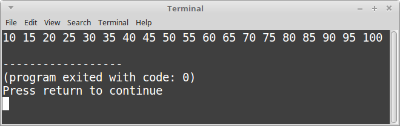
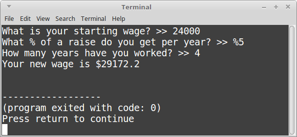

# CS 200 Lab 6: For Loops

## Chrome!

Please read this in chrome so that the solutions are collapsed by default!

## Topics

* While Loops
* If Statements
* Input (cin) and Output (cout)

## Turn In

Make sure to zip your entire project folder and upload it in the dropbox on D2L.

Also upload the .cpp file(s) to your class repository. 
[See Lab 1 for instructions](https://github.com/Rachels-Courses/CS200-Concepts-of-Progamming-Algorithms/blob/master/Assignments/In-class%20Labs/Lab%2001%20-%20Intro%20to%20GitHub%20and%20CPP.md#upload-files)

---

# Assignments

## Project 1: 0 to 20

Write a for loop that will display the numbers between 0 and 19, inclusive.

Your counter variable will start at 0, and iterate while the counter is less than 20.

Increment the counter by 1 each time.

### Knowledge

You can increment variables in a few different ways:

### Example output

### Solution

	
<strong><em>
		View the solution
	</em></strong>

	#include <iostream>
	using namespace std;

	int main()
	{
		for ( int i = 0; i < 20; i++ )
		{
			cout << i << " ";
		}
		
		return 0;
	}

---

## Project 2: 10 to 100

Write a for loop that will begin at 10, and end at 100, inclusive.

Each time through the loop, it will increment your counter by 5. (Do this in the for loop header)

### Example output

### Solution

	
<strong><em>
		View the solution
	</em></strong>

	#include <iostream>
	using namespace std;

	int main()
	{
		for ( int i = 10; i <= 100; i += 5 )
		{
			cout << i << " ";
		}
		
		return 0;
	}

    

---

## Project 3: Countdown

Write a for loop that will begin at 50, and loop while
your counter is greater than 0.

Each cycle, it will decrement the counter by 2. (Do this in the for loop header)

### Example output

### Solution

	
<strong><em>
		View the solution
	</em></strong>

	#include <iostream>
	using namespace std;

	int main()
	{
		for ( int i = 50; i > 0; i -= 2 )
		{
			cout << i << " ";
		}
		
		return 0;
	}

---

## Project 4: Getting a raise

Create four variables:

* startingWage, a float
* percentRaisePerYear, a float
* adjustedWage, a float
* yearsWorked, an integer

Ask the user to enter their *startingWage*, *percentWagePerYear*, and *yearsWorked*.

Then, calculate their new wage by using a for-loop. Each year,
their salary will be increased by the *percent* specified; we're not going
to keep taking the same percent from the original wage. Instead, we have to
recalculate the wage amount by multiplying the raise % by the current year's salary.

So in other words - before the for loop, set the *adjustedWage* to the *startingWage*.

So, use a for loop to iterate *yearsWorked* amount of times, recalculating
the new wage:

	Add (adjustedWage x percentRaisePerYear) to the adjustedWage
	each cycle of the for loop
	
Finally, after the for loop, display the new current wage.

### Example output

### Solution

	
<strong><em>
		View the solution
	</em></strong>

	#include <iostream>
	using namespace std;

	int main()
	{
		float startingWage;
		float percentRaisePerYear;
		int yearsWorked;
		
		cout << "What is your starting wage? >> ";
		cin >> startingWage;
		
		cout << "What % of a raise do you get per year? >> %";
		cin >> percentRaisePerYear;
		
		percentRaisePerYear /= 100;
		
		cout << "How many years have you worked? >> ";
		cin >> yearsWorked;
		
		float adjustedWage = startingWage;
		
		for ( int i = 0; i < yearsWorked; i++ )
		{
			adjustedWage += adjustedWage * percentRaisePerYear;
		}
		
		cout << "Your new wage is $" << adjustedWage << endl;
		
		
		return 0;
	}

    

---

## Project 5: Summation

Write a program that will sum the numbers from 1 to 10 by using a for loop.

You will need to declare a "sum" variable, whose type should be a float.

Your program should display the sum at the end. (You don't have to list out
all the numbers like in the example output, just the sum.)

### Example output

### No solution

Have to figure this one out on your own, or with a classmate.

