# CS 200 Lab 06a: GitHub

---

[Information](#information) |
[Lab](#lab) | [
Questions](#questions)

---

# Information

## Lab topics

* Source control


## Turn in

Once you're finished with this project, you will open up the **Lab 06a - Source Control** quiz and answer the questions.


---

# Introduction

## What is source control?

"Source control" is a general term for how you keep track of:

* **Your source code files** - So you can download them from anywhere!
* **The changes to the code** - So you can see what you've done over time!
* **Multiple users editing the code** - So you don't have to manually merge code files between multiple people!

There are many types of source control methods and software we can use,
but for this lab we will just be uploading our files to the **GitHub** website.

Normally, you would use GitHub with the desktop program **Git**,
but since this is just an introduction to source control,
we will be working with **GitHub directly through the web interface.**


## What is GitHub?


GitHub is a **source hosting website**.
We can create an account on it for free, and create as many **repositories** as we want.
Usually, we create one repository per project, but here we will create one repository for all our CS 200 files so far.

---

# Setting up a GitHub account

First, register an account on GitHub. Go to [https://github.com/](https://github.com/)
and click on the "Sign up" button.

* Choose any username - you can always change it later. It might be easiest to use
your school ID for now.
* Email address - use your personal email or school email address.
* Password - specify a password.

Next, there will be a "Choose a plan" section. Just select the **free** plan.

After you're done registering, you can go to **github.com/YOUR_USER_NAME**
to create new repositories and view existing repositories.

For example, my home profile is [https://github.com/racheljmorris](https://github.com/racheljmorris).

---

# Creating a repository for CS 200

Usually, you will create a **repository** per project that you're working on,
but since school assignments are pretty small and managable, we will create
one repository for one class.

From your profile page, click on the **Repositories** tab.

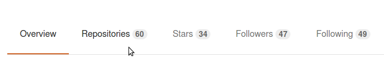

Then, click on the **New** button.

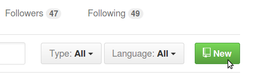

On this page, you will set a **Repository name** and **Description** (optional).

Make sure to set your repository as Public (GitHub is only free for public projects),
and click on **Initialize this repository with a README**.

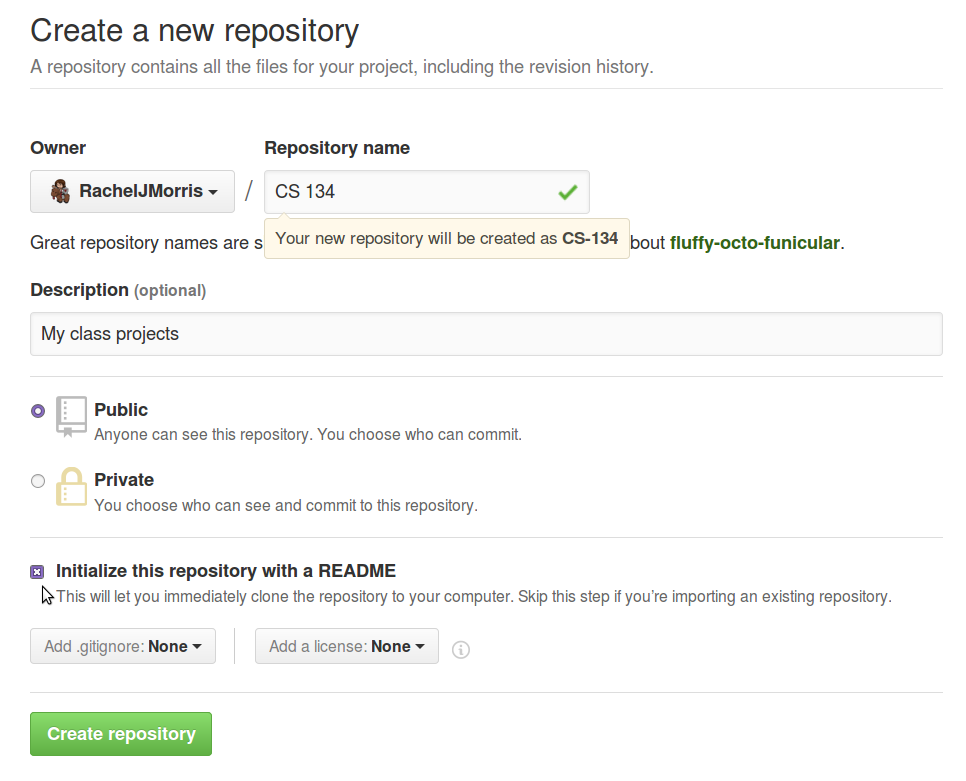

Then click **Create repository** once you're done.

It will take you to the repository page, which currently only has a 
README.md file.

---

# Editing the readme

Your repository should have a ```README.md``` file by default. Click on it,
and then click on the **edit** icon to open the text editor.

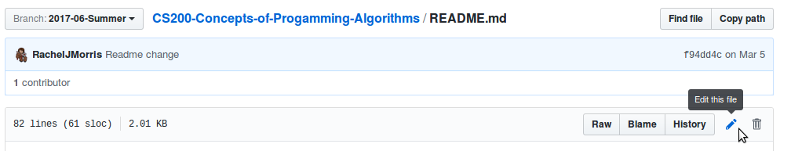

Here, you can type in some information about your repository.

Copy the following and modify it for yourself:

        # CS 200 Repository

        * Semester: Summer 2017
        * [Catalog description](http://catalog.jccc.edu/coursedescriptions/cs/#CS_200)
        * Student: YOURNAME

Once you're done, scroll to the bottom of the page and click **Commit changes**.

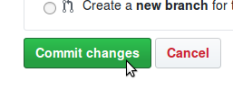

Afterward, it will go back to the repository and your readme contents will show up on the front page.

---

# Uploading one of your assignments

## Creating your assignment's folder

Let's start by going through all the steps for one of your assignments before
getting into all of them.

First, we need to **create a folder** for that assignment.

To create a folder, click on **Create new file**.

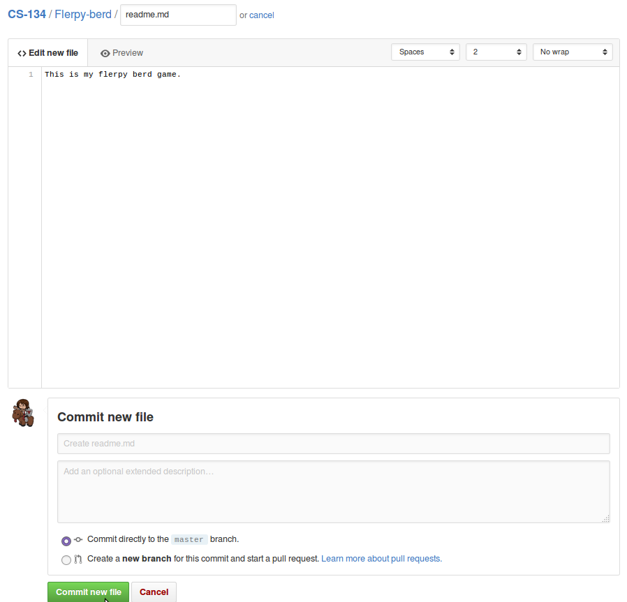

Normally, you would enter a filename in the "Name your file..." textbox,
but you can also add a folder by typing in a folder name and then a forward slash ```/```.

Type in ```Lab 01a - Recipes/```, and it will create this folder.
Then, type in ```readme.txt```

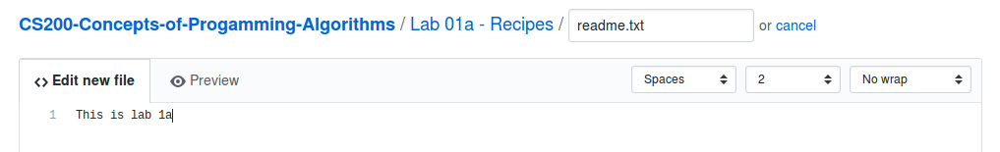

GitHub won't allow us to have empty folders, so that is why we have to create
a placeholder *readme.txt*.

After you've created the readme.txt in the folder, scroll to the bottom of the page and click **Commit changes**.


Once you've committed your changes, GitHub will be inside your project's folder,
and the readme.txt file should be the only thing displayed within it.

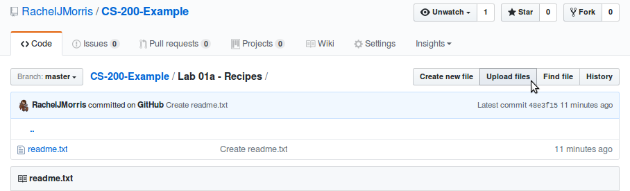


## Uploading your assignment source code

From within this folder, click on the **Upload files** button.

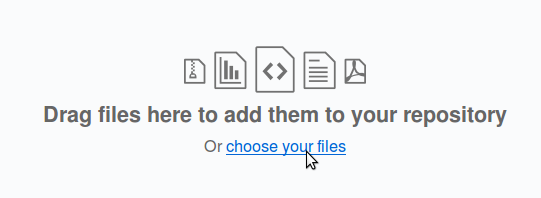

You will click on **choose your files** and find your source code files for Lab 01a. Make sure you're only uploading
```.cpp``` and/or ```.hpp``` files.

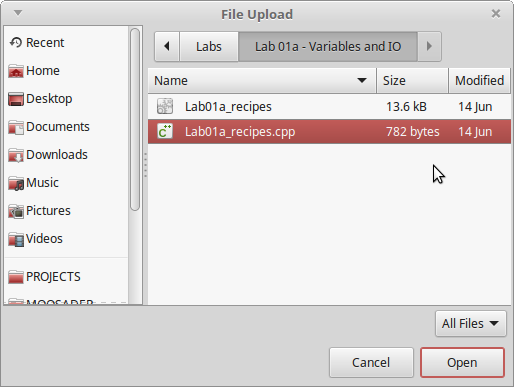

It will show a summary of the file you're trying to upload.

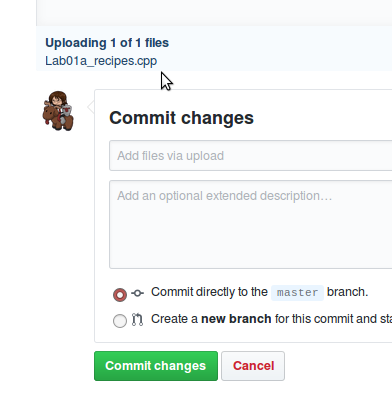

Once you have all related files, click on **Commit changes**.

Now your source file will show up in the folder.

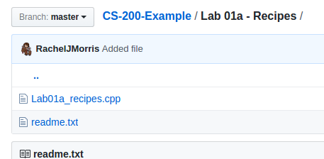

---

# Creating your assignment folders

Now create folders with placeholder readmes for all the rest of your projects.

**After you create a readme file in a folder, it will place you inside that folder.
Make sure to go back to the top-most repository folder after each one by clicking on your repository name!**

**Lab folder names:**

* Lab 01a - Recipes (already done above)
* Lab 01b - Branching
* Lab 01c - Loops
* Lab 02a - File IO
* Lab 02b - Functions
* Lab 03a - Testing
* Lab 03b - Arrays
* Lab 04a - Pointers
* Lab 04b - Dynamic Arrays
* Lab 05 - Structs

**Project folder names:**

* Project 1 - Virtual Pet
* Project 2 - Tiny Sudoku

Once you're done, your directory should look like:

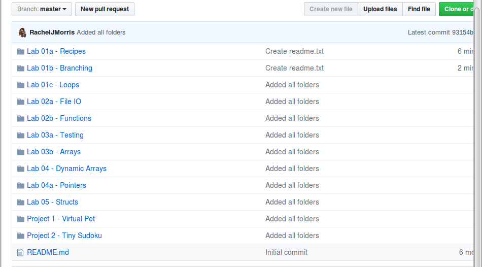

---

# Uploading your assignments

Back in your repository web interface, click on the button that says **Upload files**.
You can use this to add new files to the repository through the web interface.

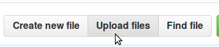

Now with each of these folders, go into each one and upload the source code (```.cpp``` and ```.hpp``` files)
from your version of the project.


If you no longer have your source files for certain assignments, let the instructor know
and they can send it to you.

---

# Finishing up the assignment

Once you're done, fill out the **Lab 06a** assignment quiz.


