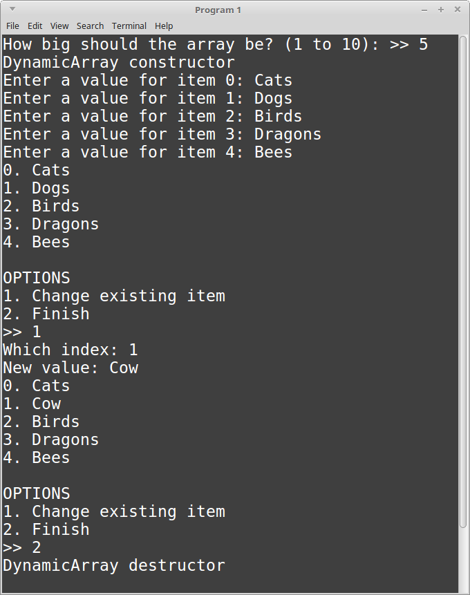

# CS 200 Lab 06b: Classes

---

[Information](#information) |
[Helper](https://github.com/Rachels-Courses/CS200-Concepts-of-Progamming-Algorithms/blob/2017-06-Summer/Assignments/In-class%20Labs/Lab%2005%20-%20Structs%20-%20Helper.md) |
[Lab](#lab) | [
Questions](#questions)

---

# Information

## Lab topics

* Pointers
* Dynamic variables
* Dynamic arrays

## Rules

* For **in-class labs**, collaboration is allowed.
    * If you work with another student on an assignment, make sure that you both
    turn in a copy of the work, and also mention in the D2L comments who you worked with.
    * You can also ask classmates questions if you're unsure on something.
    * You can ask the instructor for help at any time.

## Reference

* [How to use Visual Studio](https://github.com/Rachels-Courses/Course-Common-Files/blob/organized/STUDENT_REFERENCE/HOW_TO/Visual_Studio.md)
* [How to use Code::Blocks](https://github.com/Rachels-Courses/Course-Common-Files/blob/organized/STUDENT_REFERENCE/HOW_TO/Code_Blocks.md)
* [How to turn in code](https://github.com/Rachels-Courses/Course-Common-Files/blob/organized/STUDENT_REFERENCE/HOW_TO/Turning_in_code.md)


## Turn in

Once you are finished with a project, zip up the entire folder that contains
all source files and project/solution files. Turn in this zip file to **Desire2Learn**.

Also make sure to turn in a text file with your answers to the [question](#questions) section.


---

# Lab

For this lab, each program should go **in its own solution, and have its own files.**

Make sure to turn in each solution set on its own.

---

# Program 1: A Dynamic Array wrapper

For this lab, we will *wrap* a dynamic array within a class. Using special
class methods like **constructors** and **destructors**
(see: [the helper docs]()), we can automatically allocate and deallocate memory.

## Starter code

Create the following files:

* lab06b_program1.cpp
* DynamicArray.hpp
* DynamicArray.cpp

Use the following starter code:

**DynamicArray.hpp**

```c++
#ifndef _DYNAMIC_ARRAY_HPP
#define _DYNAMIC_ARRAY_HPP

#include <string>
#include <iostream>
using namespace std;

class DynamicArray
{
    public:
    DynamicArray( int size );
    ~DynamicArray();

    void Set( int index, string value );
    string Get( int index );
    int GetSize();

    void Display();

    private:
    string* m_arr;
    int m_size;
};

#endif
```

**DynamicArray.cpp**

```c++
#include "DynamicArray.hpp"

DynamicArray::DynamicArray( int size )
{
    cout << "DynamicArray constructor" << endl;
    // TODO: Initialize dynamic array
}

DynamicArray::~DynamicArray()
{
    cout << "DynamicArray destructor" << endl;
    // TODO: Free dynamic array
}

void DynamicArray::Set( int index, string value )
{
    // Set item at position *index* to the value *value*.
}

string DynamicArray::Get( int index )
{
    // Return the item at position *index*
    return ""; // temp
}

int DynamicArray::GetSize()
{
    // Return the size of the array
    return -1; // temp
}

void DynamicArray::Display()
{
    // Display all elements of the array
}
```

**main.cpp**

```c++
#include <iostream>
#include <string>
using namespace std;

#include "DynamicArray.hpp"

int GetValidInput( int min, int max )
{
    int choice;
    cout << ">> ";
    cin >> choice;
    while ( choice < min || choice > max )
    {
        cout << "Invalid input. Try again." << endl;
        cout << ">> ";
        cin >> choice;
    }
    return choice;
}

int GetArraySize()
{
    return -1; // temp
}

int MainMenu()
{
    return -1; // temp
}

void InitializeArray( DynamicArray& arr )
{
}

void GetNewArrayValue( DynamicArray& arr )
{
}

int main()
{
    int arraySize = GetArraySize();

    DynamicArray arr( arraySize );

    InitializeArray( arr );

    while ( true )
    {
        arr.Display();

        int choice = MainMenu();

        if ( choice == 1 )
        {
            GetNewArrayValue( arr );
        }
        else if ( choice == 2 )
        {
            break;
        }
    }

    return 0;
}
```

## DynamicArray.hpp overview

This part is already written for you, but take note of the **private member variables** of this class.

**m_arr** is a string pointer, which we will use for creating the dynamic array.

**m_size** is an integer, which will store the size of the dynamic array,
which is specified in *main.cpp* when the DynamicArray is declared.

## DynamicArray.cpp

### DynamicArray constructor

The constructor function has this header:

```c++
DynamicArray::DynamicArray( int size )
```

A constructor is a function that is **automatically run** once an
object of this type is **instantiated** - in other words,
when we declare a variable whose data-type is *DynamicArray*,
the constructor function gets called automatically.

This constructor has one parameter - ```size```. This is the size that
we will make the dynamic array.

Within this function, do the following:

1. Set the *private member variable* ```m_size``` to the value passed in as ```size```.
1. Using the *private member variable* ```m_arr``` (a string*), create a **new** dynamic
array of size ```size```.

### DynamicArray destructor

The header for this function is:

```c++
DynamicArray::~DynamicArray()
```

A destructor is another type of special function. While a constructor
is called automatically once an object is created, the destructor is called
automatically when the object is destroyed - such as if it goes out of scope.

Within this function, do the following:

1. Check to see if the ```m_arr``` pointer is *not* ```nullptr```. If not:
    1. **Delete** this dynamic array.

### Set

The header for this function is:

```c++
void DynamicArray::Set( int index, string value )
```

This function has two input parameters:

* index, an integer
* value, a string

We will assign the element of ```m_arr``` at position *index* to the *value* passed in.
However, we also need to do error checking so we don't go **outside the bounds of the array!**

1. If the ```index``` is less than 0, or if it is greater-than-or-equal-to the ```m_size```, then
    1. Call ```return;``` - it leaves the function.

1. Otherwise, set the element of ```m_arr``` at position ```index``` to the ```value```.


### Get

The header for this function is:

```c++
string DynamicArray::Get( int index )
```

This function will have error checking like the **Set** function.

If the index is invalid, return an empty string, ```""``` as the default.

If the index is valid, then return the element of ```m_arr``` at position ```index```.


### GetSize

The header for this function is:

```c++
int DynamicArray::GetSize()
```

This function should only return the value of the *private member variable*
```m_size```.

### Display

The header for this function is:

```c++
void DynamicArray::Display()
```

This function should have a *for loop* that goes over all the elements of the
array and displays each element and its index.

<!-- HINT ~~~~~~~~~~~~~~~~~~~~~~~~~~~~~~~~~~~~~~~~ -->
<details> <summary><strong><em>       Hint - Displaying all the items of the array        </em></strong></summary>

```c++
    for ( int i = 0; i < m_size; i++ )
    {
        cout << i << ". " << m_arr[i] << endl;
    }
```

</details>


## main.cpp

Within the main file, you will implement the functions besides main().

### GetArraySize()

This function asks the user how big they want the array to be, and returns that
value back to the main() function.

1. Create an integer array called ```arraySize```.
1. Display a message to the user: How big should the array be? (Between 1 and 10)
1. Using the ```GetValidInput``` function, get the user's input for the array size and assign it to. ```arraySize```
1. Return ```arraySize```.

<!-- HINT ~~~~~~~~~~~~~~~~~~~~~~~~~~~~~~~~~~~~~~~~ -->
<details> <summary><strong><em>       Getting the user's input via the function        </em></strong></summary>

```c++
    arraySize = GetValidInput( 1, 10 );
```

</details>

### MainMenu()

For this function:

1. Display the main menu: 1. Change existing item, 2. Finish
2. Declare an integer named ```choice``` and, using the ```GetValidInput``` function,
get an integer between 1 and 2.
1. Return ```choice```.

### void InitializeArray( DynamicArray& arr )

Use a for-loop to get input from the user for each element of the array.

Use ```arr.GetSize()``` to get the array's size.

Each time through the for loop:

1. Create a string variable called ```newValue```.
1. Ask the user what to store at this position.
1. Get the user's input via ```cin >>```.
1. Using ```arr.Set```, pass in the index (from the for loop's counter) and the ```newValue```.


For reference, the function signature for the array Setup function is:

```c++
void Set( int index, string value );
```

<!-- HINT ~~~~~~~~~~~~~~~~~~~~~~~~~~~~~~~~~~~~~~~~ -->
<details> <summary><strong><em>       Hint - For loop parameters        </em></strong></summary>

```c++
for ( int i = 0; i < arr.GetSize(); i++ )
```

</details>


<!-- HINT ~~~~~~~~~~~~~~~~~~~~~~~~~~~~~~~~~~~~~~~~ -->
<details> <summary><strong><em>       Hint - Assigning a value to the array       </em></strong></summary>

The layout of the function is:

```c++
arr.set( INDEX, VALUE );
```

Your for loop should be using an integer to keep track of the array position,
from 0 to ```arr.GetSize()```. Use the counter variable as the *Index* and
use the ```newValue``` entered by the user as the *Value*.
</details>

### void GetNewArrayValue( DynamicArray& arr )

For this function:

1. Create an integer named ```index```.
1. Create a string named ```newValue```.
1. Ask the user to enter the index, and store it in the ```index``` variable.
1. Ask the user to enter the value, and store it in the ```newValue``` variable.
1. Using the ```arr.Set``` function, set the array's element.

For reference, the function signature for the array Setup function is:

```c++
void Set( int index, string value );
```


## Example output




# Questions

1. Can a struct contain variables?
1. Can a struct contain functions?
1. What does setting a member to private do?
1. What does setting a member to public do?


