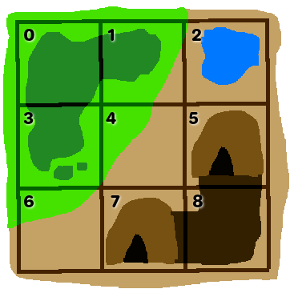

# CS 200 Lab 06b: Classes

---

[Information](#information) |
[Helper](https://github.com/Rachels-Courses/CS200-Concepts-of-Progamming-Algorithms/blob/2017-06-Summer/Assignments/In-class%20Labs/Lab%2006b%20-%20Classes%20-%20Helper.md) |
[Lab](#lab) | [
Questions](#questions)

---

# Information

## Lab topics

* Class basics

## Rules

* For **in-class labs**, collaboration is allowed.
    * If you work with another student on an assignment, make sure that you both
    turn in a copy of the work, and also mention in the D2L comments who you worked with.
    * You can also ask classmates questions if you're unsure on something.
    * You can ask the instructor for help at any time.

## Reference

* [How to use Visual Studio](https://github.com/Rachels-Courses/Course-Common-Files/blob/organized/STUDENT_REFERENCE/HOW_TO/Visual_Studio.md)
* [How to use Code::Blocks](https://github.com/Rachels-Courses/Course-Common-Files/blob/organized/STUDENT_REFERENCE/HOW_TO/Code_Blocks.md)
* [How to turn in code](https://github.com/Rachels-Courses/Course-Common-Files/blob/organized/STUDENT_REFERENCE/HOW_TO/Turning_in_code.md)


## Turn in

Once you are finished with a project, zip up the entire folder that contains
all source files and project/solution files. Turn in this zip file to **Desire2Learn**.

Also make sure to turn in a text file with your answers to the [question](#questions) section.


---

# Lab

For this lab, each part revolves around building one class, and testing each one separately.
At the end, all the parts will be put together for a small game.

You only need to turn in your final version of all the files.

---

# Part 1: Locations


Start by creating these three files:

* textadventure.cpp
* Location.hpp
* Location.cpp

**textadventure.cpp**

```c++
#include <iostream>
#include <string>
using namespace std;

#include "Location.hpp"

void LocationTest()
{
    // Create an array of locations
    Location locations[9];

    // Set the location information
    locations[0].SetInfo( "Forest", "The forest is cool and dark." );
    locations[1].SetInfo( "Eastern forest edge", "The forest expands to the west." );
    locations[2].SetInfo( "Lake", "The lake has several plants growing around it." );
    locations[3].SetInfo( "Southern forest edge", "The forest expands to the north." );
    locations[4].SetInfo( "Western desert edge", "The desert is barren, but nearby grass is growing." );
    locations[5].SetInfo( "East cave entrance", "The cave leads further in to the south." );
    locations[6].SetInfo( "Northern desert edge", "Dry grass speckle the landscape here." );
    locations[7].SetInfo( "South cave entrance", "The cave leads further in to the east." );
    locations[8].SetInfo( "Cave internal", "The cave is dark and damp." );

    // Set neighbors for each location
    locations[0].SetNeighbor( "east",   &locations[1] );
    locations[0].SetNeighbor( "south",  &locations[3] );

    locations[1].SetNeighbor( "west",   &locations[0] );
    locations[1].SetNeighbor( "south",  &locations[4] );
    locations[1].SetNeighbor( "east",   &locations[2] );

    locations[2].SetNeighbor( "west",   &locations[1] );
    locations[2].SetNeighbor( "south",  &locations[5] );

    locations[3].SetNeighbor( "east",   &locations[4] );
    locations[3].SetNeighbor( "south",  &locations[6] );
    locations[3].SetNeighbor( "north",  &locations[0] );

    locations[4].SetNeighbor( "west",   &locations[3] );
    locations[4].SetNeighbor( "south",  &locations[7] );
    locations[4].SetNeighbor( "north",  &locations[1] );
    locations[4].SetNeighbor( "east",   &locations[5] );

    locations[5].SetNeighbor( "west",   &locations[4] );
    locations[5].SetNeighbor( "south",  &locations[8] );
    locations[5].SetNeighbor( "north",  &locations[2] );

    locations[6].SetNeighbor( "east",   &locations[7] );
    locations[6].SetNeighbor( "north",  &locations[3] );

    locations[7].SetNeighbor( "west",   &locations[6] );
    locations[7].SetNeighbor( "north",  &locations[4] );
    locations[7].SetNeighbor( "east",   &locations[8] );

    locations[8].SetNeighbor( "west",   &locations[7] );
    locations[8].SetNeighbor( "north",  &locations[5] );

    for ( int i = 0; i < 9; i++ )
    {
        cout << "LOCATION " << i << ":" << endl;
        locations[i].Display();
        cout << endl << endl;
    }
}

int main()
{
    LocationTest();
    return 0;
}
```

This function is just a test for now. It will create an array of locations,
set up each location's information, and set up neighbors according to this map:



You can also change the location information if you'd like.

**Location.hpp**

```c++
#ifndef _LOCATION_HPP
#define _LOCATION_HPP

#include <iostream>
#include <string>
using namespace std;

class Location
{
public:
    Location();
    void SetInfo( string name, string description );
    void Display();
    string GetName();
    void SetNeighbor( string direction, Location* ptrLocation );
    Location* GetNeighbor( string direction );

private:
    string m_name;
    string m_description;

    Location* m_ptrToNorth;
    Location* m_ptrToSouth;
    Location* m_ptrToEast;
    Location* m_ptrToWest;
};

#endif
```

The Location class contains strings for its name and description, such as

	name: "Lake",
	description: "The lake has several plants growing around it."

There are also four pointers, in each cardinal direction. These will be
used to point to other Location objects, to set up neighbors.

These private member variables are prefixed with ```m_```, which is just
a type of naming convention which symbolizes "member". I prefer to use it
on any private member varible names.

We also have some basic functions to use the location.

**Location.cpp**

```c++
#include "Location.hpp"

Location::Location()	// constructor
{
    // Initialize all member pointers to nullptr
}

void Location::SetInfo( string name, string description )
{
    // Set m_name and m_description
}

string Location::GetName()
{
    // Return m_name value
}

void Location::Display()
{
    // Display name, description, and what directions have neighbors
}

void Location::SetNeighbor( string direction, Location* ptrLocation )
{
    // Set up neighbor in the given direction.
}

Location* Location::GetNeighbor( string direction )
{
    // Return the corresponding location pointer
}
```

You will need to implement these functions.

## Location class

### Location constructor

In the constructor, you need to initialize each of the pointers,
```m_ptrToNorth```, ```m_ptrToSouth```, ```m_ptrToEast```, ```m_ptrToWest```,
to ```nullptr```.

### SetInfo function

There are two input parameters: ```name``` and ```description```.

Set up the private member variables ```m_name``` and ```m_description``` to these input values.

### GetName function

This function should only return the value of ```m_name```.

### Display function

This function should display ```m_name``` and ```m_description```, as well as do the following:

1. If ```m_ptrToNorth``` is **not** ```nullptr```, then display "To the north is", and the name of the location to the north.
1. If ```m_ptrToSouth``` is **not** ```nullptr```, then display "To the south is", and the name of the location to the south.
1. If ```m_ptrToEast``` is **not** ```nullptr```, then display "To the east is", and the name of the location to the east.
1. If ```m_ptrToWest``` is **not** ```nullptr```, then display "To the west is", and the name of the location to the west.

<!-- HINT ~~~~~~~~~~~~~~~~~~~~~~~~~~~~~~~~~~~~~~~~ -->
<details> <summary><strong><em>       Hint - How to get the name of a Location via its pointer        </em></strong></summary>

The ```m_ptrToNorth``` variable is a pointer to another location.
We need to access its ```GetName()``` method, but since this is a pointer,
we have to do it in one of two ways:

```c++
m_ptrToNorth->GetName()
```

or

```c++
(*m_ptrToNorth).GetName()
```

Either of these is OK, but using the arrow operator ```->``` is more traditional.
It de-references and access a class' member in one step.

</details>

### SetNeighbor function

Look at the value stored in the input parameter ```direction``` to decide
if we're storing information for the ```m_ptrToNorth```, ```m_ptrToSouth```, ```m_ptrToEast```, or ```m_ptrToWest``` pointer.

1. If direction is "north", then set ```m_ptrToNorth``` to ```ptrLocation```.
1. If direction is "south", then set ```m_ptrToSouth``` to ```ptrLocation```.
1. If direction is "east", then set ```m_ptrToEast``` to ```ptrLocation```.
1. If direction is "west", then set ```m_ptrToWest``` to ```ptrLocation```.

### GetNeighbor function

Look at the value stored in the input parameter ```direction``` to decide
whether we're returning ```m_ptrToNorth```, ```m_ptrToSouth```, ```m_ptrToEast```, or ```m_ptrToWest``` pointer.

If direction is not "north", "south", "east", or "west", then just return ```nullptr```.

<!-- HINT ~~~~~~~~~~~~~~~~~~~~~~~~~~~~~~~~~~~~~~~~ -->
<details> <summary><strong><em>       Hint - Returning a direction        </em></strong></summary>

```c++
return m_ptrToNorth;
```

</details>


## Example output

Run the program with the test function being called from main(). Your output should look like:

	LOCATION 0:
	Forest
	The forest is cool and dark.
	To the SOUTH is Southern forest edge
	To the EAST is Eastern forest edge


	LOCATION 1:
	Eastern forest edge
	The forest expands to the west.
	To the SOUTH is Western desert edge
	To the EAST is Lake
	To the WEST is Forest


	LOCATION 2:
	Lake
	The lake has several plants growing around it.
	To the SOUTH is East cave entrance
	To the WEST is Eastern forest edge


	LOCATION 3:
	Southern forest edge
	The forest expands to the north.
	To the NORTH is Forest
	To the SOUTH is Northern desert edge
	To the EAST is Western desert edge


	LOCATION 4:
	Western desert edge
	The desert is barren, but nearby grass is growing.
	To the NORTH is Eastern forest edge
	To the SOUTH is South cave entrance
	To the EAST is East cave entrance
	To the WEST is Southern forest edge


	LOCATION 5:
	East cave entrance
	The cave leads further in to the south.
	To the NORTH is Lake
	To the SOUTH is Cave internal
	To the WEST is Western desert edge


	LOCATION 6:
	Northern desert edge
	Dry grass speckle the landscape here.
	To the NORTH is Southern forest edge
	To the EAST is South cave entrance


	LOCATION 7:
	South cave entrance
	The cave leads further in to the east.
	To the NORTH is Western desert edge
	To the EAST is Cave internal
	To the WEST is Northern desert edge


	LOCATION 8:
	Cave internal
	The cave is dark and damp.
	To the NORTH is East cave entrance
	To the WEST is South cave entrance

---

# Part 2: Game

Create the following files:

* Game.hpp
* Game.cpp

**Game.hpp**

```c++
#ifndef _GAME_HPP
#define _GAME_HPP

#include <iostream>
#include <string>
using namespace std;

#include "Location.hpp"

class Game
{
public:
    Game();
    void Run();
    char GetChoice();
    void TryToMove( char direction );

private:
    void SetupLocations();

    Location locations[9];
    Location* ptrStart;
    Location* ptrEnd;
    Location* ptrCurrent;
};

#endif
```

The Game class contains the array of locations now, as well as pointers for
the starting location, ending location, and current location.

**Game.cpp**

```c++
#include "Game.hpp"

Game::Game()
{
}

void Game::TryToMove( char direction )
{
}

void Game::Run()
{
    while( true )
    {
	// DISPLAY THE CURRENT LOCATION'S INFO HERE

        if ( ptrCurrent == ptrEnd )
        {
            // End the game
            break;
        }

        char choice = GetChoice();

        if ( choice == 'q' )
        {
            break;
        }

        TryToMove( choice );
    }

    cout << endl << "You've reached your destination!" << endl;
    cout << "You win!" << endl;
}

char Game::GetChoice()
{
    cout << endl << "What do you want to do? (N/S/E/W/Q): ";
    char choice;
    cin >> choice;
    return tolower( choice );
}

void Game::SetupLocations()
{
    // Move your array init stuff from the file with main() to here.
    
    locations[0].SetInfo( "Forest", "The forest is cool and dark." );
    locations[1].SetInfo( "Eastern forest edge", "The forest expands to the west." );
    locations[2].SetInfo( "Lake", "The lake has several plants growing around it." );
    locations[3].SetInfo( "Southern forest edge", "The forest expands to the north." );
    locations[4].SetInfo( "Western desert edge", "The desert is barren, but nearby grass is growing." );
    locations[5].SetInfo( "East cave entrance", "The cave leads further in to the south." );
    locations[6].SetInfo( "Northern desert edge", "Dry grass speckle the landscape here." );
    locations[7].SetInfo( "South cave entrance", "The cave leads further in to the east." );
    locations[8].SetInfo( "Cave internal", "The cave is dark and damp." );

    locations[0].SetNeighbor( "east",   &locations[1] );
    locations[0].SetNeighbor( "south",  &locations[3] );

    locations[1].SetNeighbor( "west",   &locations[0] );
    locations[1].SetNeighbor( "south",  &locations[4] );
    locations[1].SetNeighbor( "east",   &locations[2] );

    locations[2].SetNeighbor( "west",   &locations[1] );
    locations[2].SetNeighbor( "south",  &locations[5] );

    locations[3].SetNeighbor( "east",   &locations[4] );
    locations[3].SetNeighbor( "south",  &locations[6] );
    locations[3].SetNeighbor( "north",  &locations[0] );

    locations[4].SetNeighbor( "west",   &locations[3] );
    locations[4].SetNeighbor( "south",  &locations[7] );
    locations[4].SetNeighbor( "north",  &locations[1] );
    locations[4].SetNeighbor( "east",   &locations[5] );

    locations[5].SetNeighbor( "west",   &locations[4] );
    locations[5].SetNeighbor( "south",  &locations[8] );
    locations[5].SetNeighbor( "north",  &locations[2] );

    locations[6].SetNeighbor( "east",   &locations[7] );
    locations[6].SetNeighbor( "north",  &locations[3] );

    locations[7].SetNeighbor( "west",   &locations[6] );
    locations[7].SetNeighbor( "north",  &locations[4] );
    locations[7].SetNeighbor( "east",   &locations[8] );

    locations[8].SetNeighbor( "west",   &locations[7] );
    locations[8].SetNeighbor( "north",  &locations[5] );
}
```

## Game functions

### Game constructor

Within the constructor, do the following:

1. initialize ```ptrStart``` to the address of ```locations[0]```.
1. initialize ```ptrEnd``` to the address of ```locations[8]```.
1. initialize ```ptrCurrent``` to ```ptrStart```.
1. Call the ```SetupLocations()``` function.

### Run function

Within this function, you just need to add one line. Where it says...

	// DISPLAY THE CURRENT LOCATION'S INFO HERE

Use the ```ptrCurrent``` pointer, and call the Location's ```Display``` function from it.

<!-- HINT ~~~~~~~~~~~~~~~~~~~~~~~~~~~~~~~~~~~~~~~~ -->
<details> <summary><strong><em>       Hint - Calling a class function via a pointer        </em></strong></summary>

```c++
ptrCurrent->Display();
```

</details>

### TryToMove function

In this function, you will be checking the input variable ```direction``` to see
the direction the player wants to move. You also need to check if the neighbor
in that direction is ```nullptr``` or not. If you *can* move in that direction,
you're going to update the pointer ```ptrCurrent``` to the neighbor. Otherwise,
you will just display an error message.

1. If ```direction``` is 'n' AND ```ptrCurrent->GetNeighbor( "north" )``` is not ```nullptr``` then:
    1. Set ```ptrCurrent``` to ```ptrCurrent->GetNeighbor( "north" )```.
    1. Display a message like "You move north."
    
1. Else if ```direction``` is 's' AND ```ptrCurrent->GetNeighbor( "south" )``` is not ```nullptr``` then:
    1. Set ```ptrCurrent``` to ```ptrCurrent->GetNeighbor( "south" )```.
    1. Display a message like "You move south."
    
1. Else if ```direction``` is 'e' AND ```ptrCurrent->GetNeighbor( "east" )``` is not ```nullptr``` then:
    1. Set ```ptrCurrent``` to ```ptrCurrent->GetNeighbor( "east" )```.
    1. Display a message like "You move east."
    
1. Else if ```direction``` is 'w' AND ```ptrCurrent->GetNeighbor( "west" )``` is not ```nullptr``` then:
    1. Set ```ptrCurrent``` to ```ptrCurrent->GetNeighbor( "west" )```.
    1. Display a message like "You move west."


## main() function

Back in the function that has ```main()``` in it, make sure to

```c++
#include "Game.hpp"
```

Within main, don't call ```LocationTest()``` anymore. Instead, use this:

```c++
int main()
{
    Game game;
    game.Run();
    return 0;
}
```

When you run the game, you should be able to "walk around", and once you
get to location at index 8, the game should end.

## Example output

	--------------------------------
	Forest
	The forest is cool and dark.

	To the SOUTH is Southern forest edge
	To the EAST is Eastern forest edge

	What do you want to do? (N/S/E/W/Q): s

	You move south.

	--------------------------------
	Southern forest edge
	The forest expands to the north.

	To the NORTH is Forest
	To the SOUTH is Northern desert edge
	To the EAST is Western desert edge

	What do you want to do? (N/S/E/W/Q): s

	You move south.

	--------------------------------
	Northern desert edge
	Dry grass speckle the landscape here.

	To the NORTH is Southern forest edge
	To the EAST is South cave entrance

	What do you want to do? (N/S/E/W/Q): e

	You move east.

	--------------------------------
	South cave entrance
	The cave leads further in to the east.

	To the NORTH is Western desert edge
	To the EAST is Cave internal
	To the WEST is Northern desert edge

	What do you want to do? (N/S/E/W/Q): e

	You move east.

	--------------------------------
	Cave internal
	The cave is dark and damp.

	To the NORTH is East cave entrance
	To the WEST is South cave entrance

	You've reached your destination!
	You win!


# Questions

1. True or false - Creating a class means that you can now declare a variable with that class as the data type.
1. True or false - You can create a pointer that points to a data-type created via a class.
1. True or false - You can call the functions of a class via a pointer to that object.

1. What is the operator that you use to access a class' function?
1. What is the operator that you use to access a class' function via a pointer?
1. When pointers are not being used (i.e., assigned some address of a valid item), they should be defaulted to what value?


