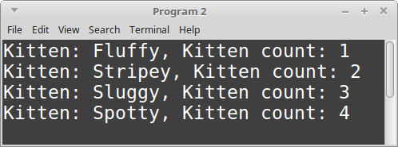
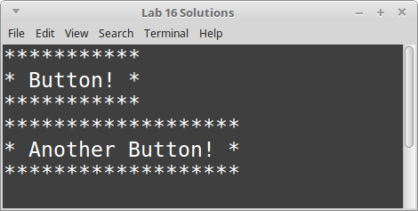

# CS 200 Lab 06b: Classes

---

[Information](#information) |
[Helper](https://github.com/Rachels-Courses/CS200-Concepts-of-Progamming-Algorithms/blob/2017-06-Summer/Assignments/In-class%20Labs/Lab%2006b%20-%20Classes%20-%20Helper.md) |
[Lab](#lab) | [
Questions](#questions)

---

# Information

## Lab topics

* Pointers
* Dynamic variables
* Dynamic arrays

## Rules

* For **in-class labs**, collaboration is allowed.
    * If you work with another student on an assignment, make sure that you both
    turn in a copy of the work, and also mention in the D2L comments who you worked with.
    * You can also ask classmates questions if you're unsure on something.
    * You can ask the instructor for help at any time.

## Reference

* [How to use Visual Studio](https://github.com/Rachels-Courses/Course-Common-Files/blob/organized/STUDENT_REFERENCE/HOW_TO/Visual_Studio.md)
* [How to use Code::Blocks](https://github.com/Rachels-Courses/Course-Common-Files/blob/organized/STUDENT_REFERENCE/HOW_TO/Code_Blocks.md)
* [How to turn in code](https://github.com/Rachels-Courses/Course-Common-Files/blob/organized/STUDENT_REFERENCE/HOW_TO/Turning_in_code.md)


## Turn in

Once you are finished with a project, zip up the entire folder that contains
all source files and project/solution files. Turn in this zip file to **Desire2Learn**.

Also make sure to turn in a text file with your answers to the [question](#questions) section.


---

# Lab

For this lab, each program should go **in its own solution, and have its own files.**

Make sure to turn in each solution set on its own.

---

# Program 1: A Dynamic Array wrapper

For this lab, we will *wrap* a dynamic array within a class. Using special
class methods like **constructors** and **destructors**
(see: [the helper docs](https://github.com/Rachels-Courses/CS200-Concepts-of-Progamming-Algorithms/blob/2017-06-Summer/Assignments/In-class%20Labs/Lab%2006b%20-%20Classes%20-%20Helper.md)), we can automatically allocate and deallocate memory.

## Starter code

Create the following files:

* lab06b_program1.cpp
* DynamicArray.hpp
* DynamicArray.cpp

Use the following starter code:

**DynamicArray.hpp**

```c++
#ifndef _DYNAMIC_ARRAY_HPP
#define _DYNAMIC_ARRAY_HPP

#include <string>
#include <iostream>
using namespace std;

class DynamicArray
{
    public:
    DynamicArray( int size );
    ~DynamicArray();

    void Set( int index, string value );
    string Get( int index );
    int GetSize();

    void Display();

    private:
    string* m_arr;
    int m_size;
};

#endif
```

**DynamicArray.cpp**

```c++
#include "DynamicArray.hpp"

DynamicArray::DynamicArray( int size )
{
    cout << "DynamicArray constructor" << endl;
    // TODO: Initialize dynamic array
}

DynamicArray::~DynamicArray()
{
    cout << "DynamicArray destructor" << endl;
    // TODO: Free dynamic array
}

void DynamicArray::Set( int index, string value )
{
    // Set item at position *index* to the value *value*.
}

string DynamicArray::Get( int index )
{
    // Return the item at position *index*
    return ""; // temp
}

int DynamicArray::GetSize()
{
    // Return the size of the array
    return -1; // temp
}

void DynamicArray::Display()
{
    // Display all elements of the array
}
```

**lab06b_program1.cpp**

```c++
#include <iostream>
#include <string>
using namespace std;

#include "DynamicArray.hpp"

int GetValidInput( int min, int max )
{
    int choice;
    cout << ">> ";
    cin >> choice;
    while ( choice < min || choice > max )
    {
        cout << "Invalid input. Try again." << endl;
        cout << ">> ";
        cin >> choice;
    }
    return choice;
}

int GetArraySize()
{
    return -1; // temp
}

int MainMenu()
{
    return -1; // temp
}

void InitializeArray( DynamicArray& arr )
{
}

void GetNewArrayValue( DynamicArray& arr )
{
}

int main()
{
    int arraySize = GetArraySize();

    DynamicArray arr( arraySize );

    InitializeArray( arr );

    while ( true )
    {
        arr.Display();

        int choice = MainMenu();

        if ( choice == 1 )
        {
            GetNewArrayValue( arr );
        }
        else if ( choice == 2 )
        {
            break;
        }
    }

    return 0;
}
```

## DynamicArray.hpp overview

This part is already written for you, but take note of the **private member variables** of this class.

**m_arr** is a string pointer, which we will use for creating the dynamic array.

**m_size** is an integer, which will store the size of the dynamic array,
which is specified in *main.cpp* when the DynamicArray is declared.

## DynamicArray.cpp

### DynamicArray constructor

The constructor function has this header:

```c++
DynamicArray::DynamicArray( int size )
```

A constructor is a function that is **automatically run** once an
object of this type is **instantiated** - in other words,
when we declare a variable whose data-type is *DynamicArray*,
the constructor function gets called automatically.

This constructor has one parameter - ```size```. This is the size that
we will make the dynamic array.

Within this function, do the following:

1. Set the *private member variable* ```m_size``` to the value passed in as ```size```.
1. Using the *private member variable* ```m_arr``` (a string*), create a **new** dynamic
array of size ```size```.

### DynamicArray destructor

The header for this function is:

```c++
DynamicArray::~DynamicArray()
```

A destructor is another type of special function. While a constructor
is called automatically once an object is created, the destructor is called
automatically when the object is destroyed - such as if it goes out of scope.

Within this function, do the following:

1. Check to see if the ```m_arr``` pointer is *not* ```nullptr```. If not:
    1. **Delete** this dynamic array.

### Set

The header for this function is:

```c++
void DynamicArray::Set( int index, string value )
```

This function has two input parameters:

* index, an integer
* value, a string

We will assign the element of ```m_arr``` at position *index* to the *value* passed in.
However, we also need to do error checking so we don't go **outside the bounds of the array!**

1. If the ```index``` is less than 0, or if it is greater-than-or-equal-to the ```m_size```, then
    1. Call ```return;``` - it leaves the function.

1. Otherwise, set the element of ```m_arr``` at position ```index``` to the ```value```.


### Get

The header for this function is:

```c++
string DynamicArray::Get( int index )
```

This function will have error checking like the **Set** function.

If the index is invalid, return an empty string, ```""``` as the default.

If the index is valid, then return the element of ```m_arr``` at position ```index```.


### GetSize

The header for this function is:

```c++
int DynamicArray::GetSize()
```

This function should only return the value of the *private member variable*
```m_size```.

### Display

The header for this function is:

```c++
void DynamicArray::Display()
```

This function should have a *for loop* that goes over all the elements of the
array and displays each element and its index.

<!-- HINT ~~~~~~~~~~~~~~~~~~~~~~~~~~~~~~~~~~~~~~~~ -->
<details> <summary><strong><em>       Hint - Displaying all the items of the array        </em></strong></summary>

```c++
    for ( int i = 0; i < m_size; i++ )
    {
        cout << i << ". " << m_arr[i] << endl;
    }
```

</details>


## main.cpp

Within the main file, you will implement the functions besides main().

### GetArraySize()

This function asks the user how big they want the array to be, and returns that
value back to the main() function.

1. Create an integer array called ```arraySize```.
1. Display a message to the user: How big should the array be? (Between 1 and 10)
1. Using the ```GetValidInput``` function, get the user's input for the array size and assign it to. ```arraySize```
1. Return ```arraySize```.

<!-- HINT ~~~~~~~~~~~~~~~~~~~~~~~~~~~~~~~~~~~~~~~~ -->
<details> <summary><strong><em>       Getting the user's input via the function        </em></strong></summary>

```c++
    arraySize = GetValidInput( 1, 10 );
```

</details>

### MainMenu()

For this function:

1. Display the main menu: 1. Change existing item, 2. Finish
2. Declare an integer named ```choice``` and, using the ```GetValidInput``` function,
get an integer between 1 and 2.
1. Return ```choice```.

### void InitializeArray( DynamicArray& arr )

Use a for-loop to get input from the user for each element of the array.

Use ```arr.GetSize()``` to get the array's size.

Each time through the for loop:

1. Create a string variable called ```newValue```.
1. Ask the user what to store at this position.
1. Get the user's input via ```cin >>```.
1. Using ```arr.Set```, pass in the index (from the for loop's counter) and the ```newValue```.


For reference, the function signature for the array Setup function is:

```c++
void Set( int index, string value );
```

<!-- HINT ~~~~~~~~~~~~~~~~~~~~~~~~~~~~~~~~~~~~~~~~ -->
<details> <summary><strong><em>       Hint - For loop parameters        </em></strong></summary>

```c++
for ( int i = 0; i < arr.GetSize(); i++ )
```

</details>


<!-- HINT ~~~~~~~~~~~~~~~~~~~~~~~~~~~~~~~~~~~~~~~~ -->
<details> <summary><strong><em>       Hint - Assigning a value to the array       </em></strong></summary>

The layout of the function is:

```c++
arr.set( INDEX, VALUE );
```

Your for loop should be using an integer to keep track of the array position,
from 0 to ```arr.GetSize()```. Use the counter variable as the *Index* and
use the ```newValue``` entered by the user as the *Value*.
</details>

### void GetNewArrayValue( DynamicArray& arr )

For this function:

1. Create an integer named ```index```.
1. Create a string named ```newValue```.
1. Ask the user to enter the index, and store it in the ```index``` variable.
1. Ask the user to enter the value, and store it in the ```newValue``` variable.
1. Using the ```arr.Set``` function, set the array's element.

For reference, the function signature for the array Setup function is:

```c++
void Set( int index, string value );
```


## Example output


---

# Program 2: Static members

Make sure to read the [helper docs](https://github.com/Rachels-Courses/CS200-Concepts-of-Progamming-Algorithms/blob/2017-06-Summer/Assignments/In-class%20Labs/Lab%2006b%20-%20Classes%20-%20Helper.md)
for information on static members.

Create a new solution and files for this project!

## Starter code

Create the following files:

* lab06b_program2.cpp
* Kitten.hpp
* Kitten.cpp

**lab06b_program2.cpp**

```c++
#include <iostream>
using namespace std;

#include "Kitten.hpp"

int main()
{
    Kitten happyCat( "Fluffy" );
    happyCat.Display();

    Kitten angryCat( "Stripey" );
    angryCat.Display();

    Kitten sadCat( "Sluggy" );
    sadCat.Display();

    Kitten curiousCat( "Spotty" );
    curiousCat.Display();

    return 0;
}
```

**Kitten.hpp**

```c++
#ifndef _KITTEN_HPP
#define _KITTEN_HPP

#include <string>
#include <iostream>
using namespace std;

class Kitten
{
    public:
    Kitten( string name );
    void Display();

    private:
    string m_name;
    static int m_kittenCount;
};

#endif
```

**Kitten.cpp**

```c++#include "Kitten.hpp"

// This is needed for our static member variable
int Kitten::m_kittenCount = 0;

Kitten::Kitten( string name )
{
}

void Kitten::Display()
{
}
```

Notice that in the Kitten class, there is an integer ```m_kittenCount``` that is ```static```.
This means that all Kittens will share this variable.

This is also why, in **Kitten.cpp**, we need this line of code to initialize it:

```c++
int Kitten::m_kittenCount = 0;
```

## Kitten functions

### Kitten constructor

In this function, set the kitten's ```m_name``` member variable to 
the passed in parameter.

Also increment the static ```m_kittenCount``` by one.

### Display

Use ```cout``` to display the kitten's name and the kitten count.

## Example output




---

# Program 3: Const functions

Create a new solution for this project!

Create the following files:

* lab06b_program3.cpp
* Button.hpp
* Button.cpp

## Starter code

**lab06b_program3.cpp**

```c++
#include <iostream>
using namespace std;

#include "Button.hpp"

int main()
{
    Button btn;
    btn.SetText( "Button!" );
    btn.Draw();

    btn.SetText( "Another Button!" );
    btn.Draw();

    return 0;
}
```

**Button.hpp**

```c++
#ifndef _BUTTON_HPP
#define _BUTTON_HPP

#include <string>
#include <iostream>
using namespace std;

class Button
{
public:
    void SetText( string text );
    void Draw() const;

private:
    string m_text;
};

#endif
```

**Button.cpp**

```c++
#include "Button.hpp"

void Button::SetText( string text )
{
}

void Button::Draw() const
{
}
```

The Button class contains a private member variable ```m_text```, a string.

Also notice that the **Draw** function is set as const - if a function is const,
you will be unable to change any of the class' member variables from within this function.

This is good if you need to *access* data, but not *change* data.

## Button functions

### SetText

The *SetText* function will take the parameter ```text``` and assign its value
to the private member variable ```m_text```.

### Draw

You should draw a frame for the button, as well as the text.

You can either hard-code this, or use a for-loop. A button should have a rectangular frame around it like:

        ***********
        * Button! *
        ***********

## Example output



---

# Program 4: Operator Overloading

In C++, we can overload the various operators, such as the **math operators**,
**relational operators**, **subscript operator**, and more.

You can read about it [in the helper docs](https://github.com/Rachels-Courses/CS200-Concepts-of-Progamming-Algorithms/blob/2017-06-Summer/Assignments/In-class%20Labs/Lab%2006b%20-%20Classes%20-%20Helper.md#operator-overloading-introduction)

We will be implementing a Coordinate Pair class and overloading some operators.

Create a new solution, and begin with the following files:

* lab06b_program4.cpp
* CoordinatePair.hpp
* CoordinatePair.cpp

## Starter code

**lab06b_program4.cpp**

```c++
```

**CoordinatePair.hpp**

```c++
#ifndef _COORD_PAIR_HPP
#define _COORD_PAIR_HPP

#include <iostream>
using namespace std;

class CoordinatePair
{
public:
    // Math operators
	friend CoordinatePair operator+( const CoordinatePair& item1, const CoordinatePair& item2 );
	friend CoordinatePair operator-( const CoordinatePair& item1, const CoordinatePair& item2 );

    // Relational operators
	friend bool operator==( const CoordinatePair& item1, const CoordinatePair& item2 );
	friend bool operator!=( const CoordinatePair& item1, const CoordinatePair& item2 );

    // Stream operators
	friend ostream& operator<<( ostream& out, CoordinatePair& item );
	friend istream& operator>>( istream& in, CoordinatePair& item );

private:
    float m_x, m_y;
};

#endif
```

Take note of the private member variables ```m_x``` and ```m_y```.

**CoordinatePair.cpp**

```c++
#include "CoordinatePair.hpp"

// Math operators
CoordinatePair operator+( const CoordinatePair& item1, const CoordinatePair& item2 )
{
	CoordinatePair sum;

	// do the math

	return sum;
}

CoordinatePair operator-( const CoordinatePair& item1, const CoordinatePair& item2 )
{
	CoordinatePair difference;

    // do the math
    
	return difference;
}

// Relational operators
bool operator==( const CoordinatePair& item1, const CoordinatePair& item2 )
{
	return false; // temp
}

bool operator!=( const CoordinatePair& item1, const CoordinatePair& item2 )
{
	return false; // temp
}

// Stream operators
ostream& operator<<( ostream& out, CoordinatePair& item )
{
	return out;
}

istream& operator>>( istream& in, CoordinatePair& item )
{
	return in;
}
```

## CoordinatePair functions

### operator+

```c++
CoordinatePair operator+( const CoordinatePair& item1, const CoordinatePair& item2 )
{
	CoordinatePair sum;

	// do the math

	return sum;
}
```

You will be able to access the following variables here:

* ```sum.m_x```
* ```sum.m_y```
* ```item1.m_x```
* ```item1.m_y```
* ```item2.m_x```
* ```item2.m_y```

You should add *m_x* from item1 and item2 and store it in the sum,
and add *m_y* from item1 and item2 and store it in the sum.

<!-- HINT ~~~~~~~~~~~~~~~~~~~~~~~~~~~~~~~~~~~~~~~~ -->
<details> <summary><strong><em>       Hint - Add        </em></strong></summary>

```c++
	CoordinatePair sum;

	sum.m_x = item1.m_x + item2.m_x;
	sum.m_y = item1.m_y + item2.m_y;

	return sum;
```

</details>


### operator-

```c++
CoordinatePair operator-( const CoordinatePair& item1, const CoordinatePair& item2 )
{
	CoordinatePair difference;

    // do the math
    
	return difference;
}
```

You will be able to access the following variables here:

* ```sum.m_x```
* ```sum.m_y```
* ```item1.m_x```
* ```item1.m_y```
* ```item2.m_x```
* ```item2.m_y```

You should subtract *m_x* from item1 and item2 and store it in the difference,
and subtract *m_y* from item1 and item2 and store it in the difference.

<!-- HINT ~~~~~~~~~~~~~~~~~~~~~~~~~~~~~~~~~~~~~~~~ -->
<details> <summary><strong><em>       Hint - subtract        </em></strong></summary>

```c++
	CoordinatePair difference;

	difference.m_x = item1.m_x - item2.m_x;
	difference.m_y = item1.m_y - item2.m_y;

	return difference;
```

</details>


### operator==

```c++
bool operator==( const CoordinatePair& item1, const CoordinatePair& item2 )
{
	return false; // temp
}
```

Check to see if item1's ```m_x``` equals item2's ```m_x```,
and see if item1's ```m_y``` equals item2's ```m_y```.

If they both match, return **true**. Otherwise, return **false**.

<!-- HINT ~~~~~~~~~~~~~~~~~~~~~~~~~~~~~~~~~~~~~~~~ -->
<details> <summary><strong><em>       Hint -         </em></strong></summary>

```c++
	return ( item1.m_x == item2.m_x && item1.m_y == item2.m_y );
```

</details>


### operator!=

```c++
bool operator!=( const CoordinatePair& item1, const CoordinatePair& item2 )
{
	return false; // temp
}
```

Basically the opposite logic of the ```==``` operator, if the two coordinate pairs
are not equivalent, then return **true**. Otherwise, if they are equal, return **false**.

<!-- HINT ~~~~~~~~~~~~~~~~~~~~~~~~~~~~~~~~~~~~~~~~ -->
<details> <summary><strong><em>       Hint -         </em></strong></summary>

```c++
	return !( item1.m_x == item2.m_x && item1.m_y == item2.m_y );
```

</details>


### operator<<

```c++
ostream& operator<<( ostream& out, CoordinatePair& item )
{
	return out;
}
```

Above ```return out;```, you will use ```out``` similar to how you would use ```cout```,
and display the values of ```item.m_x``` and ```item.m_y```.

<!-- HINT ~~~~~~~~~~~~~~~~~~~~~~~~~~~~~~~~~~~~~~~~ -->
<details> <summary><strong><em>       Hint - Outputting        </em></strong></summary>

```c++
    out << "(" << item.m_x << ", " << item.m_y << ")";
	return out;
```

</details>


### operator>>

```c++
istream& operator>>( istream& in, CoordinatePair& item )
{
	return in;
}
```

Above ```return in;```, you will use ```in``` similar to how you would use ```cin```,
and get input and store it in ```item.m_x``` and ```item.m_y```.

<!-- HINT ~~~~~~~~~~~~~~~~~~~~~~~~~~~~~~~~~~~~~~~~ -->
<details> <summary><strong><em>       Hint - Getting input        </em></strong></summary>

```c++
	in >> item.m_x >> item.m_y;
	return in;
```

</details>


## Example output

**Main menu**

        MAIN MENU
        1. Set coordinate pair 1
        2. Set coordinate pair 2
        3. Display the coordinate pairs
        
        4. ADD coordinate pairs
        5. SUBTRACT coordinate pairs

        6. Are they equal?

        7. Exit

**Option 1**

        Enter x and y for coordinate 1: 3 5

**Option 2**

        Enter x and y for coordinate 2: 2 3

**Option 3**

        Coordinate pairs:
            (3, 5)
            (2, 3)

**Option 4**

        (3, 5) + (2, 3) = (5, 8)


**Option 5**

        (3, 5) - (2, 3) = (1, 2)


**Option 6**

        The coordinate pairs are not equal


# Questions

1. What kind of files do function declarations go in?
1. What kind of files do function definitions go in?
1. What is the scope resolution operator?
1. When is a constructor method called?
1. When is a destructor method called?
1. What is function overloading?
1. What is a static member?
1. What is a friend?


