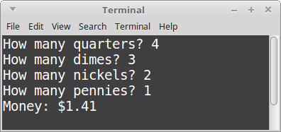
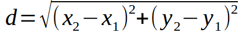

# CS 200 Lab 7: Functions

## Chrome!

Please read this in chrome so that the solutions are collapsed by default!

## Topics

* While Loops
* If Statements
* Input (cin) and Output (cout)

## Turn in

**You will need to upload your code both to the class D2L Dropbox, and to your CS 200 GitHub repository!**

Locate your source files for this project. They should have the extentions .cpp, .hpp, and/or .h. In Windows, they are labelled as "C++ source file" and/or "Header file". 

[Windows, you're annoying.](images/sourcefiles.png)

**These are the only files you need** - You do not need to upload any Visual Studio files.

Upload these source files to your GitHub repository and to the Dropbox.

See also: 
[TURNING IN SOURCE CODE instructions](https://github.com/Rachels-Courses/Course-Common-Files/blob/master/How-to/Turning%20in%20source%20code.md)

## Rules

* Finishing the lab after class:
   * If you are not able to complete the lab during the class period, please finish it up outside of class and turn it in as soon as you can. The lab dropbox will be open for 1 week after the class session.

* Group work:
   * You may work with other students on labs:
   * All people working together must turn in code in their own dropboxes, and upload the code to their own GitHub repositories.
   * All group work must be noted as such - either put a comment in the code file or in the dropbox upload.
   * If you turn in duplicate works without noting that you worked together, you may get a 0% grade.

---

# Review

In algebra, we have functions like this:

	f(x) = 2x + 1
	
This is a function.

The general idea behind a function is that it takes **input**, does some
calculation, and returns an **output**.

We can do the same thing in programming - though, we're not necessarily restricted to numbers.

Functions all have **inputs** and **outputs** - though, sometimes,
the inputs and/or the outputs might be empty, or return nothing.

A basic function declaration looks like this:

	float DoubleMe( float number )
	{
		return 2 * number;
	}
	
The function **declaration** begins by specifying the **return type** - a float.
This means that the function will return a float value as its **OUTPUT**.

Second, **DoubleMe**, is the function name.

Third, within parenthesis, are the **function parameters**. This function only 
has one parameter - a number. The parameters are the **INPUTS** of the function.

Finally, within the curly braces { and } is the **function body**. This is where
you define your calculations and your logic that get executed.

The function body works with the **input** to generate some **output**.

---

# Assignments

## Project 1: Calling a function

Start off with the following code:

	#include <iostream>
	using namespace std;

	// Input: A percent value (0% - 100%, no percent sign though)
	// Output: The decimal equivalent (0.0 - 1.0)
	float PercentToDecimal( float percent )
	{
		float decimal = percent / 100;
		return decimal;
	}

	int main()
	{
		return 0;
	}

This code has a function called **PercentToDecimal**.

Within **main()**, you'll make several calls to this function.

First, create the following variables. All of these are floats. **a**, **b**, and **c** are OK for now.

Since our function returns a value, we can store its return value in a variable. To do this, 
we assign the variable to the function **call**:

	a = PercentToDecimal( 100 );
	
Assign the following values to the variables, then output their values:

* a: 50 percent converted to 0.5 via the PercentToDecimal function.
* b: 12.5 percent converted to 0.125 via the PercentToDecimal function.
* c: 99.99 percent converted to 0.9999 via the PercentToDecimal function.

### Example output

### Solution

	
<strong><em>
		View the solution
	</em></strong>

	#include <iostream>
	using namespace std;

	// Input: A percent value (0% - 100%, no percent sign though)
	// Output: The decimal equivalent (0.0 - 1.0)
	float PercentToDecimal( float percent )
	{
		float decimal = percent / 100;
		return decimal;
	}

	int main()
	{
		float a, b, c;
		
		a = PercentToDecimal( 50 );
		b = PercentToDecimal( 12.5 );
		c = PercentToDecimal( 99.99 );
		
		cout << "a: " << a << endl;
		cout << "b: " << b << endl;
		cout << "c: " << c << endl;
		
		return 0;
	}

---

## Project 2: Price and tax

Start off with the following code:

	#include <iostream>
	using namespace std;
	
	// Declare function here

	int main()
	{
		cout << "Price: $" << 9.99 << " \t with tax: $" << AddTax( 9.99 ) << endl;
		cout << "Price: $" << 19.95 << " \t with tax: $" << AddTax( 19.95 ) << endl;
		cout << "Price: $" << 10.00 << " \t with tax: $" << AddTax( 10.00 ) << endl;
		
		return 0;
	}

This program initially won't build; notice that it is expecting an **AddTax** function.
You will have to implement this.

For the **AddTax** function, it should return a **float** type as its output,
and its input will be a **float** named **dollar**.

Within the function, calculate the price plus tax and return that value.

First, to get the additional tax amount, you will multiply *dollar* by 0.12 (12% tax).
Then, add this value to the original *dollar* amount.
This is the value you will return as the function's output.

Once you've written it, the program should build and look similar to below.

### Example output

### No solution

Solve on your own, or work with classmates to solve.

--- 

## Project 3: Adding change

Start off with the following code:

	#include <iostream>
	#include <string>
	using namespace std;
	
	// Declare function here

	int main()
	{	
		while ( true )
		{
			int quarters, dimes, nickels, pennies;
			
			cout << "How many quarters? ";
			cin >> quarters;
			
			cout << "How many dimes? ";
			cin >> dimes;
			
			cout << "How many nickels? ";
			cin >> nickels;
			
			cout << "How many pennies? ";
			cin >> pennies;
			
			float money = CountChange( quarters, dimes, nickels, pennies );	
			cout << "Money: $" << money << endl;
			
			cout << endl << endl;
		}
		
		return 0;
	}

This program needs a function called **CountChange**. You will declare it.

Its inputs will be, in order:

* quarterCount, an integer
* dimeCount, an integer
* nickelCount, an integer
* pennyCount, an integer

And its output will be a float. The output will be the money value
calculated from the change.

For example, if quarterCount is 4, then the resulting money
would be 4 * 0.25, or 1.00.

Return the calculated money value.

### Example output

### No solution

Solve on your own, or work with classmates to solve.

---

## Project 4: Calculate distance

Start off with the following code:

	#include <iostream>
	#include <string>
	#include <cmath> // needed for square root
	using namespace std;

	int main()
	{	
		while ( true )
		{
			float x1, y1, x2, y2;
			
			cout << "First coordinate pair, enter x and y: ";
			cin >> x1 >> y1;
			
			cout << "Second coordinate pair, enter x and y: ";
			cin >> x2 >> y2;
			
			float distance = GetDistance( x1, y1, x2, y2 );
			cout << "Distance: " << distance << endl;
			
			cout << endl << endl;
		}
		
		return 0;
	}

This program needs a function called **GetDistance**. You will declare it.

Its inputs will be, in order:

* x1, a float
* y1, a float
* x2, a float
* y2, a float

And its output will be a float. The output will be the distance between
the two points.

Within the function, you will need to use the distance formula...:

But you will have to translate it into programming code!

To calculate a square root, we call the square root function...:

	float a = sqrt( 4 ); // a = 2 now

And if you want to calculate an exponent you can use the pow function:

	float b = pow( 5, 2 ); // 5 to the 2nd power
	
Or simply multiple something by itself:

	float c = 5 * 5; // Also basically 5 to the 2nd power.
	

### Example output

### No solution

Solve on your own, or work with classmates to solve.

