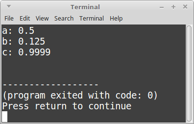

# CS 200 Lab 7: Functions

## Chrome!

Please read this in chrome so that the solutions are collapsed by default!

## Topics

* While Loops
* If Statements
* Input (cin) and Output (cout)

## Turn In

Make sure to zip your entire project folder and upload it in the dropbox on D2L.

Also upload the .cpp file(s) to your class repository. 
[See Lab 1 for instructions](https://github.com/Rachels-Courses/CS200-Concepts-of-Progamming-Algorithms/blob/master/Assignments/In-class%20Labs/Lab%2001%20-%20Intro%20to%20GitHub%20and%20CPP.md#upload-files)

---

# Review

In algebra, we have functions like this:

	f(x) = 2x + 1
	
This is a function.

The general idea behind a function is that it takes **input**, does some
calculation, and returns an **output**.

We can do the same thing in programming - though, we're not necessarily restricted to numbers.

Functions all have **inputs** and **outputs** - though, sometimes,
the inputs and/or the outputs might be empty, or return nothing.

A basic function declaration looks like this:

	float DoubleMe( float number )
	{
		return 2 * number;
	}
	
The function **declaration** begins by specifying the **return type** - a float.
This means that the function will return a float value as its **OUTPUT**.

Second, **DoubleMe**, is the function name.

Third, within parenthesis, are the **function parameters**. This function only 
has one parameter - a number. The parameters are the **INPUTS** of the function.

Finally, within the curly braces { and } is the **function body**. This is where
you define your calculations and your logic that get executed.

The function body works with the **input** to generate some **output**.

---

# Assignments

## Project 1: Calling a function

Start off with the following code:

	#include <iostream>
	using namespace std;

	// Input: A percent value (0% - 100%, no percent sign though)
	// Output: The decimal equivalent (0.0 - 1.0)
	float PercentToDecimal( float percent )
	{
		float decimal = percent / 100;
		return decimal;
	}

	int main()
	{
		return 0;
	}

This code has a function called **PercentToDecimal**.

Within **main()**, you'll make several calls to this function.

First, create the following variables. All of these are floats. **a**, **b**, and **c** are OK for now.

Since our function returns a value, we can store its return value in a variable. To do this, 
we assign the variable to the function **call**:

	a = PercentToDecimal( 100 );
	
Assign the following values to the variables, then output their values:

* a: 50 percent converted to 0.5 via the PercentToDecimal function.
* b: 12.5 percent converted to 0.125 via the PercentToDecimal function.
* c: 99.99 percent converted to 0.9999 via the PercentToDecimal function.

### Example output

### Solution

	
<strong><em>
		View the solution
	</em></strong>

	#include <iostream>
	using namespace std;

	// Input: A percent value (0% - 100%, no percent sign though)
	// Output: The decimal equivalent (0.0 - 1.0)
	float PercentToDecimal( float percent )
	{
		float decimal = percent / 100;
		return decimal;
	}

	int main()
	{
		float a, b, c;
		
		a = PercentToDecimal( 50 );
		b = PercentToDecimal( 12.5 );
		c = PercentToDecimal( 99.99 );
		
		cout << "a: " << a << endl;
		cout << "b: " << b << endl;
		cout << "c: " << c << endl;
		
		return 0;
	}

---

## Project 2: Price and tax

Start off with the following code:

	#include <iostream>
	using namespace std;
	
	// Declare function here

	int main()
	{
		cout << "Price: $" << 9.99 << " \t with tax: $" << AddTax( 9.99 ) << endl;
		cout << "Price: $" << 19.95 << " \t with tax: $" << AddTax( 19.95 ) << endl;
		cout << "Price: $" << 10.00 << " \t with tax: $" << AddTax( 10.00 ) << endl;
		
		return 0;
	}

This program initially won't build; notice that it is expecting an **AddTax** function.
You will have to implement this.

For the **AddTax** function, it should return a **float** type as its output,
and its input will be a **float** named **dollar**.

Within the function, calculate the price plus tax and return that value.

First, to get the additional tax amount, you will multiply *dollar* by 0.12 (12% tax).
Then, add this value to the original *dollar* amount.
This is the value you will return as the function's output.

Once you've written it, the program should build and look similar to below.

### Example output

### No solution

Solve on your own, or work with classmates to solve.

--- 

## Project 3: Adding change

Start off with the following code:

	#include <iostream>
	#include <string>
	using namespace std;
	
	// Declare function here

	int main()
	{	
		while ( true )
		{
			int quarters, dimes, nickels, pennies;
			
			cout << "How many quarters? ";
			cin >> quarters;
			
			cout << "How many dimes? ";
			cin >> dimes;
			
			cout << "How many nickels? ";
			cin >> nickels;
			
			cout << "How many pennies? ";
			cin >> pennies;
			
			float money = CountChange( quarters, dimes, nickels, pennies );	
			cout << "Money: $" << money << endl;
			
			cout << endl << endl;
		}
		
		return 0;
	}

This program needs a function called **CountChange**. You will declare it.

Its inputs will be, in order:

* quarterCount, an integer
* dimeCount, an integer
* nickelCount, an integer
* pennyCount, an integer

And its output will be a float. The output will be the money value
calculated from the change.

For example, if quarterCount is 4, then the resulting money
would be 4 * 0.25, or 1.00.

Return the calculated money value.

### Example output

### No solution

Solve on your own, or work with classmates to solve.

