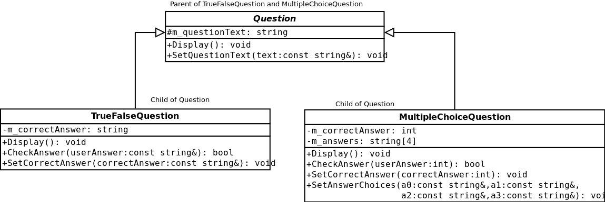
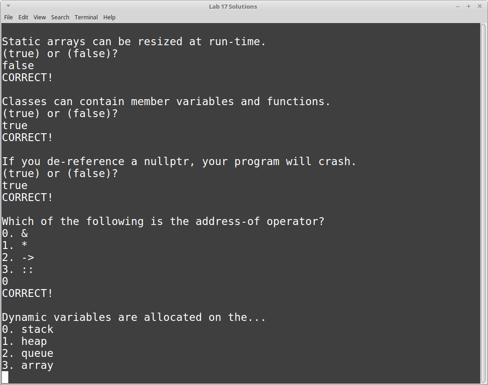

# CS 200 Lab 07b: Inheritance

## Topics

* Classes
* Inheritance

---

# Starting Out

Make sure to download the starting code:

* main.cpp
* Question.hpp
* Question.cpp
* Quizzer.hpp
* Quizzer.cpp

You will be adding three classes into the *Question* files.
The rest of the code is already finished.

**main.cpp**

```c++
#include <iostream>
using namespace std;

#include "Quizzer.hpp"

int main()
{
    Quizzer quizzer;

    TrueFalseQuestion tf1, tf2, tf3;
    tf1.SetQuestionText( "Static arrays can be resized at run-time." );
    tf1.SetCorrectAnswer( "false" );
    quizzer.AddTrueFalseQuestion( &tf1 );

    tf2.SetQuestionText( "Classes can contain member variables and functions." );
    tf2.SetCorrectAnswer( "true" );
    quizzer.AddTrueFalseQuestion( &tf2 );

    tf3.SetQuestionText( "If you de-reference a nullptr, your program will crash." );
    tf3.SetCorrectAnswer( "true" );
    quizzer.AddTrueFalseQuestion( &tf3 );

    MultipleChoiceQuestion mc1, mc2, mc3;
    mc1.SetQuestionText( "Which of the following is the address-of operator?" );
    mc1.SetAnswerChoices( "&", "*", "->", "::" );
    mc1.SetCorrectAnswer( 0 );
    quizzer.AddMultipleChoiceQuestion( &mc1 );

    mc2.SetQuestionText( "Dynamic variables are allocated on the..." );
    mc2.SetAnswerChoices( "stack", "heap", "queue", "array" );
    mc2.SetCorrectAnswer( 1 );
    quizzer.AddMultipleChoiceQuestion( &mc2 );

    mc3.SetQuestionText( "When a value is being passed into a function call, it is known as a..." );
    mc3.SetAnswerChoices( "parameter", "structure", "reference", "argument" );
    mc3.SetCorrectAnswer( 3 );
    quizzer.AddMultipleChoiceQuestion( &mc3 );

    quizzer.Run();

    return 0;
}
```

**Question.hpp**

```c++
#ifndef _QUESTION_HPP
#define _QUESTION_HPP

#endif
```

**Question.cpp**

```c++
#include "Question.hpp"
```

**Quizzer.hpp**

```c++
#ifndef _QUIZZER_HPP
#define _QUIZZER_HPP

#include "Question.hpp"

class Quizzer
{
public:
    Quizzer();

    void AddTrueFalseQuestion( TrueFalseQuestion* q );
    void AddMultipleChoiceQuestion( MultipleChoiceQuestion* q );

    void Run();

private:
    TrueFalseQuestion* m_tfQuestions[3];
    MultipleChoiceQuestion* m_mcQuestions[3];

    int m_count_tfQuestions;
    int m_count_mcQuestions;
};

#endif
```

**Quizzer.cpp**

```c++
#include "Quizzer.hpp"

#include <iostream>
#include <string>
using namespace std;

Quizzer::Quizzer()
{
    m_count_mcQuestions = 0;
    m_count_tfQuestions = 0;
}

void Quizzer::AddTrueFalseQuestion( TrueFalseQuestion* q )
{
    if ( m_count_tfQuestions >= 3 ) { return; }
    m_tfQuestions[ m_count_tfQuestions++ ] = q;
}

void Quizzer::AddMultipleChoiceQuestion( MultipleChoiceQuestion* q )
{
    if ( m_count_mcQuestions >= 3 ) { return; }
    m_mcQuestions[ m_count_mcQuestions++ ] = q;
}

void Quizzer::Run()
{
    int totalQuestions = m_count_tfQuestions + m_count_mcQuestions;
    int totalRight = 0;

    for ( int i = 0; i < m_count_tfQuestions; i++ )
    {
        m_tfQuestions[ i ]->Display();

        string answer;
        cin >> answer;

        bool correct = m_tfQuestions[i]->CheckAnswer( answer );

        if ( correct )
        {
            cout << "CORRECT!" << endl;
            totalRight++;
        }
        else
        {
            cout << "INCORRECT!" << endl;
        }
    }

    for ( int i = 0; i < m_count_mcQuestions; i++ )
    {
        m_mcQuestions[ i ]->Display();

        int answer;
        cin >> answer;

        bool correct = m_mcQuestions[i]->CheckAnswer( answer );

        if ( correct )
        {
            cout << "CORRECT!" << endl;
            totalRight++;
        }
        else
        {
            cout << "INCORRECT!" << endl;
        }
    }

    cout << endl << endl;
    cout << "Final Score: " << totalRight << " out of " << totalQuestions << endl;
}
```

---

# The Question family




First, you will build the *Question* class, which is the base class.

On its own, we won't create just a vanilla "Question" - we will create
two child classes for *True/False* questions and *Multiple Choice* questions,
and use those when we are declaring variables (creating the variables is already
being done in ```main()```).

## QuestionBase class

The one thing in common between all our questions will be having
the question text itself. True/False and Multiple Choice questions
have different types of answers, so those will be handled in their
respective classes.

Within QuestionBase, declare the **protected member variable:**

* m_questionText, a string

and the **public member functions:**

* Display
* SetQuestionText

Use the diagram to fill out the return-types and parameter lists.

### Display

Use ```cout``` to display ```m_questionText```.

### SetQuestionText

This same function will be used by both child classes.
This function is only responsible for assigning the
protected member variable ```m_questionText``` to the value
of the passed-in string.


## TrueFalseQuestion class

For this class, you're going to override the *Display* function,
and also add special functionality for True/False answer types.

**private member variable:**

* m_correctAnswer, a string.

### Display

To call the parents' version of the Display function, you can do:

```QuestionBase::Display()```

This will at least get rid of the duplicate code of displaying
the question - let the base class handle that part.

Next, you will display the possible options. Show the user
that they can enter *true* or *false* as an answer.

### SetCorrectAnswer

The correct answer (either "true" or "false") will be passed in
as the parameter. Set the private member variable ```m_questionText```
to the passed-in value.

### CheckAnswer

Check to see if the user's answer equals the correct answer.
Return true if so, or false if not.

## MultipleChoiceQuestion class

For this class, you're going to override the *Display* function,
and also add special functionality for Multiple Choice answer types.

**private member variables:**

* m_answers, a string array of size 4.
* m_correctAnswer, an integer (related to the index of the correct answer.)


### Display

To call the parents' version of the Display function, you can do:

```QuestionBase::Display()```

This will at least get rid of the duplicate code of displaying
the question - let the base class handle that part.

Next, you will display the list of answer options the user can select.
This should include the *index* of the choice and the *text* of the choice.

You can use a for-loop to iterate over ```m_answers``` to display them all.

### SetCorrectAnswer

The correct answer (one of the indexes: 0, 1, 2, or 3) will be passed in
as the parameter. Set the private member variable ```m_questionText```
to the passed-in value.

### CheckAnswer

Check to see if the user's choice (0, 1, 2, or 3) matches the
correct answer. Return true if so, or false if incorrect.

### SetAnswerChoices

For this function, 4 strings are passed in. Assign these strings to
the different elements of the ```m_answers``` array.

---

# Example output




		Static arrays can be resized at run-time.
		(true) or (false)?
		true
		INCORRECT!

		Classes can contain member variables and functions.
		(true) or (false)?
		true
		CORRECT!

		If you de-reference a nullptr, your program will crash.
		(true) or (false)?
		false
		INCORRECT!

		Which of the following is the address-of operator?
		0. &
		1. *
		2. ->
		3. ::
		0
		CORRECT!

		Dynamic variables are allocated on the...
		0. stack
		1. heap
		2. queue
		3. array
		2
		INCORRECT!

		When a value is being passed into a function call, it is known as a...
		0. parameter
		1. structure
		2. reference
		3. argument
		1
		INCORRECT!


		Final Score: 2 out of 6
