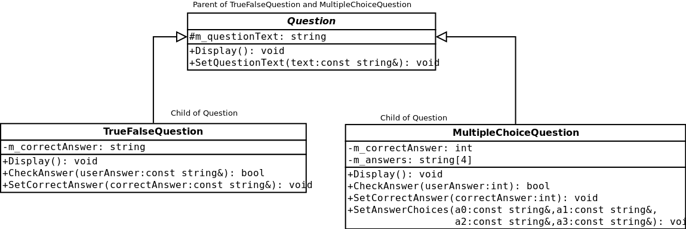

# CS 200 Lab 17: Inheritance

## Topics

* Classes
* Inheritance

## Turn in

**You will need to upload your code both to the class D2L Dropbox, and to your CS 200 GitHub repository!**

Locate your source files for this project. They should have the extentions .cpp, .hpp, and/or .h. In Windows, they are labelled as "C++ source file" and/or "Header file". 


**These are the only files you need** - You do not need to upload any Visual Studio files.

Upload these source files to your GitHub repository and to the Dropbox.

See also: 
[TURNING IN SOURCE CODE instructions](https://github.com/Rachels-Courses/Course-Common-Files/blob/master/How-to/Turning%20in%20source%20code.md)

## Rules

* Finishing the lab after class:
   * If you are not able to complete the lab during the class period, please finish it up outside of class and turn it in as soon as you can. The lab dropbox will be open for 1 week after the class session.

* Group work:
   * You may work with other students on labs:
   * All people working together must turn in code in their own dropboxes, and upload the code to their own GitHub repositories.
   * All group work must be noted as such - either put a comment in the code file or in the dropbox upload.
   * If you turn in duplicate works without noting that you worked together, you may get a 0% grade.

---

# Starting Out

Make sure to download the starting code:

* main.cpp
* Question.hpp
* Question.cpp
* Quizzer.hpp
* Quizzer.cpp

You will be adding three classes into the *Question* files.
The rest of the code is already finished.

---

# The Question family



First, you will build the *Question* class, which is the base class.

On its own, we won't create just a vanilla "Question" - we will create
two child classes for *True/False* questions and *Multiple Choice* questions,
and use those when we are declaring variables (creating the variables is already
being done in ```main()```).

## QuestionBase class

The one thing in common between all our questions will be having
the question text itself. True/False and Multiple Choice questions
have different types of answers, so those will be handled in their
respective classes.

Within QuestionBase, declare the **protected member variable:**

* m_questionText, a string

and the **public member functions:**

* Display
* SetQuestionText

Use the diagram to fill out the return-types and parameter lists.

### Display

Use ```cout``` to display ```m_questionText```.

### SetQuestionText

This same function will be used by both child classes.
This function is only responsible for assigning the
protected member variable ```m_questionText``` to the value
of the passed-in string.


## TrueFalseQuestion class

For this class, you're going to override the *Display* function,
and also add special functionality for True/False answer types.

**private member variable:**

* m_correctAnswer, a string.

### Display

To call the parents' version of the Display function, you can do:

```QuestionBase::Display()```

This will at least get rid of the duplicate code of displaying
the question - let the base class handle that part.

Next, you will display the possible options. Show the user
that they can enter *true* or *false* as an answer.

### SetCorrectAnswer

The correct answer (either "true" or "false") will be passed in
as the parameter. Set the private member variable ```m_correctAnswer```
to the passed-in value.

### CheckAnswer

Check to see if the user's answer equals the correct answer.
Return true if so, or false if not.

## MultipleChoiceQuestion class

For this class, you're going to override the *Display* function,
and also add special functionality for Multiple Choice answer types.

**private member variables:**

* m_answers, a string array of size 4.
* m_correctAnswer, an integer (related to the index of the correct answer.)


### Display

To call the parents' version of the Display function, you can do:

```QuestionBase::Display()```

This will at least get rid of the duplicate code of displaying
the question - let the base class handle that part.

Next, you will display the list of answer options the user can select.
This should include the *index* of the choice and the *text* of the choice.

You can use a for-loop to iterate over ```m_answers``` to display them all.

### SetCorrectAnswer

The correct answer (one of the indexes: 0, 1, 2, or 3) will be passed in
as the parameter. Set the private member variable ```m_correctAnswer```
to the passed-in value.

### CheckAnswer

Check to see if the user's choice (0, 1, 2, or 3) matches the
correct answer. Return true if so, or false if incorrect.

### SetAnswerChoices

For this function, 4 strings are passed in. Assign these strings to
the different elements of the ```m_answers``` array.

---

# Example output


		Static arrays can be resized at run-time.
		(true) or (false)?
		true
		INCORRECT!

		Classes can contain member variables and functions.
		(true) or (false)?
		true
		CORRECT!

		If you de-reference a nullptr, your program will crash.
		(true) or (false)?
		false
		INCORRECT!

		Which of the following is the address-of operator?
		0. &
		1. *
		2. ->
		3. ::
		0
		CORRECT!

		Dynamic variables are allocated on the...
		0. stack
		1. heap
		2. queue
		3. array
		2
		INCORRECT!

		When a value is being passed into a function call, it is known as a...
		0. parameter
		1. structure
		2. reference
		3. argument
		1
		INCORRECT!


		Final Score: 2 out of 6
