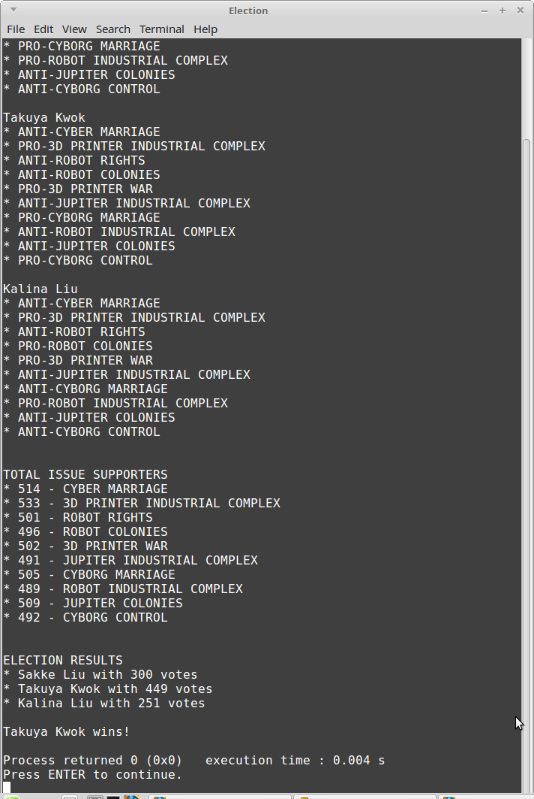

# CS 200 Lab 8: Election (Structs)

Please read this document in Chrome. :)

## Topics

* Arrays
* Functions
* Structs

## Introduction

For this program, a lot has already been implemented.

Issues are randomly generated, as are political candidates.

You have to complete the election by creating an array of citizens,
who have their own views on issues.

Run the program as-is and you'll be able to see a list of candidates
and their stance on issues.

## Turn-in

Make sure to upload all your source files (.cpp) to the Dropbox.

When you're uploading your source to the Dropbox, make sure
to also leave a comment with the URL of your repository!

**Add the name of all people in your team in the upload comments**.

Turn in as one source file.

---

# Step 1: Creating the citizens

First, we must create a struct to contain information about
our citizens.

A citizen must have the following member variable:

* positions, an array of Issues, of size 10

And the following functions:

## ChooseIssues

* Function name: ChooseIssues
* Return type: void
* Parameters:
	* An array of Issues, of size 10.
	
Within this function, the citizen will randomly chose their stance
on an issue. Use the random number generator to choose between "for" or "against":

	rand() % 2; // 0 = false, 1 = true
	
The citizen will need to chose their position for all 10 issues, so use
a **for loop** to generate positions for all 10.	

If the citizen is *for* the issue, the amount of supporters of the issue should
go up.

### How to increment issue supporters?

The Issue struct is:

	struct Issue
	{
		string name;
		bool isPro;
		int totalSupporters;
	};

And in the function, we have an array of issues:

	...( Issue issues[10] )...
	
Within our for-loop, we are currently looking at issue *i*. If that issue
is supported (1 = true), then add one to the issue with:

	issues[i].totalSupporters++;
	

## CheckCandidateAgreement

* Function name: CheckCandidateAgreement
* Return type: int
* Parameters:
	* A single Candidate
	
This function will tally up the amount of agreement between this citizen
and a political candidate. The return value will be the amount of
agreement (between 0 and 10).

Create a temporary int variable called **agreementCount**, and initialize it to 0.

Create a for loop to iterate through all issues. Within the loop, 
check to see if the candidate and the citizen agree on the issue.

If they do agree, increment agreementCount by 1.

After the for loop, return the value of the **agreementCount** variable.

### How to check agreement?

The Issue struct is:

	struct Issue
	{
		string name;
		bool isPro;
		int totalSupporters;
	};

The Citizen and the Candidate each contain an array of 10 issues,
that they are either **for** or **against**.

While iterating through the for loop, check the **isPro** value for 
the issues for each.

	positions[i] == candidate.positions[i] ?
	
(Note: since this function belongs to a *Citizen*, the right-hand side
here implicitly refers to that citizen, while the left-hand side
explicitly refers to the Candidate.)

