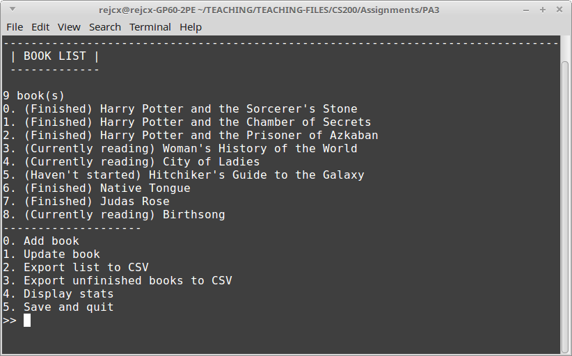
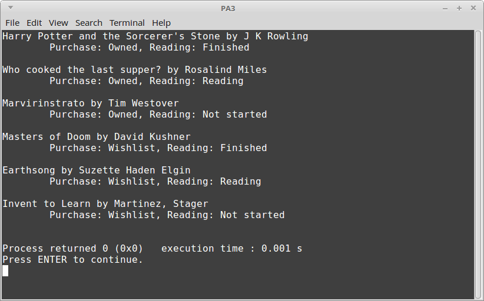

# CS 200 Programming Assignment 3

Book List

## Turn-In

Once finished with your project, you will need to turn in all
**.cpp** and **.hpp** files into the Dropbox.

## Groupwork

You are allowed to collaborate with one other classmate if you'd like.
If you work on this program as a group project, you **must** use GitHub
in order to coordinate your code - I will be checking the
commit logs to see who
worked on what portion of the program.

## Introduction

The final version of this program will store a list of books on the hard drive and
load in that list any time the program begins. It allows the user to add new books
to the list, or update current books, as well as get stats on the books,
export special book lists to CSV files.

It will offer a clean user interface to allow the user to navigate 
through their books and the options for their book list.

Since this program has a lot of features, we will cover things *iteratively*,
and work on some of these features during class. It is better to work on
a few features at a time and test, rather than trying to implement the entire thing at once.

---

# Iteration 1: Book Objects

First, we are going to start out by creating a Book object. We will be using a struct
in order to create our "Book" data-type. The Book will contain the title,
author, and "reading status" and "purchase status".

## Enumerations: ReadingStatus and PurchaseStatus

Enumerations are helpful because they allow us to give text labels to
integers. Generally, it is a bad idea to store fields as strings, because
it is prone to typos and hard to make sure that all the string fields are
consistent throughout the program.

By using enumerations, the compiler will complain if we use a label that
is not recognized, so it also offers an extra layer of protection for us
from logic errors.

We are going to need two enumerations: One for the purchase status, and one for the reading status.
They will be written like this, toward the top of the .cpp file (above main):

	enum ReadingStatus {  NOT_STARTED = 0, READING = 1, FINISHED = 2 };
	enum PurchaseStatus { OWNED = 0, WISHLIST = 1 };
	
We use enumerations similarly to variables. You could declare a variable like this:

	ReadingStatus rs = NOT_STARTED;
	
or you can **cast** an integer to an enumeration:

	int userInput = 2;
	ReadingStatus rs = (ReadingStatus)userInput;
	
Our Book object will contain these two enumerations to keep track of each Book's status.

## Struct: Book

Our Book struct will contain the title, author, and purchase and reading status.
The struct declaration will also be above main, but below the enumeration declarations.

	struct Book
	{
		string title;
		string author;
		ReadingStatus readingStatus;
		PurchaseStatus purchaseStatus;
	};

Now we've essentially made our own *Book* data type, and can declare books like this:

	Book myBook;
	myBook.title = "A history of dinosaurs";
	myBook.author = "ME!";
	myBook.readingStatus = FINISHED;
	myBook.purchaseStatus = OWNED;
	
All of the *internal member variables* of the Book object must be accessed through
the dot operator "."

## Helper Functions: ReadingStatusString and PurchaseStatusString

If we try to *cout* a PurchaseStatus or ReadingStatus...

	PurchaseStatus ps = OWNED;
	cout << ps << endl;
	
it will only display the number value it is associated with:

	0
	
So, if we want *user-friendly* labels for these, we need to write a 
function that take in a ReadingStatus or PurchaseStatus, and return
a string, the user-friendly label.

### ReadingStatusString

* Return type: string
* Parameters:
	* rs, a ReadingStatus

Use an if-statement to check for all possible values of ReadingStatus:
NOT_STARTED, READING, and FINISHED. You will also want a "default" or an "else"
statement to deal with the case where something is passed in that is not found.

If NOT_STARTED is passed in, **return** "Not started". (Do not cout it, return it!)

If READING is passed in, return "Reading".

If FINISHED is passed in, return "Finished".

Otherwise, return "?".

### PurchaseStatusString

* Return type: string
* Parameters:
	* ps, a PurchaseStatus

Similar to ReadingStatusString, this takes in some ReadingStatus and
returns a user-friendly string.

* OWNED - return "Owned"
* WISHLIST - return "Wishlist"
* Other - return "?"

## Functions: SetBook and DisplayBook

First, we are only going to deal with modifying and displaying *one* book, but later on
we will have an array of books that we will be working with.

Rather than having to set a book's member variables manually each time,
let's create a function that will allow us to set up a book.

### SetBook

* Return type: void
* Parameters:
  * book, a Book, passed by reference
  * title, string
  * author, string
  * ps, PurchaseStatus
  * rs, ReadingStatus

Within the function, a *book* is being passed in - this is the book we are
modifying. We are not declaring a new Book within this function.

With the book object, set each of its member variables to the parameters passed in.
Title, author, purchase status, and reading status.

### DisplayBook

* Return type: void
* Parameters:
  * book, a Book
  
This function is responsible for displaying all the information about a book,
so that we don't have to manually cout all the information *every time we want
to list out a book*.

Make sure to use cout to display all four member variables of the *book*.
You can organize these how you'd like.

Remember to use the **ReadingStatusString** and **PurchaseStatusString**
functions to display user-friendly information instead of just numbers!

## Testing

Within main(), create a few **Book** object variables to work with. Use the
SetBook and DisplayBook to set each of these books and make sure that
everything is outputted to the screen properly.

Tester main():

	int main()
	{
		Book bookA, bookB, bookC, bookD, bookE, bookF;

		// Testing all permutations of purchase/reading status
		SetBook( bookA, "Harry Potter and the Sorcerer's Stone", "J K Rowling", OWNED, FINISHED );
		SetBook( bookB, "Who cooked the last supper?", "Rosalind Miles", OWNED, READING );
		SetBook( bookC, "Marvirinstrato", "Tim Westover", OWNED, NOT_STARTED );

		SetBook( bookD, "Masters of Doom", "David Kushner", WISHLIST, FINISHED );
		SetBook( bookE, "Earthsong", "Suzette Haden Elgin", WISHLIST, READING );
		SetBook( bookF, "Invent to Learn", "Martinez, Stager", WISHLIST, NOT_STARTED );

		DisplayBook( bookA );
		DisplayBook( bookB );
		DisplayBook( bookC );
		DisplayBook( bookD );
		DisplayBook( bookE );
		DisplayBook( bookF );

		return 0;
	}

Output:

## Backup!

Make sure to commit your changes to your project repository before continuing! :)

---

# Iteration 2: Array of Books

Now we're going to start dealing with an array of books, as well as starting a simple menu system.
Rather than storing a lot of logic in main(), let's create functions to distribute all
functionality of the program - from displaying menus, to updating books.

We will be creating the book array in main(), but passing it around to each function so that
it can be utilized throughout the program. Later on, once we're working with classes more,
we will be writing programs that don't require so much "passing around".

What we currently have in main() from Iteration 1 was just for testing, so we can erase this stuff.

## main()

Create an array of Books, as well as an integer to keep track of book size.

	int main()
	{
		Book books[100];
		int bookCount = 0;

		return 0;
	}

## Functions: GetValidInput MainMenu, AddBookMenu, UpdateBookMenu, DisplayBookList

main() is only the entry-point of the program, but that doesn't mean that it
has to hold all the core logic of the program. Instead, we're going to distribute
the functionality of the program between multiple functions.

### GetValidInput

* Return type: int
* Parameters:
	* min (int)
	* max (int)

For this function, we will have it handle getting numeric input from the user.
If the user enters something invalid (less than min or greater than max),
it will keep asking the user to re-enter their choice until the user finally
gives a valid item.

When this function returns the user's input, it will be guaranteed to have
a valid number (between [min, max]).

1. Create an integer variable named **choice**.
2. Prompt the user for input (could just cout ">> " or "Input: ")
3. Get the user's input and store it in **choice** (use cin).
4. Create a while loop. While choice is less than min, or greater than max:
	1. Display an error message.
	2. Prompt the user for input.
	3. Get the user's input and store it in **choice**.
5. Call cin.ignore() after the while loop
6. Return the choice.

We have to use cin.ignore() in our program because we will be switching
between getting user input with

	cin >> var;
	
and

	getline( cin, var );

-- the problem is, if we inter-mix these, it might skip over our getline statement
during the program, because the way the input stream works. To get around this,
you can use *cin.ignore()* after an input using the stream operator >> to
make sure it doesn't skip over the next input.

### AddBookMenu

This menu is responsible for getting the book's information, and then calling
the **SetBook** function.

* Return type: void
* Parameters:
	* Array of Books
	* Book count (int), passed by reference

1. Create two temporary string variables: title and author.
2. Create two temporary integer variables: ps and rs.
3. Ask the user to enter a title, store it in **title**. (use getline)
4. Ask the user to enter an author, store it in **author**. (use getline)

Then, you'll display the options for purchase status like this:

    cout << endl << "Purchase Status:" << endl;
    cout << "\t" << OWNED       << ". " << PurchaseStatusString( OWNED ) << endl;
    cout << "\t" << WISHLIST    << ". " << PurchaseStatusString( WISHLIST ) << endl;
	
Remember, when using cout with one of these enum values, it will display the NUMBER value.
We can use this as a shortcut to build a numeric menu - the user will enter 0 for OWNED, or 1 for WISHLIST.
We're going to store their integer choice in an int variable, then **cast** it to a PurchaseStatus for the book.

Use **GetValidInput** to get the user's input and make sure it is one of the valid PurchaseStatus options:

	ps = GetValidInput( OWNED, WISHLIST );
	
Do the same sort of thing with Reading Status. Then, once everything is entered, call
**SetBook** to set the specific book, then increment the bookCount. Your call to SetBook will look like this:

	SetBook( books[ bookCount ], title, author, (PurchaseStatus)ps, (ReadingStatus)rs );

We are passing in books[ bookCount ], which will pass in **one element of the books array** -- essentially, one Book variable.
We are using the bookCount as the index, because it begins at 0 when there are no books, which coincidentally is also
the index of the first book we will add. As the bookCount goes up, its value stores the *index that the next book will go at.*

We are casting the integers *ps* and *rs* to their proper enumerations.
One way we can cast values to other data-types is to use the data-type in parenthesis before the variable name.
This won't work for *all* variables, but it will work for us here.

### DisplayBookList

* Return type: void
* Parameters:
	* Array of Books
	* Book count (int)

For this function, simply create a for-loop that goes from 0 to the bookCount (not-inclusive),
and displays each book with **DisplayBook**.

First, make sure to display the value of *i* (if that is your counter variable), then call the DisplayBook function in this manner:

	DisplayBook( books[i] );

Where *i* is the counter variable in the for-loop. Again, we're passing in **one element of the books array**,
which is essentially one variable.

### UpdateBookMenu

This menu allows the user to choose which Book field to update (so they don't have to re-enter *all* the
information every time they want to make an update). It will store these values in temp variables,
then call **SetBook** to update the book chosen.

1. Use **DisplayBookList** to show the list of all possible books the user can update.
2. Ask the user what index they want to update.
3. Get the user's choice and store it in an integer variable **index**. Make sure to use **GetValidInput**! The value should be between 0 <= index < bookCount.
4. Create temporary variables: title (string), author (string), ps (PurchaseStatus), rs (ReadingStatus).
	Initialize *each of these variables* to the book's current values...

	title = books[ index ].title;
	
After this setup, ask the user what they want to update in another number menu. Something like:

	1. Update title
	2. Update author
	3. Update purchase status
	4. Update reading status

Get the user's input (again, through *GetValidInput*), and use an if or switch statement.

Based on the user's input, have them either enter a new title (to the *title* variable),
author (to the *author* variable), purchase status, or reading status.

Note: For the status variables, you might need to create a temporary *int* variable and then
cast their input to the proper value, similar to in **AddBook**.

### MainMenu

* Return type: void
* Parameters:
	* The book array
	* The book count, passed by reference.
	
	void MainMenu( Book books[100], int & bookCount )

Within the main menu, it should display the list of options the user can do.
Create a while loop that will keep the program running until the user quits.
Let's only display a few menu options for now.

1. Add book
2. Update book
3. Display book list
4. Quit

Get the user's input with the **GetValidInput** function, then use a switch
or if statement to decide what to do.

* Add book - call **AddBookMenu**
* Update book - call **UpdateBookMenu**
* Display book list - call **DisplayBookMenu**
* Quit - stop the program loop.

## Test and backup

Test the program and make sure to backup your work before continuing!

* Add several books
* Update each field of each book, to make sure each type of update works
* Display the list of books after each add

---

# Iteration 3: Book stats

---

# Iteration 4: Saving and loading data to the text file

---

---

# Iteration 5: CSV files

---

# Grading Rubric

<table>
	<tr>
		<th>Percentage</th>
		<th>Feature</th>
		<th>Description</th>
	</tr>
	
	<tr>
		<td> 5% </td>
		<td> Code compiles </td>
		<td> Code should build! How are you even testing if you can't build it? </td>
	</tr>
	
	<tr>
		<td> 5% </td>
		<td> Clean code </td>
		<td> Code is easy to read, consistently indented, descriptive variable names used. </td>
	</tr>
	
	<tr>
		<td> 15% </td>
		<td> HP array is being declared and initialized correctly </td>
		<td> Declaring the array, initializing each element of the array to 100 </td>
	</tr>
	
	<tr>
		<td> 10% </td>
		<td> Game loop (while loop) implemented and will eventually end </td>
		<td> Creating a game loop so the game continues until the player either wins or loses </td>
	</tr>
	
	<tr>
		<td> 10% </td>
		<td> Correct if statement check to see if player wins </td>
		<td> Properly checking to see if the player has won </td>
	</tr>
	
	<tr>
		<td> 10% </td>
		<td> "Correct if statement check to see if player loses
(requires using &&)"
 </td>
		<td> Proper logic to see if player has lost </td>
	</tr>
	
	<tr>
		<td> 5% </td>
		<td> Displays the round menu and options menu for player
 </td>
		<td> Display the main menu each cycle of the game loop </td>
	</tr>
	
	<tr>
		<td> 5% </td>
		<td> Gets the user’s input properly
 </td>
		<td> Get the user's input </td>
	</tr>
	
	<tr>
		<td> 10% </td>
		<td> Character is attacked based on player’s input
 </td>
		<td> Accessing the appropriate element of the array and updating it, based on the user's input. </td>
	</tr>
	
	<tr>
		<td> 15% </td>
		<td> For-loop iterates through all NPCs properly (not the player)
 </td>
		<td> Access each element of the array, except for the player character. </td>
	</tr>
	
	<tr>
		<td> 10% </td>
		<td> Each NPC is able to attack correctly
 </td>
		<td> Attacks are done correctly - accessing the correct element. </td>
	</tr>
	

</table>
